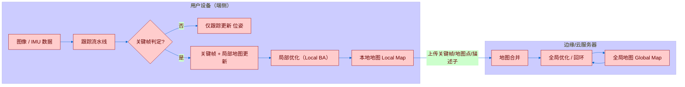
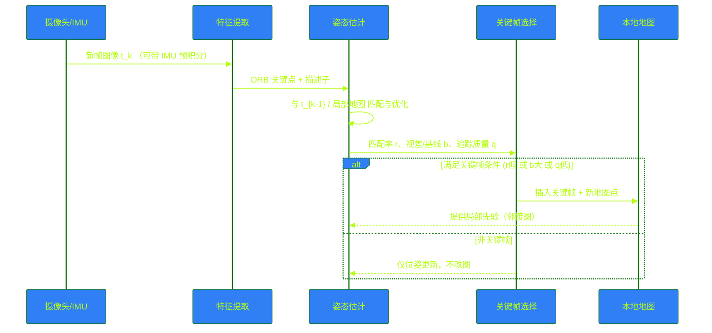
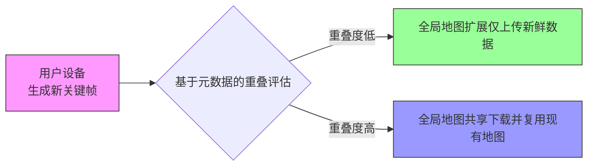
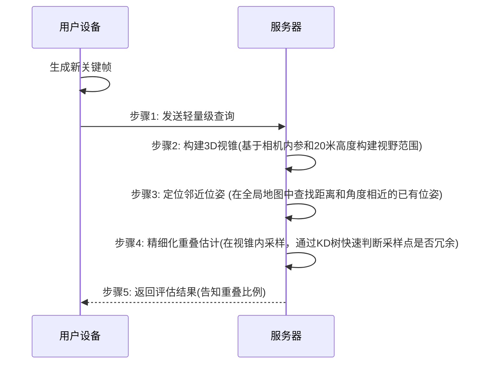
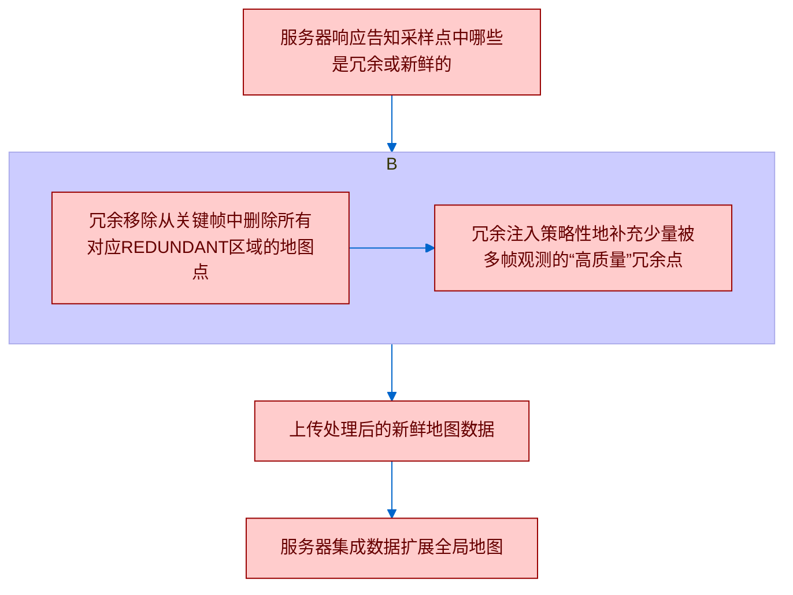
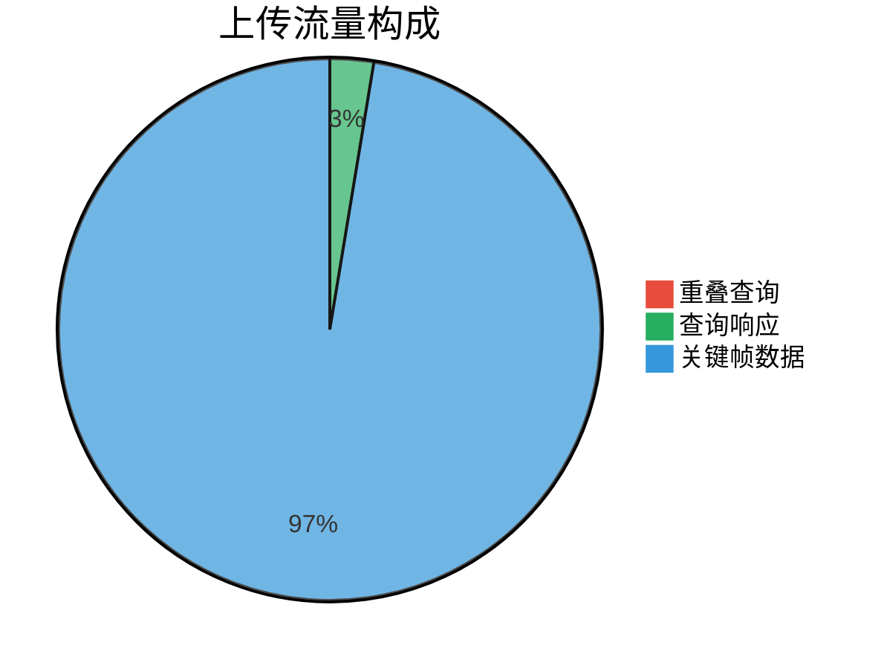
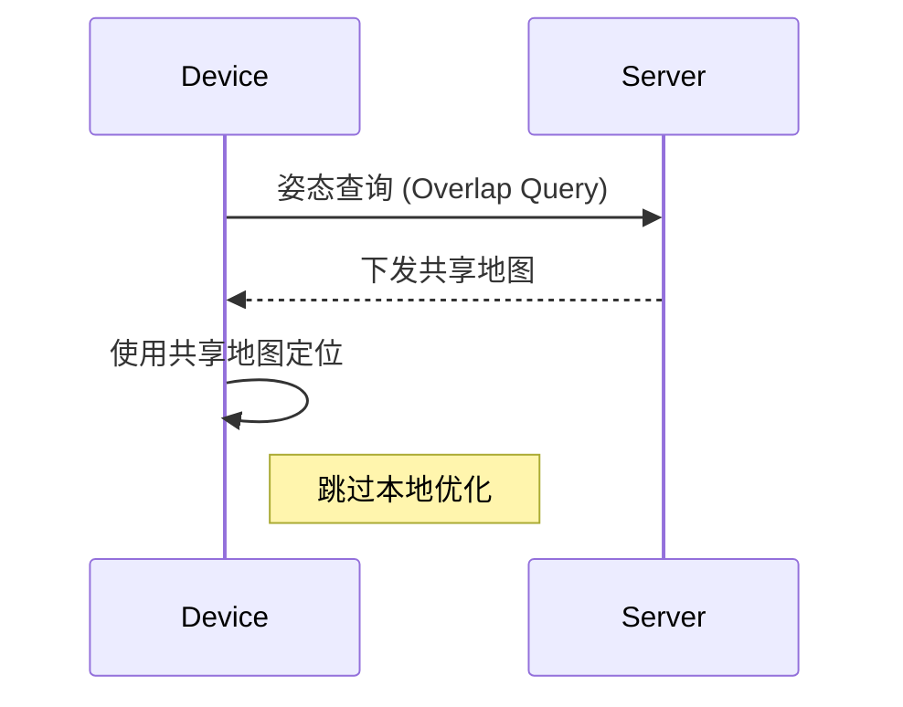

# undefined

---
layout: Bg
---

<div class="font-serif text-center text-4xl mt-18">
    Map++:用户参与式视觉SLAM系统
</div>

---

## 1. 背景与动机

<br>

<v-click>

#### 1.1 研究动机

- 现代无人驾驶与室内导航依赖高精度三维地图。  
- 传统SLAM构建大规模地图成本高昂、难以长期维护。  
- 动态环境（如多层停车场、商场）频繁变化，需持续更新。


</v-click>
<br>
<br>

<v-click>

#### 1.2 传统方法的瓶颈

- 数据采集昂贵且难以覆盖完整环境。  
- 各用户设备重复采集相似场景，造成 **冗余数据**。  
- 服务器端计算、存储、带宽压力巨大。


</v-click>

<!--
设想在一个繁忙的陌生停车场，您的汽车能够利用高精度3D地图，自动找到车位并完成泊车。实现这一愿景的关键，就是一张全面、精确、且能实时更新的3D地图。
技术核心：同步定位与地图构建 (SLAM) 技术，特别是视觉SLAM (Visual SLAM)，是实现这一愿景的核心技术，它允许设备在未知环境中实时定位自身并同步构建环境地图。

核心挑战：
  1.  高昂的成本与维护难度：由专业团队长期、大范围地采集和更新精细地图数据，成本极高。
  2.  海量的数据冗余：当多用户（车辆、手机）在相似路径上行驶时，会采集大量重叠数据，这极大地浪费了网络带宽、服务器处理能力和存储资源 。
-->

---

### 解决方案：用户参与式SLAM (User-Participatory SLAM)

<br>

<v-click>
本文提出了一种全新的范式：利用海量普通用户设备（车载摄像头、智能手机）作为传感器，以“众包”的形式，低成本、持续地构建和更新全局3D地图。
</v-click>


<v-click>

</v-click>

<!--
在这项工作中，我们提出了协作式用户参与SLAM系统，如图1所示，该系统利用用户移动设备或汽车上广泛配备的摄像头来收集地图数据，并在边缘/云服务器上构建全局3D地图。用户以一种自由的方式为地图构建做出贡献，而无需遵循特定移动指令。通过利用用户的集体力量，它促进了方便、低成本和持续的数据收集，使得地图能够随着用户在空间中的移动而扩展，并随着环境的变化而保持更新。反过来，用户可以在其设备上获取并利用最新的3D地图。具体来说，设备使用摄像头捕捉周围环境并将数据上传到地图服务器，服务器随后将数据合并到全局地图中并进行全局优化。
我们相信，这种地图构建和维护方法可以在众多环境中提供有效的解决方案。由此产生的3D地图可以作为对谷歌地图等集中式商业地图的有价值的补充，无论是在地图覆盖范围还是在为移动设备和汽车导航的能力方面。
-->

---

## Related Work

- 视觉 SLAM 系统
- 分布式/共享地图 SLAM
- 众包/参与式感知
- 地图更新与维护

<!--
- 视觉 SLAM 系统
传统 SLAM 研究主要集中在 单机视觉 SLAM，例如 ORB-SLAM3 等方法，它们依赖于特征提取、位姿估计、关键帧生成、局部/全局优化和回环检测
Map++ Towards User-Participator…。尽管精度高，但在大规模环境（如多层停车场、商场）中存在 计算资源消耗高、长期维护困难 的问题。

- 分布式/共享地图 SLAM
出现了基于 共享地图架构 的研究（如 Covins），允许多个用户上传关键帧数据，由服务器合并地图并进行全局优化Map++ Towards User-Participator…。

这种方法能扩展地图，但带来了 巨大的内存开销和通信带宽消耗。

- 众包/参与式感知
研究者尝试让用户在自然运动过程中贡献数据，即 参与式 SLAM。这避免了高昂的专用采集成本，但会产生大量 冗余数据，浪费带宽、存储与计算资源。
相关工作多缺乏 有效的冗余控制与资源优化机制，用户设备的 CPU/电量开销大，降低了参与意愿。

- 地图更新与维护
现有部分研究（如 SwarmMap）关注 如何更新地图，但缺少高效的 检测何时更新 的机制
-->

---

<v-click>

## 视觉 SLAM 入门（以 ORB-SLAM3 为例）

</v-click>

<v-click>

> 本节围绕**跟踪（Tracking）—局部优化（Local BA）—全局优化/回环（Global BA/Loop）—地图合并（Map Merge) 展开, 并给出分布式共享地图**架构（端侧 + 边缘/云）。
</v-click>


<v-click>
<div style="display:inline-block;width:1000px; height:1100px;margin-left:-50px; margin-top:100px;">



</div>
</v-click>

---

## 快速要点（Key Points）


<v-clicks>

- **跟踪三件套**：特征提取 → 姿态估计 → 关键帧生成（统称 Tracking）
- **两级优化**：局部 BA（邻域关键帧与地图点）＋ 全局 BA（回环/重定位后的一致性）
- **地图合并**：多设备/多子图在统一全局坐标系下融合
- **分布式共享地图**：端侧维持本地地图以保实时性，边缘/云负责全局优化与长期维护

</v-clicks>

<v-click>

<div style="width:600px;height:600px">



</div>

</v-click>

---

## 模块职责一览表

| 模块                  | 输入                  | 输出                | 运行位置 |
| --------------------- | --------------------- | ------------------- | -------- |
| 特征提取              | 单帧图像              | 关键点 + 描述子     | 端侧     |
| 姿态估计              | 匹配特征、IMU（可选） | 相机6DoF位姿        | 端侧     |
| 关键帧生成            | 连续帧匹配与几何约束  | 关键帧              | 端侧     |
| 局部优化（Local BA）  | 邻域关键帧 + 地图点   | 精化局部位姿/地图点 | 端侧     |
| 回环检测              | 关键帧外观            | 回环边              | 服务器   |
| 全局优化（Global BA） | 回环后的图            | 全局一致位姿/点     | 服务器   |
| 地图合并              | 多子图                | 统一全局地图        | 服务器   |

---

## 传统架构的瓶颈

<v-click>

这种“无差别上传”的模式带来了严重的性能问题。

</v-click>

<v-clicks>

* **服务器资源耗尽**：仅服务20个用户（总行程2604米），基线系统就需要 **3.98GB** 内存，全局优化耗时 **76分钟** 。
* **用户端负担沉重**：一个用户建图260米，就需要消耗 **1GB** 内存、**2.46W** 功率，并产生 **114MB** 的网络流量。这严重阻碍了用户的参与意愿。

</v-clicks>

---

## Map++ 系统设计总览

<v-click>

Map++ 作为一个即插即用的扩展模块，旨在解决上述瓶颈 。

</v-click>

<v-click>

### 核心设计目标

</v-click>

<v-clicks>

* **高可扩展性 (High Scalability)**：在有限资源下支持海量用户参与。
* **最小化冗余 (Minimal Redundancy)**：在保证地图精度的前提下，根除冗余数据的传输与计算。
* **持续更新能力 (Continuous Updates)**：支持地图的长期、高效维护。

</v-clicks>

<v-click>

### 三大核心模块协同工作

Map++的核心思想是：在上传任何数据前，先进行一次轻量级的“握手”，智能判断数据的新颖性，从而决定执行**扩展**还是**共享**。

</v-click>

<v-click>

<div style="margin-top:-50px">



</div>

</v-click>

---

## Map++ 核心设计逻辑
### 1. 基于元数据的重叠评估
**目标**：用最小的代价，判断新关键帧的视野是否已存在于全局地图中。

<v-click>

**优势**：
* **核心创新**：用 **64字节** 的元数据查询代替了 **~160KB** 的完整关键帧上传，通信开销降低了 **99.96%**。
* **避免误判**：传统的粗略方法可能因为“透视”而将不同物体表面的点误判为重叠。Map++的**地图点级别**估计方法解决了这个问题。

</v-click>

<v-click>

````md magic-move {lines: true}

```cpp {*}
// Map++ 元数据查询伪代码
OverlapQuery(C, K, Pose p) {
}
```

```cpp {*}
输入参数：
C：用户 ID，用于标识哪个设备提交的数据。
K：关键帧 ID，用于标识具体的关键帧。
Pose p：该关键帧对应的相机姿态（位置 + 姿态角度）。
```

```cpp {*|2|3|4|5|6-7|8-9}
// Map++ 元数据查询伪代码
OverlapQuery(C, K, Pose p) {
  cone = ViewCone(p);
  neighbors = KDTreeSearch(global_map, cone);
  overlap = redundant_pts / total_pts;
  if (overlap > T_seen)
      shareMap();
  else
      requestUpload();
}
```

````

</v-click>

<!--
根据相机姿态 p 计算一个 三维视锥体 (View Cone)。
视锥体代表了相机在该姿态下的可见区域。
这是 Map++ 的“元数据”，比上传完整关键帧（图像+特征点）要轻量得多。
在服务器端的全局地图 global_map 中，用 KD-tree 数据结构快速查找与该视锥体相交的邻居点/邻居关键帧。
KD-tree 是一种高效的空间搜索结构，用来判断“附近是否已有相似的观测数据”。
计算重叠比例：
redundant_pts = 被判定为冗余（已存在于全局地图）的采样点数；
total_pts = 该关键帧中采样的总点数；
overlap = 冗余点比例。
如果重叠比例 overlap 大于某个阈值 T_seen（论文中约 90%），说明该位置已经被充分建图 → 直接共享已有地图给设备（shareMap()）。

否则，说明这是“新区域” → 设备需要上传新的关键帧数据到服务器扩展全局地图（requestUpload()）。
-->

---

### Sequence示意图

<div style="width:600px;height:400px;">



</div>

---

## 2：为新位置扩展全局地图

**触发条件**：重叠度低于阈值（如90%），表明用户进入了新区域。

<v-click>

* **冗余移除 (Redundancy Removal)**：这是节省流量和服务器算力的关键。确保只为“未知”的区域上传数据。
* **冗余注入 (Redundancy Injection)**：全局优化依赖重叠数据来建立约束。通过注入少量高质量的重叠信息，Map++在不牺牲资源效率的前提下，保证了全局地图的精度。

</v-click>

---

## 智能的“减法”与“加法”：冗余控制机制

<div style="width:600px;height:400px">



</div>

---

## 3：为已见位置共享全局地图

**触发条件**：重叠度高于阈值，表明用户正行驶在“已知道路”上。

### 变“贡献者”为“受益者”

* **核心优势**：设备无需再执行耗时的局部优化（在NVIDIA Xavier平台上平均耗时 **400ms** ）。取而代之的是，直接从服务器下载并使用更精确的全局地图进行轻量级定位。
* **主动式地图共享 (Proactive Map Sharing)**：为减少频繁的网络请求，服务器会“预见性”地发送一个比当前所需范围稍大的地图片段（由超参数 `α` 控制）。实验证明 `α=1.3` 能将地图请求次数从3次减少到2次。

---

* **地图更新检测**：

````md magic-move {lines: true}

```cpp {*}
Algorithm 1 Device-Initiated Global Map Update Detection
  for i = 0 to f do
      M = Request_Shared_Map(C, K, Pq)        ▷ §4.3: Map Sharing
      if M ≠ NULL then                        ▷ §4.3: Localization
          if Localize(M, Pq) == SUCCESS then
              return;
          else                                ▷ Case 1
              Map_Expansion(C, K, Pq, M)      ▷ §4.2
              return;
      S = Get_Update_Status(KFs)              ▷ §4.3: Map Updating
     if S == EXPANSION then                  ▷ Case 1
         Map_Expansion(C, K, Pq, M)
     else if S == UPDATING then              ▷ Case 2
         Map_Update(KFs)
```

```cpp {*}
输入参数

C：用户 ID
K：关键帧 ID
Pq：查询姿态（设备当前位置）
KFs：本地关键帧集合
f：最大迭代次数
```

```cpp {*|6|7|8-10|11-13|14|15-16|17-18}
Algorithm 1 Device-Initiated Global Map Update Detection

Input: User ID C, Keyframe ID K, Query pose Pq, Local keyframe list KFs, 
       Maximum iteration number f.

  for i = 0 to f do
      M = Request_Shared_Map(C, K, Pq)        ▷ §4.3: Map Sharing
      if M ≠ NULL then                        ▷ §4.3: Localization
          if Localize(M, Pq) == SUCCESS then
              return;
          else                                ▷ Case 1
              Map_Expansion(C, K, Pq, M)      ▷ §4.2
              return;
      S = Get_Update_Status(KFs)              ▷ §4.3: Map Updating
     if S == EXPANSION then                  ▷ Case 1
         Map_Expansion(C, K, Pq, M)
     else if S == UPDATING then              ▷ Case 2
         Map_Update(KFs)
```

````

<!--
输入参数
C：用户 ID
K：关键帧 ID
Pq：查询姿态（设备当前位置）
KFs：本地关键帧集合
f：最大迭代次数

主要流程
循环迭代 (行1)：
设备尝试最多 f 次查询共享地图来定位。

请求共享地图 (行2)：
Request_Shared_Map(C,K,Pq) → 从服务器请求当前位置附近的共享地图。

判空 (行3)：

如果共享地图 M 不为空：

尝试定位 Localize(M,Pq)。

成功 → 结束（行5）。

失败 → 认为需要扩展地图，调用 Map_Expansion()（行7-8）。

地图为空 (行9)：
说明共享地图不足以支持定位，此时设备调用 Get_Update_Status(KFs) 检查更新状态。

根据状态执行 (行10-13)：
如果返回 EXPANSION → 执行地图扩展 (Map_Expansion)。
如果返回 UPDATING → 执行地图更新 (Map_Update)。

两种情况
Case 1（扩展）：当前环境中新区域，需要上传新关键帧扩展全局地图。
Case 2（更新）：环境发生变化（如障碍物或结构更新），需更新已有全局地图。
-->

---

六、系统实现

<v-click>

开发语言： C++（在 Covins 基础上新增约3100行代码）；

客户端： 基于 ORB-SLAM3；

服务器端： 基于 Covins；

通信模块： 使用 ZeroMQ 异步消息；

硬件平台：

客户端：NVIDIA AGX Xavier；

服务器：AMD EPYC 7H12 双CPU，1TB RAM。

</v-click>

<v-click>

```cpp
主要函数接口
SendMetaData();          // 上传关键帧元数据
AssessOverlap();         // 服务器重叠检测
PartitionKF();           // 关键帧冗余控制
MapInsert();             // 新数据插入
RequestSharedMap();      // 请求共享地图
```

</v-click>

---

## 📊 实验评估

### 1数据集与环境

<v-click>

| 数据集        | 场景类型      | 面积       | 特点             |
| ------------- | ------------- | ---------- | ---------------- |
| Indoor-Garage | 室内停车场    | 45×175 m   | 光照复杂、反射强 |
| Outdoor-Plaza | 室外广场      | 60×45 m    | 开阔、强光       |
| EuRoC         | 公共MAV数据集 | 453 m 轨迹 | 多重视角         |
| Future-City   | 模拟小城市    | 80×75 m    | 可控仿真环境     |

- 设备：Intel RealSense D455、Xsens IMU、RS-Helios LiDAR
- 参与者：35人（20人建图，15人共享）

</v-click>

<!--
我们对Map++和普通的参与式SLAM系统Covins进行了全面评估。我们的目标是证明：(1) Map++能显著降低构建此类共享地图系统的设备端和服务器端资源消耗；(2) Map++在用户行驶于相似路径时能提供低成本的地图共享，并促进及时的地图更新；(3) Map++能以更低的成本提供相当的地图质量。
-->

---

### 2 评估指标

- **设备端：** 上传流量、CPU占用、功耗、延迟；
- **服务器端：** 优化延迟、内存占用、带宽需求；
- **地图质量：**
  - 轨迹误差（ATE）
  - 重建误差（RMSE）

---

### 3 主要结果

<v-click>

| 指标              | Covins        | Map++  | 改进幅度     |
| ----------------- | ------------- | ------ | ------------ |
| 上传流量 / KF     | 163 KB        | ↓ 46%  | 节省带宽     |
| 设备CPU使用       | 100%          | ↓ 47%  | 降负载       |
| 服务器RAM         | 高            | ↓ 30%  | 节省内存     |
| 优化延迟 (20用户) | 76 分钟       | ↓ 40%+ | 可扩展性增强 |
| ATE误差           | +0.015~0.03 m | 可接受 | 精度保持     |

</v-click>

---




---


### 4 地图共享实验

<v-click>

- 采用 α=1.3 的主动共享策略；
- 室内场景ATE由 0.175 m → 0.128 m；
- 平均每关键帧仅需 25 KB 下行数据。

</v-click>

<v-click>

<div style="margin-left:300px; margin-top:-60px">



</div>

</v-click>

---

## 🧮 系统性能分析

- **计算效率：** 局部优化消耗约400 ms，Map++通过共享机制避免重复运算；
- **网络效率：** 上传与响应数据仅占关键帧大小的约3%；
- **全局优化：** 用户数增加时延长线性增长更缓；
- **鲁棒性：** 在带宽限制 (<30 Mbps) 下仍能稳定运行。

<div style="margin-top:-6px">

## 💡 系统优点与不足
### 优点
- 有效减少冗余数据传输与计算；
- 提升系统并发能力与实时性；
- 无需修改核心SLAM算法即可兼容；
- 适合大规模用户协同环境。

### 不足
- 对光照与视觉特征依赖较强；
- 移动端仍存在一定计算负担；
- 地图更新机制依赖服务器判定。

</div>


---

## 📘 总结

- Map++ 提出了一种创新的用户参与式SLAM体系；
- 通过元数据重叠检测与冗余控制显著降低资源开销；
- 支持地图共享，实现更高效的本地化；
- 以微小精度损失换取约50%的资源节省，极具工程价值。

<!--
未来展望：
引入 语义识别模块：自动忽略临时障碍；
开发 移动端轻量化版本；
探索 隐私保护建图机制；
实现 跨设备实时协作 与 群体更新优化。

论文的核心贡献
提出 Map++ 框架，首次实现了一个面向用户参与的 SLAM 系统，能够在 低资源消耗 的情况下构建和维护共享地图。
引入 元数据冗余检测机制：只需上传相机位姿（而非完整关键帧），通过构造视锥体并和全局地图比对，快速判断当前位置是否已被覆盖。

实现 两种操作模式：
新位置 → 上传新数据，扩展全局地图。
已见位置 → 下载共享地图，减少本地优化和资源开销。

设计 冗余控制策略：不仅去除冗余数据，还适度引入“高频冗余点”以增强全局优化约束。

在 4 个典型场景中验证，Map++ 能减少约 46% 的通信流量，支持约 2 倍用户并发数，同时保持 <0.03m 的误差增量。

个人理解与评价
创新点在于“用户-服务器协同机制”：既避免了盲目上传导致的资源浪费，又保证了地图随环境演变而更新。
工程价值高：作为一个 即插即用扩展层，不改动底层 SLAM，就能让现有系统支持众包式建图。
取舍合理：虽然牺牲了少量精度（ATE 增加 <3cm），但换来大幅降低带宽与计算消耗，适合 大规模部署。
未来展望：仍需解决动态环境（人流、车辆、障碍物）下的鲁棒性问题，可以结合 目标识别或语义 SLAM 来进一步优化。
-->

---
layout: Ballpit
---

# cnm
