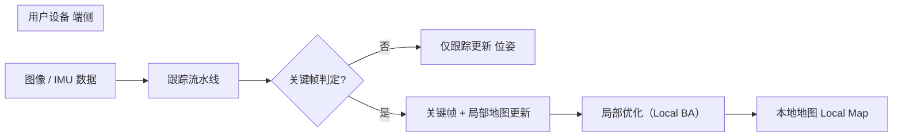
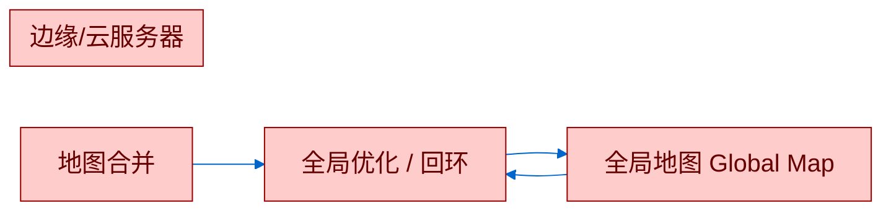
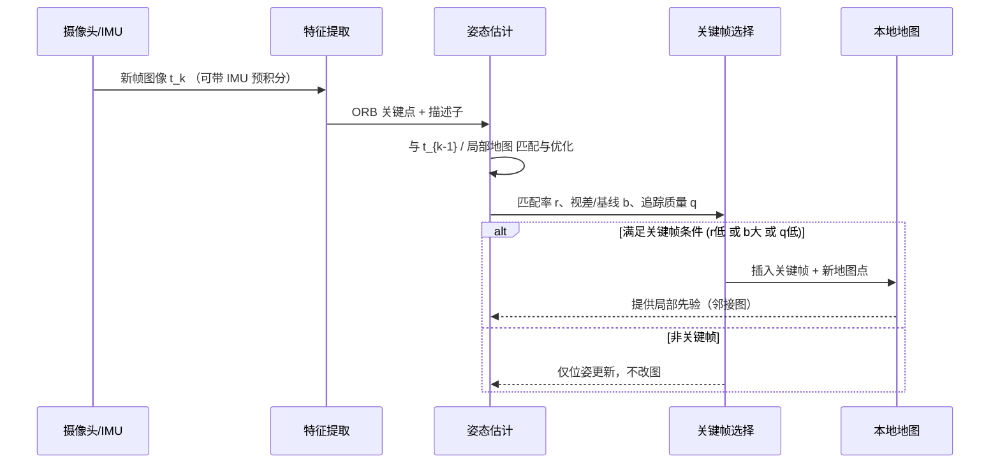
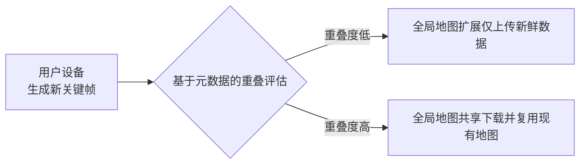
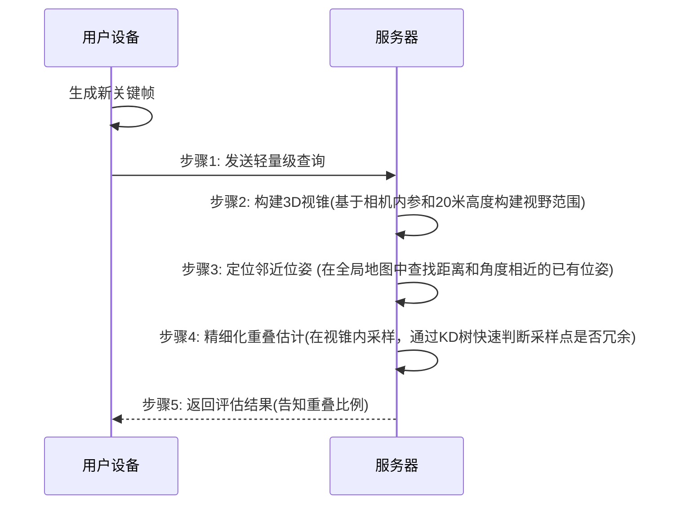
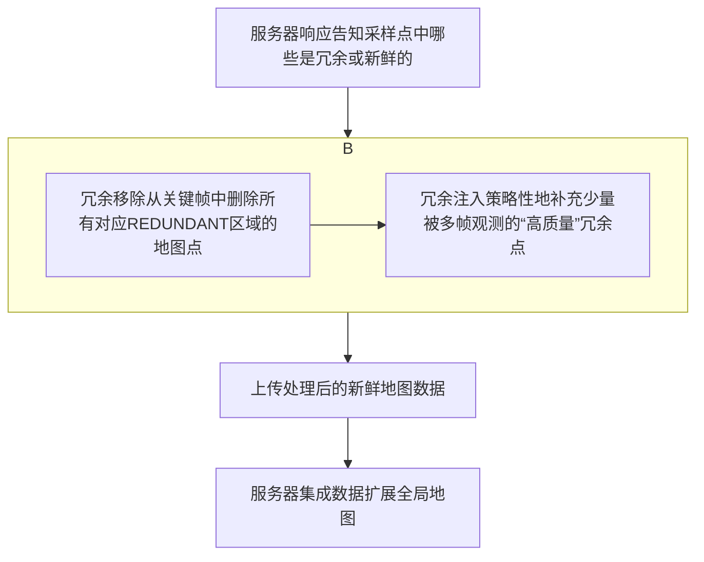
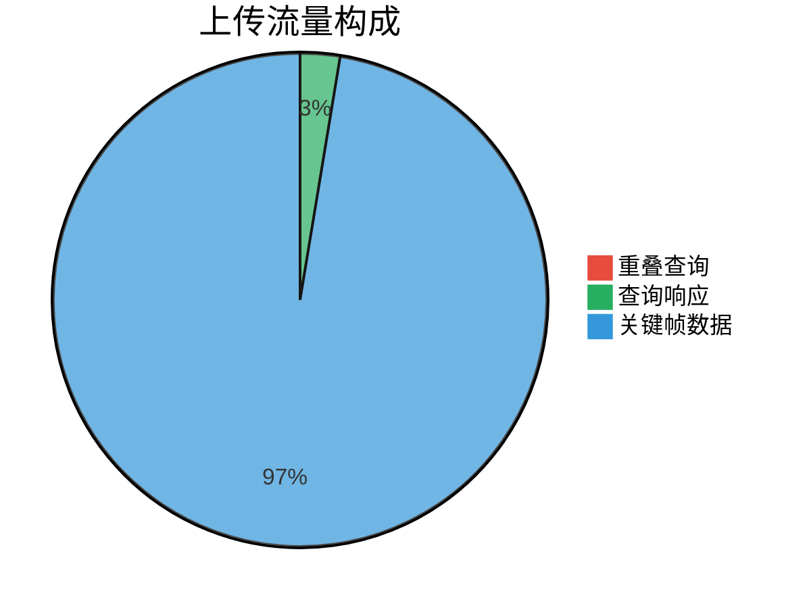
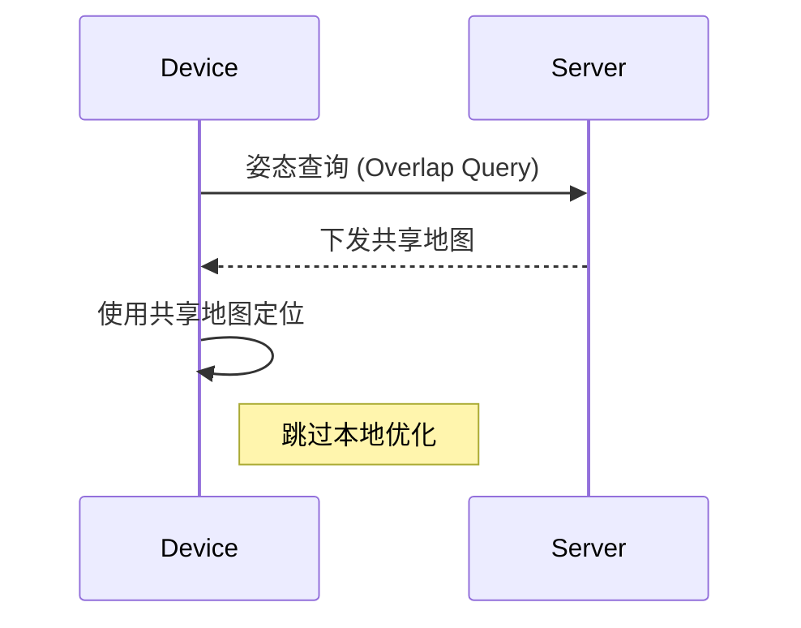

---
layout: Bg
---

<div class="font-serif text-center text-4xl mt-18">
    Map++:用户参与式视觉SLAM系统
</div>

<!--
大家好，我是来自一组的郭青松，旁边是我们组的组员赵琳，蒋军毅，本次我要演讲的是Map++，用户参与式视觉SLAM系统。
-->

---

## 1. 背景与动机

<br>

<v-click>

#### 1.1 研究动机

- 现代无人驾驶与室内导航依赖高精度三维地图。  
- 传统SLAM构建大规模地图成本高昂、难以长期维护。  
- 动态环境（如多层停车场、商场）频繁变化，需持续更新。


</v-click>
<br>
<br>

<v-click>

#### 1.2 传统方法的瓶颈

- 数据采集昂贵且难以覆盖完整环境。  
- 各用户设备重复采集相似场景，造成 **冗余数据**。  
- 服务器端计算、存储、带宽压力巨大。


</v-click>

<!--
首先我要将本篇文章的背景与动机，在现在的导航系统中，在室内或者地下停车场的复杂环境下不能做到精确导航，这是由于缺乏高精度3d地图，而slam技术就是构建3d地图的关键

目前的主要传统方法的瓶颈
-->

---

<div style="position:absolute;left:330px;">

# Related Work

</div>

<v-click>

<div style="position:absolute;left:180px;top:140px;">

- 视觉 SLAM 系统
    - 精度高
    - 计算资源消耗高
    - 长期维护困难

<br>
<br>

- 分布式/共享地图 SLAM
    - 能扩展地图
    - 巨大的内存开销
    - 通信带宽消耗

</div>

</v-click>

<v-click>

<div style="position:absolute;left:500px;top:140px;">

- 众包/参与式感知
    - 避免了高昂的专用采集成本
    - 产生大量冗余数据
    - 浪费带宽、存储与计算资源

<br>
<br>

- 地图更新与维护
    - 研究关注如何更新地图
    - 缺少高效的何时更新检测机制

</div>

</v-click>

<!--
这是几个过去传统的slam系统。

- 视觉 SLAM 系统
传统 SLAM 研究主要集中在 单机视觉 SLAM，例如 ORB-SLAM3 等方法，它们依赖于特征提取、位姿估计、关键帧生成、局部/全局优化和回环检测
Map++ Towards User-Participator…。尽管精度高，但在大规模环境（如多层停车场、商场）中存在 计算资源消耗高、长期维护困难 的问题。

- 分布式/共享地图 SLAM
出现了基于 共享地图架构 的研究（如 Covins），允许多个用户上传关键帧数据，由服务器合并地图并进行全局优化Map++ Towards User-Participator…。

这种方法能扩展地图，但带来了 巨大的内存开销和通信带宽消耗。

- 众包/参与式感知
研究者尝试让用户在自然运动过程中贡献数据，即 参与式 SLAM。这避免了高昂的专用采集成本，但会产生大量 冗余数据，浪费带宽、存储与计算资源。
相关工作多缺乏 有效的冗余控制与资源优化机制，用户设备的 CPU/电量开销大，降低了参与意愿。

- 地图更新与维护
现有部分研究（如 SwarmMap）关注 如何更新地图，但缺少高效的 检测何时更新 的机制
-->

---

### 解决方案：用户参与式SLAM (User-Participatory SLAM)

<br>

<v-click>
本文提出了一种全新的范式：利用海量普通用户设备（车载摄像头、智能手机）作为传感器，以“众包”的形式，低成本、持续地构建和更新全局3D地图。
</v-click>


<v-click>

</v-click>

<!--
所以我们提出了协作式用户参与SLAM系统，该系统利用用户移动设备或汽车上广泛配备的摄像头来收集地图数据，并在边缘/云服务器上构建全局3D地图。用户以一种自由的方式为地图构建做出贡献，而无需遵循特定移动指令。通过利用用户的集体力量，它促进了方便、低成本和持续的数据收集，使得地图能够随着用户在空间中的移动而扩展，并随着环境的变化而保持更新。
-->

---

## 用户参与式SLAM面临的挑战

<br>

<v-click>

- 地图数据的过度冗余
  - 团队出行的用户 
  - 用户行驶在共同的道路上

</v-click>

<br>

<v-click>

- 高资源消耗
  - 姿态估计
  - 地图数据生成
  - 局部优化

</v-click>

<!--
但是看似前进美好的用户式SlAM但还面临众多挑战，其中最主要的挑战是地图数据过于冗余。例如团队出行的用户，会提供许多相似的数据等。鉴于大多数用户行驶在共同的道路和路径上，存在高度的数据冗余，导致网络带宽、处理能力和内存使用的巨大浪费。此外，频繁传输地图数据可能会因用户移动设备（包括汽车）资源有限（或昂贵）而抑制用户的参与度。除了传输地图数据，一些SLAM功能也需要在用户设备上执行，包括姿态估计、地图数据生成和局部优化，这些都会导致高资源消耗。
-->

---

## 应对数据冗余的解决方案

<v-click>

<br>

- 传输"新鲜"数据
  - 地图元数据——设备分发其姿态(位置和方向)

</v-click>

<v-click>

<br>

- 判断设备位置的新旧
  - 策略性注入地图冗余数据
  - 见过——无需上传地图数据

</v-click>

<!--
我们通过识别新获取的地图数据与现有全局地图之间的冗余程度，并仅请求传
输“新鲜”数据到服务器来应对这一挑战。我们设计了一种轻量级的冗余检查机制，利用两种类型的地图元数据——设备分发其姿态（位置和方向）而非原始数据到服务器，服务器随后构建一个代表该姿态下摄像头3D视场（FOV）的视锥（view cone）。通过一种高效的空间采样技术评估该视锥与全局地图之间的重叠，我们可以以最小的成本确定新地图数据与全局地图之间的重叠。
基于重叠评估结果，我们确定设备的当前位置是之前“见过”的还是新的。如果位置已被见过并已建图，用户无需上传地图数据，从而显著减少处理/网络/内存资源。同时，服务器直接与设备共享全局地图的周围部分。利用共享的地图，设备可以跳过耗费资源的局部优化步骤，从而节省计算资源和电池能耗。

如果位置是新的或部分新的，则必须上传相应的新地图数据以扩展全局地图。为此，我们设计了一种冗余控制方法，首先移除所有与全局地图冗余的地图数据，然后策略性地注入少量被频繁观察到并可用于更好地图优化目的的冗余地图数据。
-->

---

<v-click>

## 视觉 SLAM 入门（以 ORB-SLAM3 为例）

</v-click>

<v-click>

> 本节围绕**跟踪（Tracking）—局部优化（Local BA）—全局优化/回环（Global BA/Loop）—地图合并（Map Merge) 展开, 并给出分布式共享地图**架构（端侧 + 边缘/云）。
</v-click>


<v-click>
<div style="display:inline-block;width:1000px; height:1100px;margin-left:-50px; margin-top:100px;">


</div>
</v-click>

<!--
我们使用最先进的视觉SLAM算法ORB-SLAM3来解释视觉SLAM的工作原理。如图2所示，一
个分布式的ORB-SLAM3系统包括以下模块：特征提取、姿态估计、关键帧生成、局部优化、
全局优化和地图合并。前三个模块通常被称为跟踪。


特征提取与姿态估计: ORB-SLAM3从2D图像中估计姿态，而不是依赖GPS信号。当设备
的摄像头捕捉到一帧图像时，SLAM算法首先提取其2D ORB特征（如角点）以区分该帧
中的独有特性。这些特征与先前提取的特征进行匹配，使得姿态估计算法能够估计自上一
帧以来行进的距离，从而初步评估摄像头的当前位置和方向，即其姿态。


关键帧生成: 为了减轻建图开销，那些缺乏可区分特征的帧将被排除在后续的建图任务之
外。在当前帧的特征与前一帧的特征不紧密匹配的情况下（例如匹配系数低于预定阈
值），算法会检查这些连续帧之间的距离。如果这个距离很大，当前帧就被指定为关键
帧。


局部优化: 每个选定的关键帧及其关联的地图点数据被合并到地图中。然后，SLAM算法
应用局部束调整（Bundle Adjustment, BA）来优化地图中的相邻关键帧，根据它们之
间的空间约束（如关键帧间的观测、从3D地图点到2D特征的映射关系等）来精化它们的
姿态和地图点估计。


全局优化: 随着更多关键帧被插入地图，可能会出现关键帧重复的情况，从而形成一个回
环。SLAM算法随后应用全局BA对齐来精化回环内所有关键帧及其关联地图点的姿态，这
可以显著减少累积误差。


地图合并: 此外，如果一个地图中的关键帧与另一个地图中的关键帧相似，这两个地图将
在一个全局坐标系内被合并。


用户参与式共享地图架构: 我们的系统采用共享地图架构，如图2所示，每个参与设备维护
一个本地地图以支持姿态估计和关键帧生成。通过这个为设备设计的本地地图，用户设备
执行诸如定位（计算位置和方向，共6自由度）和自主导航（无需人工干预）等任务。每
个参与设备创建的地图数据将被传输到一个中心的边缘节点或云服务器。为了支持长期运
行，服务器通过地图合并，维护一个结合了所有参与设备地图的全局地图。
-->

---

## 快速要点（Key Points）


<v-clicks>

- **跟踪三件套**：特征提取 → 姿态估计 → 关键帧生成（统称 Tracking）
- **两级优化**：局部 BA（邻域关键帧与地图点）＋ 全局 BA（回环/重定位后的一致性）
- **地图合并**：多设备/多子图在统一全局坐标系下融合
- **分布式共享地图**：端侧维持本地地图以保实时性，边缘/云负责全局优化与长期维护

</v-clicks>

<v-click>




</v-click>


<v-click>

<div style="width:550px;height:550px;margin-left:0px;margin-top:30px;">




</div>

</v-click>


<v-click>

<span style="color:white;position:absolute;left:560px;top:380px">上传关键帧/地图点/描述子</span>

</v-click>

<!--
我们使用最先进的视觉SLAM算法ORB-SLAM3来解释视觉SLAM的工作原理。如图2所示，一
个分布式的ORB-SLAM3系统包括以下模块：特征提取、姿态估计、关键帧生成、局部优化、
全局优化和地图合并。前三个模块通常被称为跟踪。


特征提取与姿态估计: ORB-SLAM3从2D图像中估计姿态，而不是依赖GPS信号。当设备
的摄像头捕捉到一帧图像时，SLAM算法首先提取其2D ORB特征（如角点）以区分该帧
中的独有特性。这些特征与先前提取的特征进行匹配，使得姿态估计算法能够估计自上一
帧以来行进的距离，从而初步评估摄像头的当前位置和方向，即其姿态。


关键帧生成: 为了减轻建图开销，那些缺乏可区分特征的帧将被排除在后续的建图任务之
外。在当前帧的特征与前一帧的特征不紧密匹配的情况下（例如匹配系数低于预定阈
值），算法会检查这些连续帧之间的距离。如果这个距离很大，当前帧就被指定为关键
帧。


局部优化: 每个选定的关键帧及其关联的地图点数据被合并到地图中。然后，SLAM算法
应用局部束调整（Bundle Adjustment, BA）来优化地图中的相邻关键帧，根据它们之
间的空间约束（如关键帧间的观测、从3D地图点到2D特征的映射关系等）来精化它们的
姿态和地图点估计。


全局优化: 随着更多关键帧被插入地图，可能会出现关键帧重复的情况，从而形成一个回
环。SLAM算法随后应用全局BA对齐来精化回环内所有关键帧及其关联地图点的姿态，这
可以显著减少累积误差。


地图合并: 此外，如果一个地图中的关键帧与另一个地图中的关键帧相似，这两个地图将
在一个全局坐标系内被合并。


用户参与式共享地图架构: 我们的系统采用共享地图架构，如图2所示，每个参与设备维护
一个本地地图以支持姿态估计和关键帧生成。通过这个为设备设计的本地地图，用户设备
执行诸如定位（计算位置和方向，共6自由度）和自主导航（无需人工干预）等任务。每
个参与设备创建的地图数据将被传输到一个中心的边缘节点或云服务器。为了支持长期运
行，服务器通过地图合并，维护一个结合了所有参与设备地图的全局地图。
-->

---

<v-click>

<div style="width:900px;height:900px">



</div>

</v-click>

---

## 模块职责一览表

| 模块                  | 输入                  | 输出                | 运行位置 |
| --------------------- | --------------------- | ------------------- | -------- |
| 特征提取              | 单帧图像              | 关键点 + 描述子     | 端侧     |
| 姿态估计              | 匹配特征、IMU（可选） | 相机6DoF位姿        | 端侧     |
| 关键帧生成            | 连续帧匹配与几何约束  | 关键帧              | 端侧     |
| 局部优化（Local BA）  | 邻域关键帧 + 地图点   | 精化局部位姿/地图点 | 端侧     |
| 回环检测              | 关键帧外观            | 回环边              | 服务器   |
| 全局优化（Global BA） | 回环后的图            | 全局一致位姿/点     | 服务器   |
| 地图合并              | 多子图                | 统一全局地图        | 服务器   |

---

## Map++ 系统设计总览

<v-click>

Map++ 作为一个即插即用的扩展模块，旨在解决上述瓶颈 。

</v-click>

<v-click>

### 核心设计目标

</v-click>

<v-clicks>

* **高可扩展性 (High Scalability)**：在有限资源下支持海量用户参与。
* **最小化冗余 (Minimal Redundancy)**：在保证地图精度的前提下，根除冗余数据的传输与计算。
* **持续更新能力 (Continuous Updates)**：支持地图的长期、高效维护。

</v-clicks>

<v-click>

### 三大核心模块协同工作

Map++的核心思想是：在上传任何数据前，先进行一次轻量级的“握手”，智能判断数据的新颖性，从而决定执行**扩展**还是**共享**。

</v-click>

<v-click>

<div style="margin-top:-50px">



</div>

</v-click>

<!--
论文提出了map++这一应用层协议，他是一个即插即用的扩展模块解决上述的瓶颈。

之前青松已经给我介绍完了传统的slam系统的原理以及存在的问题，我们来大致回顾一下。1.数据采集困难且昂贵2.资源消耗巨大，用户端降低用户使用意愿，服务端在进行全局地图优化时需要消耗大量的CPU计算资源和内存 3.缺乏地图复用机制 即使用户行驶在已经被绘制过的路线上，他们仍然需要从头开始构建地图，无法利用现有的地图数据，造成了资源的极大浪费。我们从问题出发来看map++的核心设计目标，1. 降低两端的资源消耗，支持更多的用户， 2. 最小化冗余，根据当前环境数据是否冗余来判断是扩展地图还是共享地图 3.持续更新，长期维护

Map++不直接比对庞大的地图数据，而是让用户设备先发送一个仅64字节的“元数据”（包含位姿）进行查询 。服务器通过构建3D视锥和高效的空间采样技术来快速评估重叠度 。Map++在为新区域扩展地图时，并非完全去除冗余数据。它会在移除大部分冗余信息后，策略性地“注入”少量对全局优化最有帮助的冗余数据。从而在大幅降低资源消耗的同时，仅带来微不足道的精度损失。

主动地图共享: 当检测到用户处于已建图区域时，服务器会主动共享该区域的地图，让用户从“建图者”变为“使用者”，极大降低了参与门槛 。

支持地图更新: 系统能够检测到环境变化（例如停车场中的车辆离开），为后续的地图更新操作提供了基础 。
-->

---

## Map++ 核心设计逻辑
### 1. 基于元数据的重叠评估
**目标**：用最小的代价，判断新关键帧的视野是否已存在于全局地图中。

<v-click>

**优势**：
* **核心创新**：用 **64字节** 的元数据查询代替了 **~160KB** 的完整关键帧上传，通信开销降低了 **99.96%**。
* **避免误判**：传统的粗略方法可能因为“透视”而将不同物体表面的点误判为重叠。Map++的**地图点级别**估计方法解决了这个问题。

</v-click>

<v-click>

````md magic-move {lines: true}

```cpp {*}
// Map++ 元数据查询伪代码
OverlapQuery(C, K, Pose p) {
}
```

```cpp {*}
输入参数：
C：用户 ID，用于标识哪个设备提交的数据。
K：关键帧 ID，用于标识具体的关键帧。
Pose p：该关键帧对应的相机姿态（位置 + 姿态角度）。
```

```cpp {*|2|3|4|5|6-7|8-9}
// Map++ 元数据查询伪代码
OverlapQuery(C, K, Pose p) {
  cone = ViewCone(p);
  neighbors = KDTreeSearch(global_map, cone);
  overlap = redundant_pts / total_pts;
  if (overlap > T_seen)
      shareMap();
  else
      requestUpload();
}
```

````

</v-click>

<!--
这个过程旨在以最小的资源消耗来判断新生成的关键帧与现有全局地图的重叠程度。

重叠查询 (Overlap Query)

重叠估算 (Overlap Estimation):

根据相机姿态 p 计算一个 三维视锥体 (View Cone)。
视锥体代表了相机在该姿态下的可见区域。
这是 Map++ 的“元数据”，比上传完整关键帧（图像+特征点）要轻量得多。

在服务器端的全局地图 global_map 中，用 KD-tree 数据结构快速查找与该视锥体相交的邻居点/邻居关键帧。KD-tree 是一种高效的空间搜索结构，用来判断“附近是否已有相似的观测数据”。

计算重叠比例：
redundant_pts = 被判定为冗余（已存在于全局地图）的采样点数；
total_pts = 该关键帧中采样的总点数；
overlap = 冗余点比例。

如果重叠比例 overlap 大于某个阈值 T_seen（论文中约 90%），说明该位置已经被充分建图 → 直接共享已有地图给设备（shareMap()）。

否则，说明这是“新区域” → 设备需要上传新的关键帧数据到服务器扩展全局地图（requestUpload()）。
-->

---

### Sequence示意图

<div style="width:600px;height:400px;">



</div>

<!--
重叠查询 (Overlap Query): 

设备向服务器发送一个轻量级的“重叠查询” 。该查询仅包含用户ID、关键帧ID和关键帧的位姿（位置和方向），数据包大小仅为64字节，远小于约160KB的关键帧数据 。 

构建3D视锥 (Constructing the 3D View Cone): 服务器收到查询后，会根据查询位姿和相机的内参（如焦距、光心坐标）构建一个3D视锥 。这个视锥代表了在该位姿下相机的视野范围 。 定位邻近位姿 (Locating Neighbor Poses): 服务器在全局地图中搜索与查询位姿在空间距离和方向上都相近的“邻近位姿” 。

重叠估算 (Overlap Estimation): 简单的判断邻近地图点是否落入查询视锥内会导致过高估计重叠度，因为不同视角看到的物体表面可能是不同的 。 因此，Map++ 采用了一种更精细的方法：首先在查询位姿的视锥内均匀生成K个采样点 。 然后，对于每个采样点，使用高效的KD树索引结构在邻近地图点中搜索是否存在足够近的点 。 如果一个采样点附近有地图点，则该采样点被标记为“冗余”（REDUNDANT） 。 最终，通过计算“冗余”采样点占总采样点的比例来确定重叠度 。如果该比例超过阈值（如90%），则认为该位置是“已见”位置
-->

---

## 2：为新位置扩展全局地图

**触发条件**：重叠度低于阈值（如90%），表明用户进入了新区域。

<v-click>

* **冗余移除 (Redundancy Removal)**：这是节省流量和服务器算力的关键。确保只为“未知”的区域上传数据。
* **冗余注入 (Redundancy Injection)**：全局优化依赖重叠数据来建立约束。通过注入少量高质量的重叠信息，Map++在不牺牲资源效率的前提下，保证了全局地图的精度。

</v-click>

<!--
当系统判断一个位置是新的时，会执行以下步骤来扩展地图：


重叠查询响应 (Overlap Query Response): 服务器将采样点的分析结果（哪些是冗余的，哪些是新鲜的）返回给设备 。


地图数据冗余控制 (Map Data Redundancy Control):


冗余移除: 设备根据服务器的响应，从关键帧中删除与全局地图重叠的“冗余”地图点，只保留新鲜部分 。


冗余注入: 完全移除冗余数据可能影响地图优化的质量 。因此，系统会策略性地注入少量高质量的冗余数据，例如，将那些被设备观察到次数高于平均值的地图点也一并上传，因为它们能为全局优化提供更可靠的约束 。


地图数据集成 (Map Data Integration): 服务器接收到设备发送的经过处理的地图数据后，将其整合进全局地图，并处理不同用户坐标系的对齐问题 。
-->

---

## 智能的“减法”与“加法”：冗余控制机制

<div style="width:600px;height:400px">



</div>

<!--
当系统判断一个位置是新的时，会执行以下步骤来扩展地图：

重叠查询响应 (Overlap Query Response): 服务器将采样点的分析结果（哪些是冗余的，哪些是新鲜的）返回给设备 。

地图数据冗余控制 (Map Data Redundancy Control):

冗余移除: 设备根据服务器的响应，从关键帧中删除与全局地图重叠的“冗余”地图点，只保留新鲜部分 。

冗余注入: 完全移除冗余数据可能影响地图优化的质量 。因此，系统会策略性地注入少量高质量的冗余数据，例如，将那些被设备观察到次数高于平均值的地图点也一并上传，因为它们能为全局优化提供更可靠的约束 。

地图数据集成 (Map Data Integration): 服务器接收到设备发送的经过处理的地图数据后，将其整合进全局地图，并处理不同用户坐标系的对齐问题 。
-->

---

## 3：为已见位置共享全局地图

**触发条件**：重叠度高于阈值，表明用户正行驶在“已知道路”上。

<v-click>

### 变“贡献者”为“受益者”

* **核心优势**：设备无需再执行耗时的局部优化（在NVIDIA Xavier平台上平均耗时 **400ms** ）。取而代之的是，直接从服务器下载并使用更精确的全局地图进行轻量级定位。
* **主动式地图共享 (Proactive Map Sharing)**：为减少频繁的网络请求，服务器会“预见性”地发送一个比当前所需范围稍大的地图片段（由超参数 `α` 控制）。实验证明 `α=1.3` 能将地图请求次数从3次减少到2次。

</v-click>

<!--
当一个位置被判定为“已见”时，系统会共享地图以节省资源：
主动地图共享 (Proactive Map Sharing): 服务器不仅仅共享当前视锥内的地图，而是会“向前看”，主动共享一个稍大范围的地图给设备 。这样做可以有效减少设备后续发起重叠查询的频率 。
使用共享地图进行定位: 设备接收到共享地图后，会用它替换本地地图，并用其进行后续的定位 。由于不再需要进行计算量巨大的本地优化，设备的CPU等资源消耗显著降低 。
处理定位失败: 如果设备在使用共享地图时定位失败（例如，与地图的匹配点数过低），它会停止使用共享地图，并重新开始向服务器发起重叠查询 。
检测地图更新需求: 连续的定位失败可能意味着环境发生了变化 。当设备连续几次定位失败后，它会连同查询一起发送实际的关键帧数据 。服务器通过比对新旧数据，判断是否需要触发地图更新流程 。
-->

---

* **地图更新检测**：

````md magic-move {lines: true}

```cpp {*}
Algorithm 1 Device-Initiated Global Map Update Detection
  for i = 0 to f do
      M = Request_Shared_Map(C, K, Pq)        ▷ §4.3: Map Sharing
      if M ≠ NULL then                        ▷ §4.3: Localization
          if Localize(M, Pq) == SUCCESS then
              return;
          else                                ▷ Case 1
              Map_Expansion(C, K, Pq, M)      ▷ §4.2
              return;
      S = Get_Update_Status(KFs)              ▷ §4.3: Map Updating
     if S == EXPANSION then                  ▷ Case 1
         Map_Expansion(C, K, Pq, M)
     else if S == UPDATING then              ▷ Case 2
         Map_Update(KFs)
```

```cpp {*}
输入参数

C：用户 ID
K：关键帧 ID
Pq：查询姿态（设备当前位置）
KFs：本地关键帧集合
f：最大迭代次数
```

```cpp {*|6|7|8-10|11-13|14|15-16|17-18}
Algorithm 1 Device-Initiated Global Map Update Detection

Input: User ID C, Keyframe ID K, Query pose Pq, Local keyframe list KFs, 
       Maximum iteration number f.

  for i = 0 to f do
      M = Request_Shared_Map(C, K, Pq)        ▷ §4.3: Map Sharing
      if M ≠ NULL then                        ▷ §4.3: Localization
          if Localize(M, Pq) == SUCCESS then
              return;
          else                                ▷ Case 1
              Map_Expansion(C, K, Pq, M)      ▷ §4.2
              return;
      S = Get_Update_Status(KFs)              ▷ §4.3: Map Updating
     if S == EXPANSION then                  ▷ Case 1
         Map_Expansion(C, K, Pq, M)
     else if S == UPDATING then              ▷ Case 2
         Map_Update(KFs)
```

````

<!--
输入参数
C：用户 ID
K：关键帧 ID
Pq：查询姿态（设备当前位置）
KFs：本地关键帧集合
f：最大迭代次数

主要流程
循环迭代 (行1)：
设备尝试最多 f 次查询共享地图来定位。

请求共享地图 (行2)：
Request_Shared_Map(C,K,Pq) → 从服务器请求当前位置附近的共享地图。

判空 (行3)：

如果共享地图 M 不为空：

尝试定位 Localize(M,Pq)。

成功 → 结束（行5）。

失败 → 认为需要扩展地图，调用 Map_Expansion()（行7-8）。

地图为空 (行9)：
说明共享地图不足以支持定位，此时设备调用 Get_Update_Status(KFs) 检查更新状态。

根据状态执行 (行10-13)：
如果返回 EXPANSION → 执行地图扩展 (Map_Expansion)。
如果返回 UPDATING → 执行地图更新 (Map_Update)。

两种情况
Case 1（扩展）：当前环境中新区域，需要上传新关键帧扩展全局地图。
Case 2（更新）：环境发生变化（如障碍物或结构更新），需更新已有全局地图。
-->

---

六、系统实现

<v-click>

开发语言： C++（在 Covins 基础上新增约3100行代码）；

客户端： 基于 ORB-SLAM3；

服务器端： 基于 Covins；

通信模块： 使用 ZeroMQ 异步消息；

硬件平台：

客户端：NVIDIA AGX Xavier；

服务器：AMD EPYC 7H12 双CPU，1TB RAM。

</v-click>

<v-click>

```cpp
主要函数接口
SendMetaData();          // 上传关键帧元数据
AssessOverlap();         // 服务器重叠检测
PartitionKF();           // 关键帧冗余控制
MapInsert();             // 新数据插入
RequestSharedMap();      // 请求共享地图
```

</v-click>

<!--
这部分介绍了 Map++ 原型系统的具体实现情况。

软件栈: 系统原型使用 C++ 开发 。客户端基于开源项目 ORB-SLAM3，服务器端基于 Covins 。Map++ 在 Covins 的基础上增加了约3100行C++代码 。

通信: 系统使用 ZeroMQ，一个常用于分布式系统的异步消息库，来构建通信模块 。
硬件平台:
客户端（用户设备）运行在 NVIDIA AGX Xavier 开发板上 。该平台的CPU性能与谷歌Pixel 3手机中的骁龙845处理器相似，表明该系统有在商用智能手机上运行的潜力 。
服务器端部署在一台配备两颗 AMD EPYC 7H12 CPU 的 AMAX 服务器上 。

通用性: Map++ 的设计使其可以作为一个“即插即用”的扩展，能够将任何基于点的SLAM系统转换为用户参与式的SLAM系统，因为它没有修改核心的SLAM功能
-->

---

## 📊 实验评估

### 1数据集与环境

<v-click>

| 数据集        | 场景类型      | 面积       | 特点             |
| ------------- | ------------- | ---------- | ---------------- |
| Indoor-Garage | 室内停车场    | 45×175 m   | 光照复杂、反射强 |
| Outdoor-Plaza | 室外广场      | 60×45 m    | 开阔、强光       |
| EuRoC         | 公共MAV数据集 | 453 m 轨迹 | 多重视角         |
| Future-City   | 模拟小城市    | 80×75 m    | 可控仿真环境     |

- 设备：Intel RealSense D455、Xsens IMU、RS-Helios LiDAR
- 参与者：35人（20人建图，15人共享）

</v-click>

<!--
我们对Map++和普通的参与式SLAM系统Covins进行了全面评估。我们的目标是证明：(1) Map++能显著降低构建此类共享地图系统的设备端和服务器端资源消耗；(2) Map++在用户行驶于相似路径时能提供低成本的地图共享，并促进及时的地图更新；(3) Map++能以更低的成本提供相当的地图质量。

数据集的选择
为了全面评估系统性能，研究人员在四个具有不同特点的环境中收集了数据集 。这种选择旨在测试系统在各种真实和模拟挑战下的鲁棒性和效率。

室内停车场 (Indoor-Garage): 这是一个真实世界的室内环境。该场景充满挑战，因为存在红外光、地面反光瓷砖等会引起突变和反射的干扰因素 。

室外广场 (Outdoor-Plaza): 这是一个真实世界的室外开放空间 。由于其开阔的布局和强烈的光照条件，这被认为是四个测试场景中最具挑战性的一个 。

EuRoC: 这是一个公开的、常用于评估视觉SLAM系统的权威基准数据集 。使用该数据集可以方便地将Map++的性能与其他学术研究进行比较。

未来城市 (Future-City): 这是一个模拟的迷你城市环境，包含了20条不同的无人机飞行轨迹 。模拟环境的最大优势在于它能提供完美的地面真实值 (ground truth)，不仅包括轨迹，还包括3D模型，这对于精确测量地图重建误差至关重要 。
-->

---

### 2 评估指标

- **设备端：** 上传流量、CPU占用、功耗、延迟；
- **服务器端：** 优化延迟、内存占用、带宽需求；
- **地图质量：**
  - 轨迹误差（ATE）
  - 重建误差（RMSE）

<!--
评估主要围绕三个方面展开：设备端资源消耗、服务器端资源消耗和地图质量 。

地图质量 (Map Quality):

绝对轨迹误差 (Absolute Trajectory Error, ATE): 这是衡量定位精度的核心指标，通过计算估计出的设备运行轨迹与真实的轨迹之间的差异（单位：米）来评估 。

地图重建误差 (Map Reconstruction Error): 在有真实3D模型的模拟数据集中，通过测量系统生成的地图点与真实模型之间的距离来评估建图的准确性 。
-->

---

### 3 地图扩展实验

<v-click>

| 指标              | Covins        | Map++  | 改进幅度     |
| ----------------- | ------------- | ------ | ------------ |
| 上传流量 / KF     | 163 KB        | ↓ 46%  | 节省带宽     |
| 设备CPU使用       | 100%          | ↓ 47%  | 降负载       |
| 服务器RAM         | 高            | ↓ 30%  | 节省内存     |
| 优化延迟 (20用户) | 76 分钟       | ↓ 40%+ | 可扩展性增强 |
| ATE误差           | +0.015~0.03 m | 可接受 | 精度保持     |

</v-click>

---



<!--
这张图片更加能很好的说明map++在节省带宽方面的优势，原本我们进行重叠查询时需要上传关键帧数据，但是关键帧数据在流量中的占比非常大，因此我们改为上传元数据时能够显著降低宽带消耗，在图中重叠查询占比近似等于0。
-->

---

### 4 地图共享实验

<v-click>

- 采用 α=1.3 的主动共享策略；
- 室内场景ATE由 0.175 m → 0.128 m；
- 平均每关键帧仅需 25 KB 下行数据。

</v-click>

<v-click>

<div style="margin-left:300px; margin-top:-60px">



</div>

</v-click>

<!--
在实验过程中，我们采用α=1.3.。。。 并得出两个实验结果：ate有明显降低，关键帧

地图共享场景评估 (当用户行驶在已建图区域时)
资源消耗:
设备端: 因为用户设备可以直接使用服务器共享的地图来进行定位，无需再进行计算量巨大的“局部优化”操作，所以CPU总使用率平均降低了48%，总功耗降低了47% 。设备内存的增长速度也变得更慢 。

定位精度:
精度提升: 使用服务器共享的地图，定位精度反而更高 。这是因为共享地图是经过服务器全局优化的，比设备自身的本地地图更准确 。例如，在室内车库中，ATE误差降低了0.047米 。

功能有效性:
主动共享: 实验证明，服务器主动共享一个稍大范围的地图可以有效减少用户的地图请求次数，提升了整体效率 。

地图更新: 实验成功演示了系统能够检测到环境变化（如停车场车辆离开），并标记出需要更新的地图区域，证明了该功能的可行性 。
-->

---

## 🧮 系统性能分析

- **计算效率：** 局部优化消耗约400 ms，Map++通过共享机制避免重复运算；
- **网络效率：** 上传与响应数据仅占关键帧大小的约3%；
- **全局优化：** 用户数增加时延长线性增长更缓；
- **鲁棒性：** 在带宽限制 (<30 Mbps) 下仍能稳定运行。

<div style="margin-top:-6px">

<v-click>

## 💡 系统优点与不足
### 优点
- 有效减少冗余数据传输与计算；
- 提升系统并发能力与实时性；
- 无需修改核心SLAM算法即可兼容；
- 适合大规模用户协同环境。

</v-click>

<v-click>

### 不足
- 对光照与视觉特征依赖较强；
- 移动端仍存在一定计算负担；
- 地图更新机制依赖服务器判定。

</v-click>

</div>

<!--
未来展望：
引入 语义识别模块：自动忽略临时障碍；

开发 移动端轻量化版本；

探索 隐私保护建图机制；

实现 跨设备实时协作 与 群体更新优化。
-->

---

## 📘 总结

- Map++ 提出了一种创新的用户参与式SLAM体系；
- 通过元数据重叠检测与冗余控制显著降低资源开销；
- 支持地图共享，实现更高效的本地化；
- 以微小精度损失换取约50%的资源节省，极具工程价值。

<!--
论文的核心贡献
提出 Map++ 框架，首次实现了一个面向用户参与的 SLAM 系统，能够在 低资源消耗 的情况下构建和维护共享地图。
引入 元数据冗余检测机制：只需上传相机位姿（而非完整关键帧），通过构造视锥体并和全局地图比对，快速判断当前位置是否已被覆盖。

实现 两种操作模式：
新位置 → 上传新数据，扩展全局地图。
已见位置 → 下载共享地图，减少本地优化和资源开销。

设计 冗余控制策略：不仅去除冗余数据，还适度引入“高频冗余点”以增强全局优化约束。

在 4 个典型场景中验证，Map++ 能减少约 46% 的通信流量，支持约 2 倍用户并发数，同时保持 <0.03m 的误差增量。

个人理解与评价
创新点在于“用户-服务器协同机制”：既避免了盲目上传导致的资源浪费，又保证了地图随环境演变而更新。
工程价值高：作为一个 即插即用扩展层，不改动底层 SLAM，就能让现有系统支持众包式建图。
取舍合理：虽然牺牲了少量精度（ATE 增加 <3cm），但换来大幅降低带宽与计算消耗，适合 大规模部署。
未来展望：仍需解决动态环境（人流、车辆、障碍物）下的鲁棒性问题，可以结合 目标识别或语义 SLAM 来进一步优化。
-->

---
layout: Ballpit
---
