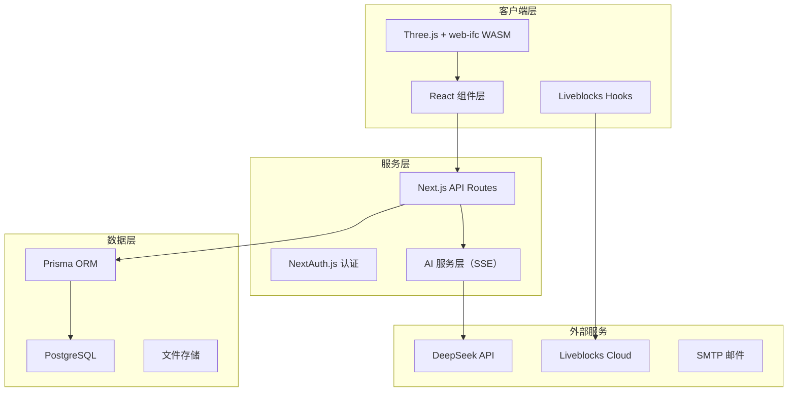
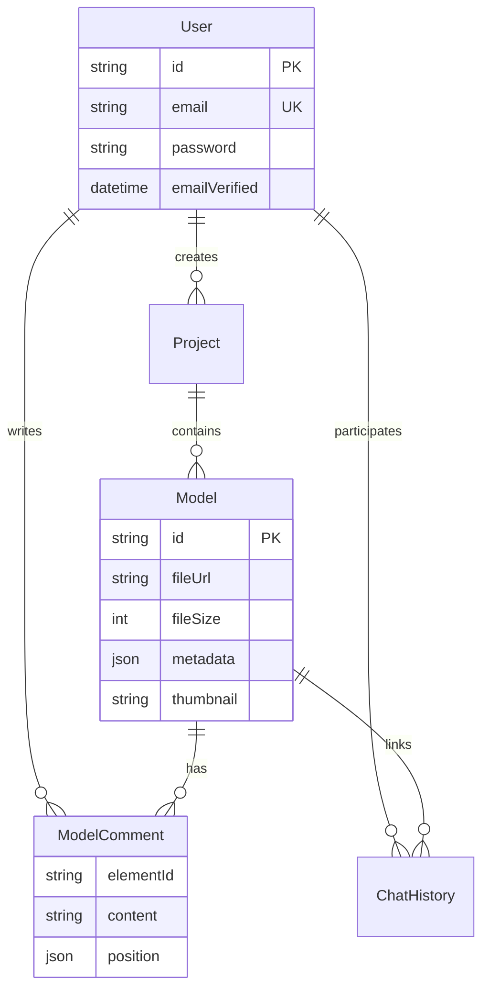
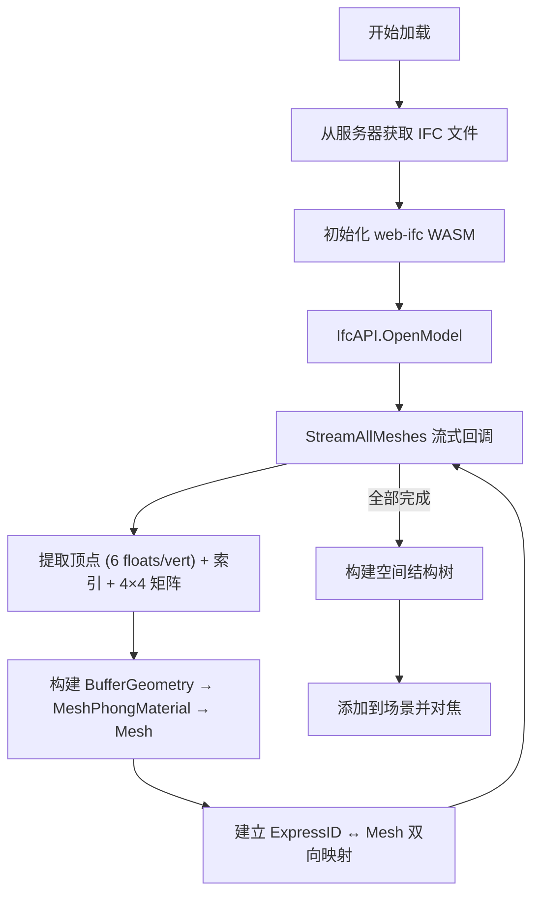
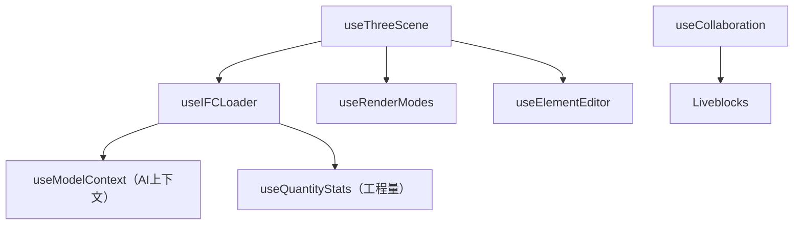
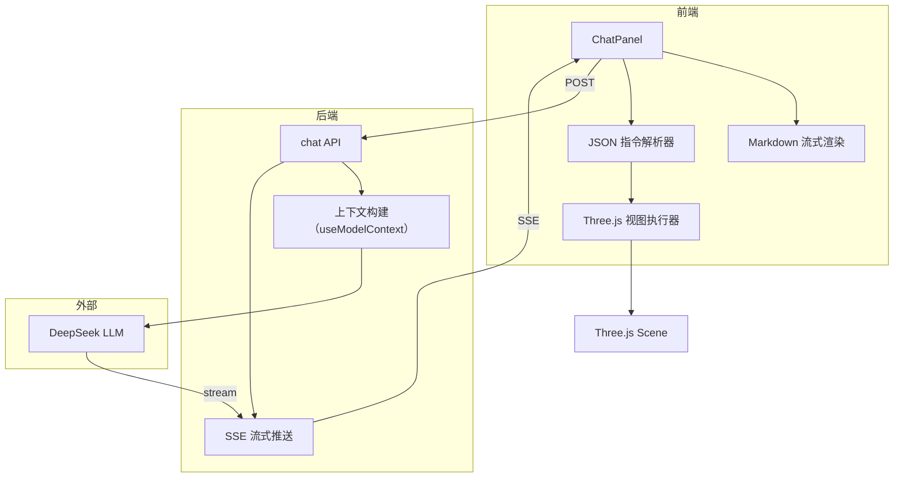
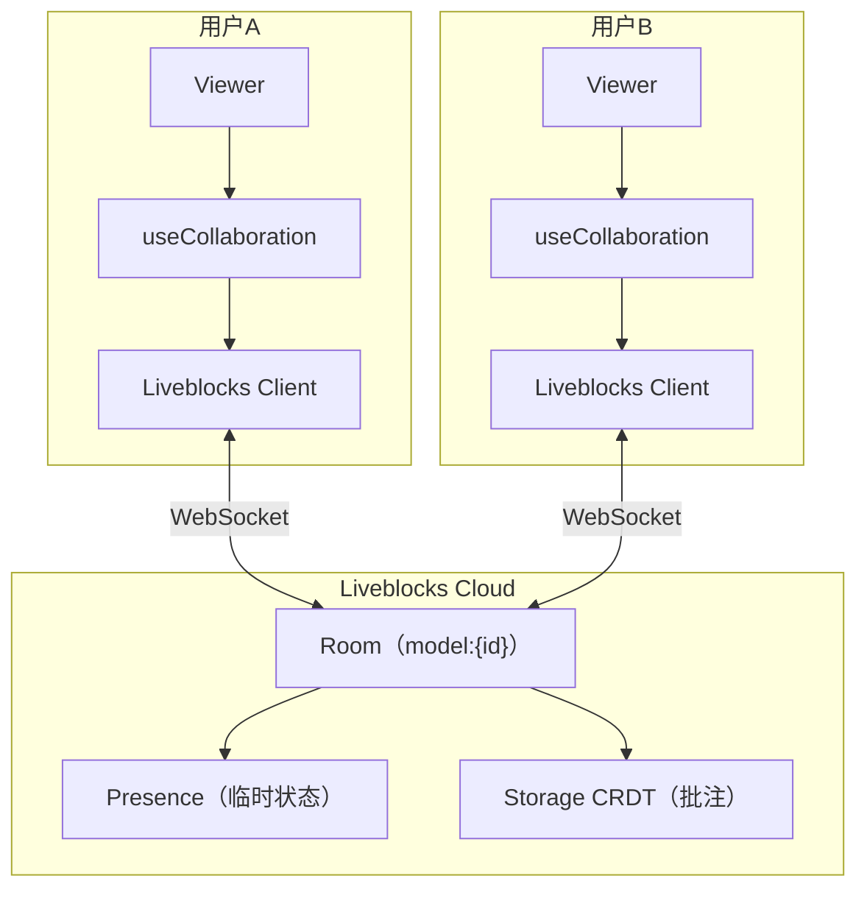

---
layout: Bg
---

<div class="font-serif text-center text-4xl mt-10">
    基于 Web 的 IFC 建筑信息模型<br>智能协作平台的设计与实现
</div>


<!--
各位评审老师好，我是XXX。今天我汇报的毕业设计题目是《基于 Web 的 IFC 建筑信息模型智能协作平台的设计与实现》。

这个课题的出发点很简单——随着建筑信息模型，也就是 BIM，在国内工程领域的快速渗透，行业对轻量化、可协作的 BIM 数据访问手段需求越来越迫切。但传统的桌面 BIM 工具在跨终端使用、多方实时沟通、数据智能解读这三个方面都存在明显短板。我想做的事情，就是把 BIM 模型从沉重的桌面软件里"解放"出来，让它跑在浏览器里，加上 AI 和实时协作，变成一个开箱即用的工具。

接下来我将从八个部分汇报我的工作，大约需要十分钟时间，最后恳请各位老师批评指正。
-->

---

## 目录

<br>

<v-click>

#### 01 研究背景与意义

</v-click>

<v-click>

#### 02 系统总体设计

</v-click>

<v-click>

#### 03 IFC 三维可视化模块

</v-click>

<v-click>

#### 04 AI 智能分析模块

</v-click>

<v-click>

#### 05 实时多人协作模块

</v-click>

<v-click>

#### 06 工程量统计与数据分析

</v-click>

<v-click>

#### 07 系统测试与性能评估

</v-click>

<v-click>

#### 08 总结与展望

</v-click>

<!--
本次汇报共分为八个部分：

第一部分，我将介绍选题的研究背景与意义，说明为什么现在是把 BIM 搬到浏览器的合适时机；

第二部分是系统总体设计，包括技术架构、技术选型和数据库建模；

第三到第五部分是整个系统的三大核心模块：IFC 三维可视化、AI 智能分析、以及实时多人协作，也是本课题的主要创新点；

第六部分介绍配套的工程量统计与数据分析功能；

第七部分给出完整的系统测试与性能评估数据，并和同类平台做横向对比；

最后第八部分是工作总结与后续展望。
-->

---

## 1. 研究背景与意义

<br>

<v-click>

#### BIM 技术的快速普及

- 全球 BIM 渗透率：2012 年 **36%** → 2022 年 **73%**
- 住建部《智能建造指导意见》：2025 年 BIM 应用比例达 **90%** 以上
- IFC（ISO 16739）是 BIM 数据互通的"通用语言"

</v-click>

<br>

<v-click>

#### 传统桌面 BIM 工具的痛点

- **客户端过重**：独立显卡、16 GB 内存，仅限 Windows
- **协作靠文件搬运**：邮件传 IFC 文件，版本混乱
- **智能辅助空白**：无法回答自然语言提问
- **学习曲线陡峭**：非专业人员门槛高

</v-click>

<!--
先看研究背景。根据 McGraw Hill Construction 的调查数据，全球 BIM 渗透率从 2012 年的 36% 已经攀升到 2022 年的 73%；国内层面，住建部在 2020 年印发的《智能建造与建筑工业化协同发展指导意见》中明确提出，到 2025 年 BIM 应用比例要达到 90% 以上。可以说 BIM 已经从"要不要用"变成了"必须用"。

而在众多 BIM 数据格式中，IFC——也就是 ISO 16739 标准定义的开放格式——扮演着通用语言的角色，是不同 BIM 软件之间数据互通的主要桥梁。

但在实际使用中，以 Autodesk Revit、Bentley、Graphisoft ArchiCAD 为代表的主流桌面 BIM 工具，暴露出四个突出痛点：

第一是客户端过重，普遍需要独立显卡、16 GB 以上内存，而且几乎全部锁定 Windows 平台。项目经理在工地上用平板，业主在会议室用 MacBook，都打不开模型。

第二是协作完全依赖文件搬运，团队成员通过邮件、网盘来回传递 IFC 文件，版本混乱非常常见，即使同时讨论同一面墙，也只能各看各的副本。

第三是智能辅助几乎空白，Revit 能帮你建模，但它回答不了"这栋楼有多少扇防火门""走廊宽度是否达标"这类自然语言问题。

第四是学习曲线陡峭，这些工具对建筑师友好，但对业主、造价、运维人员不够直觉，门槛很高。
-->

---

## 1. 研究背景与意义

<br>

<v-click>

#### Web 端技术拐点

- **WebGL 2.0** 全面普及，浏览器具备重度 3D 渲染能力
- **web-ifc**：将 C++ IFC 解析器编译为 **WebAssembly**，浏览器直接解析 .ifc 文件
- **DeepSeek / GPT-4** 等大语言模型跨越工程语义门槛
- **Liveblocks**：为三维协作提供实时同步基础设施

</v-click>

<br>

<v-click>

#### 本文目标

> 打开浏览器就能完成**模型查看、AI 问答、多人协同批注和工程量分析**
> ——不装软件、不传文件、不设门槛

</v-click>

<!--
正好近几年 Web 端的技术演进，让"浏览器做不了重度 3D"的刻板印象已经不成立了。我梳理了四个关键的技术拐点：

第一，WebGL 2.0 已经被主流浏览器全面支持，Three.js 把底层复杂性封装成了易用的场景图抽象。

第二，也是最关键的一点，That Open Company 的 web-ifc 项目把 C++ 编写的 IFC 解析器编译成了 WebAssembly 模块，浏览器可以跳过服务器，直接读取和解析 .ifc 文件。

第三，DeepSeek、GPT-4 这样的大语言模型，已经能跨越工程领域的语义门槛，为"对建筑模型进行自然语言交互"打开了全新的窗口。

第四，Liveblocks 这类实时协作基础设施，为三维场景的多人同步提供了现成的 Presence 和 Storage 原语。

正是在这四个拐点的交汇上，我提出了本文的目标：让用户打开浏览器，就能完成模型查看、AI 问答、多人协同批注和工程量分析——不装软件、不传文件、不设门槛。
-->

---

## 1. 国内外研究现状

<br>

<div style="position:absolute;left:80px;top:130px;">

<v-click>

**Web 端 BIM 可视化**
- BIMServer：Java 后端解析，工程化程度有限
- IFC.js / @thatopen：API 耦合重，嵌入已有项目成本高
- Xeokit：大模型流式加载好，但**商业许可**
- 广联达 BIMFace：闭源付费，难以二次开发

</v-click>

</div>

<div style="position:absolute;left:520px;top:130px;">

<v-click>

**AI × BIM 交叉**
- CNN 做施工进度影像识别
- 传统 NLP 解析规范条款
- GPT 接入 IFC 问答（多停留在 demo）
- **工程落地成果极少**

</v-click>

<br>

<v-click>

**实时协作**
- Google Docs / Figma：文档/设计级
- Speckle：协作粒度在模型**版本**级
- 缺少**构件级三维实时**协作方案

</v-click>

</div>

<!--
国内外相关研究我从三个角度做了梳理。

在 Web 端 BIM 可视化方向：BIMServer 是最早的开源 BIM 服务器，但前端工程化程度长期有限；IFC.js，也就是现在的 @thatopen components，提供了完整的 TypeScript 组件库，但 API 耦合度偏重，嵌入已有项目适配成本大；Xeokit 在大模型流式加载方面做得很好，但核心模块是商业许可；国内的广联达 BIMFace、品茗 HiBIM 等商业平台提供了 Web 端预览，但都是闭源付费，难以做二次开发。

在 AI 和 BIM 的交叉方向：有学者用 CNN 做施工进度影像识别，有人用传统 NLP 做建筑规范的结构化解析，也有一些用 GPT 接入 IFC 数据做问答。但大多数工作还停留在 Jupyter Notebook 的概念验证阶段，真正工程化落地的成果非常少，尤其是"让 AI 反过来操控三维视图"这件事，公开文献几乎没有成熟实践。

在实时协作方向：Google Docs、Figma 这类文档/设计级协作已经非常成熟，但三维 BIM 场景的协作复杂得多；业内知名度较高的 Speckle 框架，协作粒度定位在模型"版本"级，不能做到构件级的实时交互。

因此，一个同时具备轻量化渲染、AI 智能分析、构件级实时协作的 Web BIM 平台，在已有的研究和产品中是缺位的。
-->

---

## 1. 本文主要工作

<br>

<v-clicks>

- **全栈平台搭建**：Next.js 16 App Router，覆盖用户认证、项目管理、文件存储完整后端链路

- **高性能三维可视化**：web-ifc WASM 流式解析 + Three.js 渲染，6 种渲染模式（真实感、线框、X光、SSAO、描边、热力图）

- **AI Agent 管线**：上下文注入 → 流式对话 → 结构化指令解析 → 三维视图执行；配套中国建筑规范合规检查 DSL

- **三维场景级实时协作**：基于 Liveblocks，实现世界坐标光标同步、构件选择广播、CRDT 批注共享，延迟 < 250 ms

- **完整工具链**：工程量统计、造价估算、Excel 报表、性能监控、构件编辑（IFC 回写）、GLTF / OBJ / IFC 三格式导出

</v-clicks>

<!--
基于前面的分析，我的主要工作可以归纳为五个方面：

第一，基于 Next.js 16 App Router 搭建了一个完整的全栈平台，覆盖用户注册认证、项目组织、模型存储与元数据管理的完整后端能力。

第二，在浏览器端构建了一套高性能的 IFC 三维可视化引擎——通过 web-ifc WASM 模块实现流式几何解析，搭配 Three.js 完成渲染、拾取、剖切，并实现了六种高级渲染模式：真实感、线框、X光、SSAO、描边和热力图。

第三，将 DeepSeek 大语言模型深度集成，设计了一套"上下文注入 → 流式对话 → 结构化指令解析 → 三维视图执行"的 AI Agent 管线，并配套了面向中国建筑规范的合规检查 DSL 引擎。

第四，基于 Liveblocks 落地了三维场景级别的多人实时协作，包括远程光标的世界坐标同步、构件选择广播和批注共享，同步延迟稳定控制在 250 毫秒以内。

第五，提供了覆盖工程量统计、造价估算、Excel 报表导出、性能实时监控、构件编辑（含 IFC 回写算法）以及 GLTF、OBJ、IFC 三种格式导出的完整工具链。

下面我逐模块展开介绍实现细节。
-->

---

## 2. 系统总体架构

<br>

<v-click>


```mermaid
graph TB
    subgraph "客户端层"
        A["React 组件层"]
        B["Three.js + web-ifc WASM"]
        C["Liveblocks Hooks"]
    end
    subgraph "服务层"
        D["Next.js API Routes"]
        E["NextAuth.js 认证"]
        F["AI 服务层（SSE）"]
    end
    subgraph "数据层"
        G["PostgreSQL"]
        H["Prisma ORM"]
        I["文件存储"]
    end
    subgraph "外部服务"
        J["DeepSeek API"]
        K["Liveblocks Cloud"]
        L["SMTP 邮件"]
    end
    A --> D
    B --> A
    C --> K
    D --> F
    F --> J
    D --> H
    H --> G
```

</v-click>

<!--
这张图是系统的总体架构。平台采用 Next.js 16 前后端一体化架构，整体分为四个层次：

最上层是客户端层，包括 React 组件层负责页面和交互，Three.js 加上 web-ifc WASM 模块负责三维渲染和 IFC 解析，Liveblocks Hooks 负责实时协作状态管理。

中间是服务层，Next.js 的 API Routes 提供 RESTful 接口，NextAuth.js 负责身份认证，AI 服务层封装了与大语言模型的 SSE 流式通信。

数据层使用 PostgreSQL 作为持久化存储，Prisma ORM 提供类型安全的数据操作，文件存储支持本地文件系统和 Supabase 两种方案。

最下面是外部服务，包括 DeepSeek 大语言模型 API、Liveblocks 协作云，以及用于邮箱验证的 SMTP 服务。

这里选 Next.js 全栈框架的好处是，前后端共享同一套 TypeScript 类型定义，接口契约的维护成本非常低。
-->

---

## 2. 技术选型

<br>

<v-click>

<div style="display:grid;grid-template-columns:1fr 1fr;gap:24px;margin-top:8px;">

<div>

| 层 | 技术 | 版本 |
|----|------|------|
| 框架 | Next.js | 16.1.7 |
| UI | React | 19.2.3 |
| 语言 | TypeScript | 5.x |
| 样式 | Tailwind CSS | 4.x |
| 三维 | Three.js | 0.183.2 |
| IFC | web-ifc | 0.0.77 |

</div>

<div>

| 层 | 技术 | 版本 |
|----|------|------|
| 数据库 | PostgreSQL | 16 |
| ORM | Prisma | 7.5.0 |
| 认证 | NextAuth.js | 5.0-beta |
| 协作 | Liveblocks | 3.15.5 |
| AI | DeepSeek API | — |
| 图表 | Recharts | 3.8.0 |

</div>

</div>

</v-click>

<!--
这是完整的技术选型表。我在选型时坚持了三个原则：一是选择社区活跃度高的主流技术栈，方便长期维护；二是优先考虑 TypeScript 原生支持，保证端到端类型安全；三是尽量使用托管服务，降低部署运维复杂度。

具体来说，前端 Next.js 16 的 App Router 架构让我可以用 React Server Components 做默认服务端渲染，客户端交互部分用 use client 标记；Three.js 版本是 0.183，web-ifc 版本是 0.0.77，这两个是三维能力的核心；数据库侧用 Prisma 7.5 搭配 PostgreSQL 16；协作用 Liveblocks 3.15；AI 对接 DeepSeek，图表用 Recharts。

全栈都是 TypeScript 严格模式，从数据库 schema 到前端组件都能做编译期类型检查。
-->

---

## 2. 数据库设计

<v-click>

<div class="fixed bottom-(-2) left-70">


```mermaid {scale: 0.50}
erDiagram
    User ||--o{ Project : creates
    User ||--o{ ModelComment : writes
    User ||--o{ ChatHistory : participates
    Project ||--o{ Model : contains
    Model ||--o{ ModelComment : has
    Model ||--o{ ChatHistory : links

    User {
        string id PK
        string email UK
        string password
        datetime emailVerified
    }
    Model {
        string id PK
        string fileUrl
        int fileSize
        json metadata
        string thumbnail
    }
    ModelComment {
        string elementId
        string content
        json position
    }
```

</div>

</v-click>

<!--
数据库基于 PostgreSQL，通过 Prisma Schema 定义，核心包含六个实体：

User 表存储用户信息，password 字段是 bcrypt 哈希值，emailVerified 用来标记邮箱是否已验证，还有一个 pendingEmail 字段处理邮箱变更的过渡态。

Project 是模型的组织容器，每个用户可以创建多个项目。

Model 表存储上传的 IFC 文件记录，fileUrl 指向文件存储路径，metadata 是 JSON 字段，存放解析后的构件计数、楼层信息等元数据，thumbnail 存 Base64 编码的缩略图。

ModelComment 是协作批注表，这里有两个特殊字段：elementId 关联到 IFC 构件的 ExpressID，position 用 JSON 记录批注在三维空间的 XYZ 坐标——这是支持"批注钉在某个构件的某个位置上"的关键。

ChatHistory 通过 role 字段区分是用户消息还是 AI 回复；ViewHistory 记录用户的查看、批注、对话、导出等四类操作。

整体的关系非常清晰：一个用户拥有多个项目，一个项目包含多个模型，每个模型关联批注和对话记录。
-->


---

## 注册登录CRUD

<div class="flex justify-center mt-4">

<SlidevVideo v-click autoplay="once" controls autoreset="slide" class="rounded-lg max-h-[420px]">
  <source src="/a1.mp4" type="video/mp4" />
  <p>您的浏览器不支持视频播放，可<a href="/a1.mp4">点此下载</a>。</p>
</SlidevVideo>

</div>

<!--
这是第一段功能演示视频，请老师们观看实际运行效果。
-->

---

## 3. IFC 三维可视化 — 加载流程

<v-click>

<div class="fixed bottom-(-2) left-80">


```mermaid {scale: 0.60}
flowchart TD
    A["开始加载"] --> B["从服务器获取 IFC 文件"]
    B --> C["初始化 web-ifc WASM"]
    C --> D["IfcAPI.OpenModel"]
    D --> E["StreamAllMeshes 流式回调"]
    E --> F["提取顶点 (6 floats/vert) + 索引 + 4×4 矩阵"]
    F --> G["构建 BufferGeometry → MeshPhongMaterial → Mesh"]
    G --> H["建立 ExpressID ↔ Mesh 双向映射"]
    H --> E
    E -->|"全部完成"| I["构建空间结构树"]
    I --> J["添加到场景并对焦"]
```

</div>

</v-click>

<v-click>

<div class="w-1/2">

> **流式接口是性能关键** — 避免一次性将所有几何体载入内存，
<br>中型模型 ~4.2 秒完成加载


</div>

</v-click>

<!--
接下来进入三大核心模块的第一个——IFC 三维可视化。

这张流程图展示了从用户点击"打开模型"到三维画面呈现的完整链路。整个过程是：前端先从服务器获取 IFC 文件，初始化 web-ifc 的 WebAssembly 模块，然后调用 IfcAPI.OpenModel 打开模型。

性能最关键的是接下来的 StreamAllMeshes 流式回调——它以回调形式逐个返回每一个几何体，每次回调里我提取顶点数据（这里顶点是按 position 加 normal 交错排列的，每个顶点占 6 个 float）、三角面索引和 4×4 变换矩阵，然后组装成 Three.js 的 BufferGeometry，搭配 MeshPhongMaterial 生成 Mesh。

同时我会维护两张映射表：ExpressID 到 Mesh，以及 Mesh 到 ExpressID 数组。这两张映射表是后续所有交互的基础——比如鼠标点击要反查构件 ID，AI 指令要按 ID 高亮构件，都走这里。

所有几何体流式加载完成后，再从 IFC 关系对象中递归构建空间结构树：从 IfcProject 一路到 IfcSite、IfcBuilding、IfcBuildingStorey，再到具体构件。最后把场景加入渲染循环，对焦到包围盒中心。

这套流程的代码主体封装在 useIFCLoader Hook 里，大约 630 行。流式接口是整个加载过程的性能命脉——它避免了一次性把所有几何体堆进内存的峰值压力。实测一个 5.8 MB 的中型办公楼模型，大约 4.2 秒就能加载完。
-->

---

## 3. IFC 三维可视化 — 渲染引擎

<br>

<v-click>

#### 9 个自定义 Hook（约 2800 行 TypeScript）


```mermaid
graph TD
    A["useThreeScene"] --> B["useIFCLoader"]
    A --> C["useRenderModes"]
    A --> D["useElementEditor"]
    B --> E["useModelContext（AI上下文）"]
    B --> F["useQuantityStats（工程量）"]
    H["useCollaboration"] --> I["Liveblocks"]
```

</v-click>


<v-click>

#### 核心交互

- **Raycasting 构件拾取**：屏幕坐标 → NDC → 射线求交 → ExpressID → 属性面板
- **高亮效果**：克隆半透明叠加网格（`#22e1ff`，透明度 0.6）
- **剖切面**：`ClippingPlane(0,-1,0,constant)` 动态调节高度
- **预设视角**：顶视 / 前视 / 等轴测三键切换

</v-click>

<!--
在 Three.js 渲染引擎的封装上，我把所有三维逻辑拆成了 9 个自定义 React Hook，合计大约 2800 行 TypeScript 代码。

这种架构有三个好处：关注点分离，每个 Hook 只管自己那摊事；可复用性好，某个 Hook 可以脱离当前页面单独用；状态隔离，各 Hook 内部的 useState 和 useRef 互不干扰。

这张图展示了它们的依赖关系：useThreeScene 是场景根基，useIFCLoader 负责加载，useRenderModes 负责渲染模式切换，useElementEditor 负责构件编辑；基于 IFC 加载结果派生出 useModelContext 给 AI 用，useQuantityStats 做工程量统计；useCollaboration 则独立对接 Liveblocks。

在交互上有四个核心能力：

第一是 Raycasting 构件拾取——用户点击画布时，先把屏幕坐标归一化到 NDC 空间，再从相机发出射线做场景求交，命中的 Mesh 反查出 ExpressID，调用 web-ifc 的 GetLine 接口拉取完整属性，最后更新右侧属性面板。

第二是高亮效果，不是直接改原材质，而是克隆一个半透明叠加网格，青色 #22e1ff，透明度 0.6，盖在原构件上——这样取消选择时直接移除叠加网格即可，零副作用。

第三是剖切面，用 Three.js 的 ClippingPlane，法线朝 -Y 方向，滑动条实时调节 constant 值就能暴露建筑内部。

第四是预设视角，顶视、前视、等轴测三个快捷按钮，一键切换。
-->

---

## 3. IFC 三维可视化 — 六种渲染模式

<br>

<v-click>

| 模式 | 技术实现 | 典型用途 |
|------|---------|---------|
| Realistic | Phong 光照 + ACES 色调映射 | 日常浏览 |
| Wireframe | `material.wireframe = true` | 结构分析 |
| X-Ray | `transparent + opacity 0.15` | 透视内部 |
| SSAO | SSAOPass（后处理）kernelRadius=8 | 强化层次感 |
| Edge | Sobel 3×3 卷积描边 Shader | 图纸风格 |
| Heatmap | 属性值 → 蓝→青→绿→黄→红色阶 | 数据分析 |

</v-click>

<v-click>

**后处理管线**：RenderPass → SSAOPass → EdgePass → SectionFillPass → FXAAPass → OutputPass

> 每种模式仅激活对应 Pass，其余保持 `disabled`

</v-click>

<!--
在基础渲染之上，我还实现了六种高级渲染模式，全部封装在 useRenderModes 这个 Hook 里，大约 376 行代码。切换模式时先缓存当前所有网格的原始材质，按目标模式修改或替换，退出时自动恢复缓存——保证模式之间切换干净无残留。

具体六种模式是：

Realistic 真实感，使用 Phong 光照加 ACES 色调映射，适合日常浏览；
Wireframe 线框，直接把 material.wireframe 置为 true，适合看结构；
X-Ray 透视，所有材质开启透明，opacity 设为 0.15，能看到建筑内部；
SSAO 是屏幕空间环境光遮蔽，用 Three.js 自带的 SSAOPass，kernelRadius 设 8，在凹角和缝隙处渲染柔和暗影，层次感大幅提升；
Edge 是 Sobel 描边，我自己写了一个 Fragment Shader，对画面做 3×3 卷积提取亮度梯度，生成类似工程图纸的线稿；
Heatmap 热力图，按构件属性值（面积、造价或体积）归一化后映射到蓝→青→绿→黄→红五段色阶，用色彩直观表达数据分布。

这些效果串在一条后处理管线上：RenderPass → SSAOPass → EdgePass → SectionFillPass → FXAAPass → OutputPass，每种模式只激活自己需要的 Pass，其余保持 disabled，性能和灵活性都很好。
-->


---

## 6种不同渲染模式

<div class="flex justify-center mt-4">

<SlidevVideo v-click autoplay="once" controls autoreset="slide" class="rounded-lg max-h-[420px]">
  <source src="/a2.mp4" type="video/mp4" />
  <p>您的浏览器不支持视频播放，可<a href="/a2.mp4">点此下载</a>。</p>
</SlidevVideo>

</div>

<!--
这是第二段功能演示视频。
-->

---

## 4. AI 智能分析 — 系统架构

<v-click>

<div style="margin-top:-20px;">


```mermaid {scale: 0.6}
graph TB
    subgraph "前端"
        A["ChatPanel"] --> B["Markdown 流式渲染"]
        A --> C["JSON 指令解析器"]
        C --> D["Three.js 视图执行器"]
    end
    subgraph "后端"
        E["chat API"] --> F["上下文构建（useModelContext）"]
        E --> G["SSE 流式推送"]
    end
    subgraph "外部"
        H["DeepSeek LLM"]
    end
    A -->|POST| E
    F --> H
    H -->|stream| G
    G -->|SSE| A
    D --> I["Three.js Scene"]
```

</div>

</v-click>

<!--
第二个核心模块是 AI 智能分析，这也是我认为课题里最有意思的部分。

AI 模块按三层组织：前端、后端、外部大模型。

前端的 ChatPanel 组件负责消息收发，拿到完整回复后一边走 Markdown 流式渲染，一边交给 JSON 指令解析器扫描动作块——如果检测到 JSON，就把指令分发到 Three.js 视图执行器，直接操控三维场景。

后端的 chat API 有两个核心职责：一是上下文构建，从 useModelContext 拉取模型结构化摘要，注入系统提示词；二是用 ReadableStream 把 DeepSeek 的流式响应以 SSE 协议推回前端。

DeepSeek 在这里扮演的是大脑角色，接收带有完整模型上下文和对话历史的请求，流式返回带结构化指令的回复。

这样就形成了一个闭环：用户说一句自然语言——后端带上模型上下文问 DeepSeek——DeepSeek 流式吐字 + 附带 JSON 指令——前端边渲染边解析——指令自动操控三维视图。

为了让用户的主观等待感降低，我采用 SSE 流式传输，首个 token 到达时就开始渲染，打字机效果非常丝滑。
-->

---

## 4. AI 智能分析 — 自然语言指令

<br>

<v-click>

#### AI 响应中附带的 7 种结构化指令

| 指令 | 自然语言示例 | 执行效果 |
|------|-------------|---------|
| `highlightByType` | "高亮所有墙体" | 该类型构件变亮 |
| `setView` | "俯视看一下" | 相机跳到预设位置 |
| `toggleWireframe` | "打开线框" | 线框渲染 |
| `toggleXRay` | "X光模式" | 半透明 |
| `toggleClipping` | "剖开看内部" | 开启剖切 |
| `highlightElement` | "156号构件亮起来" | 单构件高亮 |
| `resetView` | "恢复默认" | 重置视图 |

</v-click>

<br>

<v-click>

**闭环**：自然语言 → 语义理解 → 结构化 JSON → 三维操控

</v-click>

<!--
AI 不仅仅是聊天工具，它还能反过来"操控"三维视图。

这是我设计的一个轻量级 AI Agent 模式——系统提示词里明确告诉模型："在回复末尾附带 JSON 指令块"，模型就会把自然语言意图翻译成结构化指令。前端用正则抽取 JSON，JSON.parse 后遍历 actions 数组分发执行。

目前支持 7 种指令：

highlightByType 按 IFC 类型批量高亮，比如用户说"把所有墙体亮起来"；
setView 切换预设视角，支持 top、front、iso 三种；
toggleWireframe、toggleXRay、toggleClipping 分别控制三种渲染状态；
highlightElement 按 ExpressID 单构件高亮，用户说"156 号构件亮一下"就触发；
resetView 重置到初始视角。

这样就实现了完整的闭环：自然语言 → AI 做语义理解 → 输出结构化 JSON → 前端解析并操控三维视图。

用户的体验是，他既可以问"这栋楼有多少扇门"得到文字回答，也可以说"俯视看一下并把墙体高亮"直接得到视觉反馈。这在我调研过的公开文献里，是非常少见的工程化落地实现。
-->


---

## 自然语言指令

<div class="flex justify-center mt-4">

<SlidevVideo v-click autoplay="once" controls autoreset="slide" class="rounded-lg max-h-[420px]">
  <source src="/a3.mp4" type="video/mp4" />
  <p>您的浏览器不支持视频播放，可<a href="/a3.mp4">点此下载</a>。</p>
</SlidevVideo>

</div>

<!--
这是第三段功能演示视频。
-->

---

## 4. AI 智能分析 — 合规检查 DSL

<br>

<v-click>

#### 声明式规则语法

```
IFCType.property  operator  value  unit
```

示例：
```
IfcDoor.height >= 2100 mm
IfcStairFlight.riserHeight <= 175 mm
IfcWall.fireRating exists
```

</v-click>

<!--
除了对话问答，AI 模块还集成了一个合规性检查引擎。

合规检查的核心是一套声明式规则 DSL，语法非常简单：IFC 类型点属性名，加上运算符、数值和单位。

比如 IfcDoor.height >= 2100 mm 表示"门的高度必须大于等于 2100 毫米"；
IfcStairFlight.riserHeight <= 175 mm 表示"踏步高度不能超过 175 毫米"；
IfcWall.fireRating exists 表示"墙体必须定义防火等级"。

这套 DSL 支持 9 种构件类型、10 种属性、8 种运算符和 5 种单位。引擎在执行时会遍历模型所有构件，对类型匹配的构件提取属性值——先查直接属性，找不到再深入 IfcRelDefinesByProperties 关联的属性集——做单位转换后执行比较，不合规的构件生成违规记录，最后汇总报告并在三维场景中把违规构件标红高亮。
-->

---

<v-click>

#### 9 条内置规则（依据中国建筑规范）

| 规则 | DSL | 规范依据 |
|------|-----|---------|
| 入户门最小高度 | `IfcDoor.height >= 2000 mm` | GB 50096 |
| 踏步最大高度 | `IfcStairFlight.riserHeight <= 175 mm` | GB 50352 |
| 最低层高 | `IfcSpace.height >= 2400 mm` | GB 50096 |
| 墙体防火等级 | `IfcWall.fireRating exists` | GB 50016 |

</v-click>

<v-click>

> 用户还可以用自然语言描述规范，AI 自动生成 DSL 规则并导入执行

</v-click>

<!--
系统预置了 9 条依据中国现行建筑规范的检查规则，覆盖了常见的设计合规点。

这里列了其中最重要的四条：入户门最小高度，依据 GB 50096 住宅设计规范；踏步最大高度，依据 GB 50352 民用建筑通用规范；最低层高，也是 GB 50096；墙体防火等级，依据 GB 50016 建筑设计防火规范。

更有意思的是——用户可以直接用自然语言描述新规范，比如"所有消防门必须大于 2100 毫米"，系统会把这段描述发给 DeepSeek 的 compliance 接口，AI 根据专用提示词生成符合 DSL 语法的规则 JSON，直接导入规则集执行。

这样合规检查就从"写死的硬规则"变成了"可以动态扩展的规则库"，大大提高了实用价值。
-->


---

## DSL规则检测

<div class="flex justify-center mt-4">

<SlidevVideo v-click autoplay="once" controls autoreset="slide" class="rounded-lg max-h-[420px]">
  <source src="/a4.mp4" type="video/mp4" />
  <p>您的浏览器不支持视频播放，可<a href="/a4.mp4">点此下载</a>。</p>
</SlidevVideo>

</div>

<!--
这是第四段功能演示视频。
-->


---

## 5. 实时多人协作 — 架构

<div class="fixed left-60">

<v-click>


```mermaid {scale: 0.8}
graph TB
    subgraph "用户A"
        A1["Viewer"] --> A2["useCollaboration"]
        A2 --> A3["Liveblocks Client"]
    end
    subgraph "用户B"
        B1["Viewer"] --> B2["useCollaboration"]
        B2 --> B3["Liveblocks Client"]
    end
    subgraph "Liveblocks Cloud"
        C1["Room（model:{id}）"]
        C2["Presence（临时状态）"]
        C3["Storage CRDT（批注）"]
    end
    A3 <-->|WebSocket| C1
    B3 <-->|WebSocket| C1
    C1 --> C2
    C1 --> C3
```

</v-click>

</div>

<!--
第三个核心模块是实时多人协作。

三维 BIM 协作比文档协作棘手很多——光标不再是二维屏幕坐标，而要映射到三维空间；选中对象不再是一段文字，而是带 ExpressID 的构件。我是基于 Liveblocks 这个协作基础设施来解决这些三维特有的同步难题。

架构很清晰：每个模型查看器对应一个 Liveblocks Room，Room ID 的格式是 "model:" 加上模型 ID。用户进入页面时自动加入房间，离开时自动退出。

Room 下面挂了三层原语：
Presence 管理临时用户状态，比如光标位置、选中对象，用户一离线就自动清除；
Storage 承载持久化共享数据，底层是 CRDT，保证并发写入无冲突；
Broadcast 用于一次性事件通知。

所有用户的客户端通过 WebSocket 连到 Liveblocks Cloud，任何一方的状态变化都会广播给其他在线用户，做到毫秒级同步。
-->


---

## 5. 实时多人协作 — 三维光标与批注

<br>

<v-click>

#### 远程光标同步

- Presence 包含：屏幕坐标 (x, y) + **世界坐标** (worldX, worldY, worldZ) + 选中构件 ExpressID
- 鼠标移动时通过 Raycaster 求取射线与模型表面交点，把三维坐标一并广播
- 远程光标以 SVG 叠加层绘制，带颜色标签
- 若对方选中构件，本地为该构件创建带用户颜色的**半透明叠加网格**

</v-click>

<br>

<v-click>

#### 批注协作

- 批注存于 Liveblocks **Storage（CRDT LiveList）**，并发写入无冲突
- 每条批注含：作者信息 / 关联 ExpressID / 文本 / 三维坐标 / 时间戳
- 新增批注通过 **Broadcast** 即时通知所有在线用户
- 同步持久化到 PostgreSQL `ModelComment` 表

</v-click>

<!--
具体到实现细节，这一页展示的是协作模块最有特色的两个能力。

第一是远程光标同步。我在 Presence 数据里同时记录了屏幕坐标和三维世界坐标——鼠标移动时，除了记屏幕位置，还用 Raycaster 求射线与模型表面的交点，把交点的世界坐标一并广播。远程用户接收后，一方面用 SVG 叠加层画带颜色标签的光标图标，另一方面如果对方选中了某个构件，本地还会为该构件创建一个带对方颜色的半透明叠加网格——这样就能非常直观地看到"队友在看什么"。

第二是批注协作。批注数据存在 Liveblocks Storage 层的 LiveList 里，CRDT 保证并发写入不冲突。每条批注包含作者 ID、姓名、颜色、关联的 ExpressID、文本内容、三维空间坐标和时间戳。新增批注时一方面通过 Broadcast 事件即时通知所有在线用户，另一方面经 API 持久化到 PostgreSQL 的 ModelComment 表中，保证离线后再进来还能看到历史批注。

整套协作模块的同步延迟我后面会给出实测数据，基本都能控制在 250 毫秒以内。
-->


---

## 多人协作

<div class="flex justify-center mt-4">

<SlidevVideo v-click autoplay="once" controls autoreset="slide" class="rounded-lg max-h-[420px]">
  <source src="/a5.mp4" type="video/mp4" />
  <p>您的浏览器不支持视频播放，可<a href="/a5.mp4">点此下载</a>。</p>
</SlidevVideo>

</div>

<!--
这是第五段功能演示视频。
-->


---

## 5. 构件编辑与多格式导出

<br>

<v-click>

#### 6 类编辑操作（useElementEditor，966 行）

- 属性修改 / 平移·旋转·缩放变换 / 隐藏·显示 / 复制 / 删除 / **撤销**

</v-click>

<br>

<v-click>

#### IFC 回写（最大技术难点）

将 Three.js 网格变换同步回 IFC 数据：

1. 计算当前矩阵与原始矩阵的差异
2. 在 web-ifc 中创建新的 `IfcCartesianPoint`、`IfcDirection`、`IfcAxis2Placement3D`
3. 更新 `IfcLocalPlacement.RelativePlacement` 引用
4. 新实体 ExpressID 从 `GetMaxExpressID() + 1` 递增分配

</v-click>

<!--
除了浏览和协作，系统还支持在浏览器里直接编辑构件。

useElementEditor 是整个项目中最大的一个 Hook，966 行，提供了 6 类编辑操作：属性修改、平移旋转缩放变换、隐藏显示、复制、删除，以及完整的撤销功能——每一步操作都会记录到 modifications 数组里，撤销时回退到上一步的状态快照。

整个编辑系统最大的技术难点，是把 Three.js 层面的网格变换同步回 IFC 数据本身——这个过程我称为"IFC 回写"。

回写的算法是：

第一步，对比每个被修改构件的当前矩阵和原始矩阵，计算出差异；
第二步，在 web-ifc 内部创建新的 IfcCartesianPoint（笛卡尔点）、IfcDirection（方向）实体，组装成新的 IfcAxis2Placement3D（三维轴放置）；
第三步，更新该构件 IfcLocalPlacement 的 RelativePlacement 引用，指向新的轴放置实体；
第四步，新实体的 ExpressID 要从 GetMaxExpressID 加 1 开始递增分配，确保不与已有实体冲突。

这样改出来的 IFC 文件，用 Revit、ArchiCAD 等桌面工具打开，改动是完全保留并正确渲染的——这是整个编辑功能价值的体现。
-->

---

<v-click>

#### 三种导出格式

| 格式 | 特点 |
|------|------|
| **glTF (.glb)** | Web 3D 标准，体积最小 |
| **OBJ (.obj)** | 通用网格，兼容性广 |
| **IFC (.ifc)** | 保留完整 BIM 语义信息 |

</v-click>

<!--
编辑完之后，平台支持三种格式的导出。

glTF 也就是 .glb，是 Web 3D 的事实标准，体积最小，适合放到其他 Web 可视化平台；

OBJ 是通用网格格式，兼容性最广，几乎所有 3D 软件都能打开；

最重要的是 IFC 导出——它保留了完整的 BIM 语义信息，包括构件类型、属性集、空间结构、材质等。IFC 导出前会自动执行变换同步和删除同步，导出后还会用一个临时 IfcAPI 实例重新解析一次文件，验证完整性。

这样三种格式一起，基本覆盖了从 Web 可视化到传统 BIM 工作流再到通用 3D 软件的全部下游需求。
-->

---

## 6. 工程量统计与数据可视化

<br>

<v-click>

#### 自动提取指标（useQuantityStats）

- 构件总数与楼层总数
- 按 IFC 类型降序排列的构件计数（饼图）
- 按楼层聚合的构件分布（柱状图）
- 包围盒尺寸、估算表面积（叉积法）和体积

</v-click>

<br>

<v-click>

#### 造价估算

- 用户填写每种构件单价 → 自动计算分项造价与总额
- Recharts 柱状图展示各类占比

</v-click>

<br>

<v-click>

#### Excel 报表导出（SheetJS）

> Sheet 1 模型概况 · Sheet 2 构件类型统计 · Sheet 3 楼层统计 · Sheet 4 造价明细

</v-click>

<!--
第六部分是工程量统计与数据分析，这是为造价和项目管理场景配套的工具链。

useQuantityStats 会从空间树、类型映射和 Three.js 几何体三个数据源自动提取指标：构件总数和楼层总数；按 IFC 类型降序排列的计数，用饼图展示；按楼层聚合的分布，用柱状图展示；还有包围盒尺寸、估算表面积和体积。表面积的算法是遍历所有 Mesh 的每个三角面，把三个顶点变换到世界坐标系后用向量叉积求面积，然后累加。

在这套基础数据之上还做了造价估算：用户在界面上填写每种构件的单价，系统自动计算分项造价和总额，并用柱状图展示各类占比——对造价人员是很直观的视图。

所有统计数据支持一键导出为多 Sheet 的 Excel 文件，底层用 SheetJS 生成 xlsx 二进制。一份报表里 Sheet 1 是模型概况，Sheet 2 是构件类型统计，Sheet 3 是楼层统计，Sheet 4 是造价明细，可以直接交付给业主或造价方。
-->

---

## 6. 性能监控

<br>

<v-click>

| 类别 | 指标 | 采集方式 |
|------|------|---------|
| 帧率 | 当前 / 均值 / 极值 FPS | rAF 计数（500ms 滑动窗口）|
| 加载 | 模型加载耗时 | `performance.now` |
| AI | 响应延迟（最近/平均）| 请求计时 |
| 渲染 | Draw Calls / 三角形数 | `renderer.info` |
| 内存 | JS 堆 / 几何体 / 纹理 | `performance.memory` |

</v-click>

<br>

<v-click>

- **FPS 趋势图**：维护 120 个样本滚动窗口，Recharts AreaChart 展示
- `usePerfTracker` + `useFPSMonitor` 两个 Hook 协作采集

</v-click>

<!--
性能监控模块是我在开发阶段自用、最后又开放给用户的一个小工具。

它采集五大类指标：

帧率这一组，用 requestAnimationFrame 计数，以 500 毫秒为滑动窗口算实时 FPS，另外维护 120 个样本的滚动窗口算均值和极值；

加载耗时用 performance.now 在加载开始和结束打点；

AI 响应延迟记最近 50 次的平均值；

渲染这一组直接从 Three.js 的 renderer.info 读 draw calls 和 triangles；

内存指标用浏览器的 performance.memory API 采 JS 堆、几何体内存、纹理内存三个数字。

整个性能面板把这些数字用仪表盘形式展示，FPS 区域还用 Recharts 的 AreaChart 画趋势图，可以直观看到性能波动。

背后是 usePerfTracker 和 useFPSMonitor 两个 Hook 协作完成采集。
-->


---

## 可视化统计与性能指标

<div class="flex justify-center mt-4">

<SlidevVideo v-click autoplay="once" controls autoreset="slide" class="rounded-lg max-h-[420px]">
  <source src="/a6.mp4" type="video/mp4" />
  <p>您的浏览器不支持视频播放，可<a href="/a6.mp4">点此下载</a>。</p>
</SlidevVideo>

</div>

<!--
这是第六段功能演示视频。
-->

---

## 7. 系统测试 — 加载性能

<br>

<v-click>

| 模型 | 文件大小 | 构件数 | 三角面数 | 加载耗时 | 内存峰值 |
|------|---------|--------|---------|---------|---------|
| 小型住宅 | 1.2 MB | ~200 | ~50K | ~1.5 s | ~80 MB |
| 中型办公楼 | 5.8 MB | ~800 | ~200K | ~4.2 s | ~180 MB |
| 大型综合体 | 15.3 MB | ~2500 | ~600K | ~12.8 s | ~420 MB |
| 超大型项目 | 35.6 MB | ~6000 | ~1.5M | ~28.5 s | ~850 MB |

</v-click>

<br>

<v-click>

- 加载耗时与文件大小大致呈**线性关系**
- **10 MB 以下**的文件 5 秒内完成加载，满足日常工程场景

</v-click>

<!-- 可插入 benchmark 加载时间折线图截图 -->

<!--
下面进入系统测试部分。

我准备了四种不同规模的 IFC 模型做加载性能测试，从 1.2 MB 的小型住宅到 35.6 MB 的超大型项目，构件数从 200 到 6000，三角面数从 5 万到 150 万。

实测数据可以看出几个规律：

第一，加载耗时和文件大小大致呈线性关系——小型 1.5 秒，中型 4.2 秒，大型 12.8 秒，超大型 28.5 秒。

第二，内存峰值也是线性增长，超大型模型会占用接近 850 MB，接近浏览器单 tab 的常规上限。

第三，10 MB 以下的文件基本都能在 5 秒内完成加载，这已经能够覆盖绝大多数日常工程场景——毕竟单栋楼或单个专业的 IFC 通常不会超过 10 MB。

超过 30 MB 的场景确实会有明显压力，这部分我在后面的展望里会提到后续优化方向。

注：这组数据是在配置独立显卡的环境下采集的，具体数值因硬件而异。
-->


---

## 性能测试

<div class="flex justify-center mt-4">

<SlidevVideo v-click autoplay="once" controls autoreset="slide" class="rounded-lg max-h-[420px]">
  <source src="/a7.mp4" type="video/mp4" />
  <p>您的浏览器不支持视频播放，可<a href="/a7.mp4">点此下载</a>。</p>
</SlidevVideo>

</div>

<!--
这是第七段功能演示视频。
-->


---

## 其他有趣功能

<div class="flex justify-center mt-4">

<SlidevVideo v-click autoplay="once" controls autoreset="slide" class="rounded-lg max-h-[420px]">
  <source src="/a8.mp4" type="video/mp4" />
  <p>您的浏览器不支持视频播放，可<a href="/a8.mp4">点此下载</a>。</p>
</SlidevVideo>

</div>

<!--
这是第八段功能演示视频。
-->

---

## 7. 系统测试 — 渲染帧率与 AI 延迟

<br>

<div style="position:absolute;left:60px;top:120px;width:420px;">

<v-click>

#### 渲染帧率（中型办公楼 5.8 MB）

| 模式 | 平均 FPS | 最低 FPS |
|------|---------|---------|
| Realistic | 58 | 45 |
| Wireframe | 62 | 50 |
| X-Ray | 55 | 42 |
| SSAO | 42 | 32 |
| Edge | 48 | 36 |
| Heatmap | 56 | 44 |

> 所有模式均 ≥ **30 FPS**

</v-click>

</div>

<div style="position:absolute;left:530px;top:120px;width:400px;">

<v-click>

#### AI 响应延迟

| 问题类型 | 首 token | 完整 |
|---------|---------|------|
| 简单查询 | ~0.8 s | ~2.1 s |
| 统计类 | ~1.0 s | ~3.5 s |
| 指令类 | ~0.9 s | ~2.8 s |
| 合规类 | ~1.2 s | ~4.2 s |

> SSE 流式传输显著降低主观等待感

</v-click>

</div>

<!--
左边是渲染帧率测试，以 5.8 MB 中型办公楼为测试对象，跑六种渲染模式：

Realistic 平均 58 FPS，Wireframe 62 FPS，X-Ray 55 FPS，SSAO 42 FPS，Edge 48 FPS，Heatmap 56 FPS。

所有模式都稳定保持在 30 FPS 以上——SSAO 因为要做屏幕空间的深度采样计算，帧率稍低，但 42 FPS 已经非常流畅。

右边是 AI 响应延迟。我按问题类型分了四组测试：

简单查询比如"这栋楼几层"，首 token 0.8 秒，完整回复 2.1 秒；
统计类比如"列出所有构件类型"，首 token 1 秒，完整 3.5 秒；
指令类比如"高亮墙体并俯视"，首 token 0.9 秒，完整 2.8 秒；
合规类最复杂，首 token 1.2 秒，完整 4.2 秒。

首 token 基本都在 1 秒左右——SSE 流式传输让用户在第一个字符到达时就开始阅读，主观感受到的等待时间远小于完整响应的生成耗时，这也是我坚持做流式传输的主要原因。
-->

---

## 7. 系统测试 — 协作延迟与兼容性

<br>

<div style="position:absolute;left:60px;top:120px;width:380px;">

<v-click>

#### 协作同步延迟（局域网）

| 操作 | 平均延迟 | 最大延迟 |
|------|---------|---------|
| 光标移动 | ~80 ms | ~150 ms |
| 构件选择 | ~100 ms | ~200 ms |
| 批注发送 | ~120 ms | ~250 ms |

> 全部 ≤ **250 ms**，体验流畅

</v-click>

</div>

<div style="position:absolute;left:510px;top:120px;width:430px;">

<v-click>

#### 浏览器兼容性

| 浏览器 | 三维 | AI | 协作 |
|--------|------|-----|------|
| Chrome 124+ | ✓ | ✓ | ✓ |
| Edge 124+ | ✓ | ✓ | ✓ |
| Firefox 126+ | ✓ | ✓ | ✓ |
| Safari 17+ | △ WASM 略慢 | ✓ | ✓ |

</v-click>

<br>

<v-click>

#### 功能测试

27 个测试用例，全部**通过** ✓

</v-click>

</div>

<!--
左边是协作同步延迟测试，两名用户在同一局域网内：

光标移动平均 80 毫秒，最大 150 毫秒；
构件选择平均 100 毫秒，最大 200 毫秒；
批注发送平均 120 毫秒，最大 250 毫秒。

全部控制在 250 毫秒以内——这个指标参考了实时协作领域的经验阈值，基本可以认为是"无感"的协作体验。

右上是浏览器兼容性测试，Chrome、Edge、Firefox 都完全支持；Safari 17+ 上 WASM 解析稍慢，但基本功能完整可用。

右下是功能测试汇总。我一共设计了 27 个测试用例，覆盖用户认证、文件上传、三维渲染、渲染模式切换、AI 对话、合规检查、实时协作、构件编辑、多格式导出和统计报表的全部核心路径，最终全部通过。
-->

---

## 7. 与同类平台对比

<br>

<v-click>

| 功能 | **本平台** | BIMServer | IFC.js | Xeokit | Speckle |
|------|-----------|-----------|--------|--------|---------|
| IFC 解析 + 浏览器渲染 | ✓ | ✓ | ✓ | ✓ | ✓ |
| 渲染模式（6种）| ✓ | — | 部分 | 部分 | — |
| SSAO 后处理 | ✓ | — | — | ✓ | — |
| 热力图 | ✓ | — | — | — | — |
| **AI 问答** | ✓ | — | — | — | — |
| **AI 指令驱动** | ✓ | — | — | — | — |
| 合规检查 | ✓ | 插件 | — | — | — |
| **实时多人协作** | ✓ | — | — | — | 版本级 |
| **远程 3D 光标** | ✓ | — | — | — | — |
| 构件编辑 + IFC 回写 | ✓ | — | — | — | — |
| 开源免费 | ✓ | ✓ | ✓ | 商业 | 部分 |

</v-click>

<v-click>

> 在 **AI 分析、实时协作、渲染模式丰富度**三个维度上具有明显差异化

</v-click>

<!--
最后我做了一张和同类 Web BIM 平台的功能对比表。

横向比较的对象是行业内四个代表性项目：开源的 BIMServer、IFC.js、Xeokit，以及商业化的 Speckle。

基础能力上，IFC 解析和浏览器渲染大家都有，这是 Web BIM 平台的门槛。

差异化主要体现在三个维度：

第一是 AI 能力——AI 问答和 AI 指令驱动三维视图，这四个同类平台都不具备，是本平台独有的；

第二是实时协作——Speckle 虽然叫"协作框架"，但粒度停留在模型版本级；本平台做到了构件级的实时同步，包括远程 3D 光标，这也是差异化的部分；

第三是渲染模式丰富度——本平台的六种模式、SSAO 后处理、热力图，远多于同类方案；

此外，本平台还支持构件编辑加 IFC 回写，也是开源项目里比较少见的。

综合来看，本平台在 AI 分析、实时协作和渲染模式丰富度三个维度上，相比同类方案具有明显的差异化优势。
-->

---

## 8. 工作总结

<br>

<v-clicks>

- **全栈架构**：Next.js 16 App Router 打通用户注册、项目管理、文件存储到认证鉴权的完整后端链路

- **三维可视化引擎**：web-ifc WASM 流式解析 + Three.js 渲染 + 9 个自定义 Hook（~2800 行），覆盖构件拾取、空间树、剖切面、6 种渲染模式

- **AI Agent 系统**：上下文注入 → 流式对话 → 7 种结构化指令 → 合规检查 DSL，工程化落地而非 demo

- **三维实时协作**：世界坐标光标、构件选择广播、CRDT 批注，同步延迟 < 250 ms

- **完整工具链**：工程量统计、造价估算、Excel 导出、性能监控、构件编辑（含 IFC 回写）、3 种格式导出

- **系统测试**：27 个功能用例全部通过；中型模型加载 ~4.2 s，渲染帧率 ≥ 30 FPS

</v-clicks>

<!--
现在做一个整体的工作总结。

本文围绕"让 BIM 协作走进浏览器"这个目标，从零搭建了一个基于 Web 的 IFC 建筑信息模型智能协作平台。主要工作归纳为六点：

一是完成了 Next.js 16 的全栈架构，打通了从用户注册到文件存储的后端全链路；

二是落地了一套基于 web-ifc WASM 和 Three.js 的高性能三维可视化引擎，以 9 个自定义 Hook（合计约 2800 行 TypeScript）实现了从加载到渲染模式的全部能力；

三是工程化实现了 AI Agent 系统，不是 demo 级的概念验证，而是能稳定跑起来的对话、指令驱动和合规检查；

四是跑通了三维场景的实时协作——带世界坐标的光标、构件选择广播、CRDT 批注，同步延迟稳定控制在 250 毫秒以内；

五是提供了工程量统计、造价估算、Excel 导出、性能监控、构件编辑和三种格式导出的完整工具链；

六是 27 个功能用例全部通过，中型模型加载 4.2 秒，渲染帧率稳定在 30 FPS 以上，性能达到实用水平。
-->

---

## 8. 不足与展望

<br>

<v-clicks>

- **大模型加载优化**：超 30 MB 文件加载接近半分钟，可引入 LOD 或按楼层/视野按需加载

- **AI 上下文扩容**：接入 pgvector 做 RAG，按需注入最相关的构件属性片段，避免 token 浪费

- **移动端触控适配**：平板端双指缩放、单指旋转等手势专项优化

- **离线缓存**：利用 Service Worker + IndexedDB 做模型本地缓存，支持网络不稳定场景

- **版本管理深化**：完整版本链 + GlobalId 级变更追踪，支持任意两版本差异分析

</v-clicks>

<!--
当然，平台也还存在若干值得改进的方向，后续我会继续完善：

第一是大模型加载优化。目前超过 30 MB 的文件加载接近半分钟，下一步考虑引入 LOD 多层次细节或者按楼层、按视野范围做按需加载，降低初始内存峰值和等待时间。

第二是 AI 上下文扩容。现在是把全量模型摘要塞进系统提示词，大型模型上可能超出 token 限额，后续可以接入 pgvector 做属性数据的向量化检索，也就是 RAG 方案，按需注入最相关的上下文片段。

第三是移动端触控适配。三维交互目前以鼠标操作为主，平板端的双指缩放、单指旋转等手势还需要专门优化。

第四是离线缓存。利用 Service Worker 和 IndexedDB 做模型的本地缓存，让用户在网络不稳定时也能查看已加载过的模型。

第五是版本管理深化。当前的模型 Diff 功能还比较基础，后续可以做完整的版本链、任意两版本之间的差异分析和 GlobalId 级的变更追踪。

这些方向我在毕业后仍然会继续打磨这个项目。
-->


---
layout: Ballpit
---

<!--
我的汇报就到这里。再次感谢各位老师的聆听，也欢迎各位老师批评指正，我会根据大家的意见继续改进。谢谢大家！
-->
