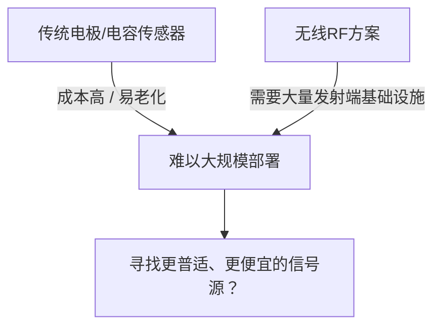
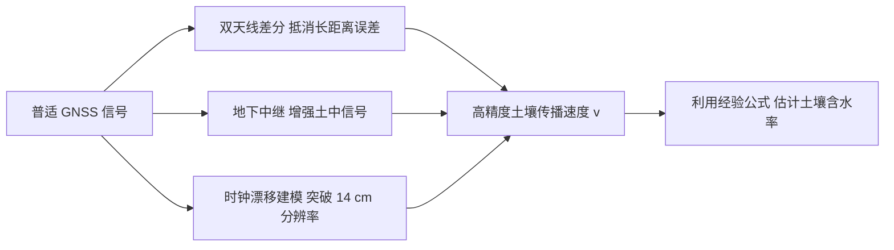

---
layout: Bg
---

    GPSoil：面向利用 GNSS 信号的低成本土壤水分感知

<v-click>

</v-click>

---

## 1. 背景——水资源 & 精准农业

 

**动机**

- 2050 年全球人口将近 100 亿，农业用水压力巨大
- 地球水资源：淡水仅 **3%**，农业消耗其中 **70%**
- 由于灌溉低效，**40% 以上淡水被浪费**
- 精准农业核心：**在合适时间、给合适的水**
  - 前提 → **准确感知土壤水分**

<v-click>

</v-click>

---

# 现有土壤水分监测手段的局限

 

**传统传感器**

- 石膏块、张力计、电容式水分传感器
- 问题：
  - 需要埋电极 → 易腐蚀 / 维护成本高
  - 精度 OK，但**耐久性差、数量多时成本高**

<v-click>

</v-click>  

---

# 现有土壤水分监测手段的局限

 

**无线 RF 方案（WiFi / LoRa / LTE）**

<v-click>

</v-click>  

<!-- - 利用无线信号在土壤中的传播速度估计水分
- 优点：无电极，可长期监测
- 缺点：
  - 需要发射端基础设施（AP / LoRa 网关 / LTE 基站）
  - WiFi 穿土覆盖 < 10 m，一英亩要部署几十个发射端
  - 农村地区 LTE 覆盖不足，小农场只有约 37% 有 LTE -->

---

# 问题归纳

```mermaid
flowchart TB
    T1[传统电极/电容传感器] -->|成本高 / 易老化| P[难以大规模部署]
    T2[无线RF方案] -->|需要大量发射端基础设施| P
    P --> Q[寻找更普适、更便宜的信号源？]
```

---

## 机会--GNSS信号

 

**关键问题**

> 能否利用真正“无处不在”的信号做土壤水分感知？——**GNSS**

**GNSS 带来的优势**

- **无盲区**：全球上百颗卫星，几乎所有农田都在覆盖范围
- **24/7 连续工作**：卫星持续广播，不依赖本地基础设施
- **独立频段**：不占用 WiFi / 蜂窝频谱，不干扰其他通信

---

# 使用 GNSS 的三大挑战

<v-click>

**挑战 1：传播误差巨大**

- 卫星到接收机距离 > 20,000 km
- 电离层、对流层、大气延迟、多普勒、 时钟漂移等误差
- 土壤水分引起的变化很小，容易被淹没

 

**挑战 2：接收信号极弱**

- 到地面约 -125 dBm，再穿土进一步衰减
- 根系深度 30–100 cm → 需要更深层感知， 信号几乎不可用

**挑战 3：测量分辨率粗糙**

- GNSS 以码相测距，分辨率约 14 cm
- 1% 含水率分辨率 ≈ 6.7 cm 距离精度 → 14 cm 太粗

</v-click>

---

## Slide 7：GPSoil 的核心贡献

**GPSoil 提出的方案**

- 首次利用 GNSS 信号做土壤水分感知 → **不需要自建发射端**
- 硬件：单颗 GNSS 芯片 + **2 个天线 + RF 开关** 做差分测量
- 软件：把**时钟漂移这种“坏东西”变成工具**，提升分辨率
- 中继：**低成本、低功耗 GNSS 中继**，将信号“搬到地下”

**效果**

- 物料成本：**10.56 美元**
- 土壤水分误差：**约 5.2%**
- 感知深度：**最深 1 m**

```mermaid
flowchart LR
    A[普适 GNSS 信号] --> B[双天线差分 抵消长距离误差]
    A --> C[地下中继 增强土中信号]
    B --> D[高精度土壤传播速度 v]
    C --> D
    D --> E[利用经验公式 估计土壤含水率]
    A --> F[时钟漂移建模 突破 14 cm 分辨率]
    F --> D
```

---

## 背景——RF 土壤水分感知原理

**基本物理**

<v-click>

- 土壤介电常数 ε 随含水量增加而增大

- RF 信号在介质中的速度：

  
  $$v=\frac{c_0}{\sqrt{\epsilon}} $$

</v-click>

<v-click>

</v-click>

<v-click>

- 水多 → ε 大 → 传播速度 **变慢**

- 传播速度 v 与土壤体积含水率Msoil的关系：

  $$Msoil= 0.1138 \cdot \frac{c_0}{v} - 0.1758$$

- 实际做法：

  - 用 RF 信号**测 v** → 算 ε → 推出水分含量

</v-click>

---

## 背景——GNSS 码相测距

**GNSS 测距主要量**

- 卫星发送：带 PRN 伪随机序列的信号
- 接收机：
  - 将接收信号与各个卫星的 PRN 做滑动相关
  - 找到**相关峰** → 得到该卫星的 **码相（Code Phase）**
  - 同时估计多普勒频移

---

## GPSoil 总体架构

 
 
 

三大核心组件：

1. **双天线 + RF 开关差分测量**
   - 抵消长路径误差，只剩土壤中那段差异
2. **地下 GNSS 中继**
   - 把卫星信号“带到地下”，可测到 1 m 深度
3. **时钟漂移增强**
   - 将 GNSS 芯片的 14 cm 精度变成毫米级

---

## 处理流水线概览（三阶段）

**三阶段工作流程**

1. **Stage 1：功率调制 & 时间对齐**
   - 周期性开关一个天线、关另一个
   - C/N0 上出现“高低图案” → 用来做时间对齐
2. **Stage 2：慢切换估计时钟漂移**
   - 降低切换频率，采集较长时间序列
   - 利用多颗卫星估计 GNSS 接收机时钟漂移
3. **Stage 3：快切换 + 高分辨率差分**
   - 切回快速切换频率
   - 用 Stage 2 得到的漂移参数，做精细码相差分
   - 得到精确的 Δd → v → M_soil

---

## 实现——硬件原型 & 成本

**硬件组成（Figure 11）**

- GNSS 接收芯片：Ublox UBX-M8030
- RF 开关：Analog HMC349
- MCU：STM32L152
- 低噪声放大器：AT2659S × 3
- 两个地下 RHCP 天线 + 一个地上 RX 天线 + 一个地下 TX 天线
- 3D 打印支架用于固定天线相对位置

**成本拆解（物料价）**

- GNSS 芯片：$2.50
- LNA：$0.23 × 3
- RF 开关：$3.87
- MCU：$3.50
- 总计 ≈ **$10.56**

**功耗与寿命**

- 工作电压：3.3 V
- 活动模式总功耗：约 103.2 mW
- 每次测量约 30 s，每天 2 次 → 平均 0.86 mWh/天
- 2000 mWh 纽扣电池 → 约 **3.2 年** 续航

---

## 实验环境

>在实验室和实际农田环境中评估系统性能。

在实验室环境中，在多个土壤含水水平下评估整体精度，并与两种商用土壤水分传感器对比；

随后考察不同土壤类型、天气、施肥条件等对感知性能的影响。

在真实农田实验中，在不同地理位置、不同作物类型、不同埋深和不同植被覆盖条件下评估系统性能，以验证实际可行性。

## 评估指标

采用估计土壤水分值与参考值之间的  **平均绝对误差** 评价性能。

土壤含水率定义为 水体积与土壤总体积之比。

<!--
我将对本次实验进行评估，首先实验是在实验室环境中以及实际农田环境中评估系统的性能。

首先是在实验室环境中，需要评估多土壤的整体精度并与两种商用的传感器进行对比。还要考察不同的土壤，天气，施肥条件等对感知性能的影响。
而在实际环境下，需要评估地理位置，不同作物，埋的深度以及不同植被的覆盖这些条件下的系统性能，以验证实际可行性。

这张图就是实验场景与布局，左侧是设备，有GPSoil System，以及传感接收器 等等，右边是部署的环境。
-->

---

## 实验室测试

- 整体精度：平均绝对误差（MAE）5.2%，满足多数作物灌溉需求
- 对比优势：
  - 低成本传感器（$6）：误差～10%，30% 湿度以上饱和失效

  

  - 高端传感器（$115）：精度略高但成本是 GPSoil 的 77倍

<!--
在实验室测试的结果中，GPSoil 的平均估计误差约为 5.2%，价格与低成本的传感器相近，但是比它误差少10%，而高度传感器虽然比GPSoil的精度高一点，但是价格却贵了77倍。

随着土壤含水率升高，额外衰减使得测量误差略有下降。

GPSoil 的标准差为 2.21%，略高于高端传感器的 1.14%，但显著低于低端传感器。

当土壤含水率超过 30% 时，低端传感器出现饱和失效，始终输出几乎不变但错误的结果，因此看上去方差偏小。

总体而言，GPSoil 的土壤水分感知精度对于大多数灌溉管理场景是足够的
-->

---

## 实验室测试(环境适应性)

土壤类型(普通土/石质土/盆栽土)(figure1)

实验影响(尿素/磷酸二氢钾)(figure2)

天气条件(晴/阴/雨)(figure3)

冠层影响：50-150cm 植被高度(figure4)

(figure1 误差3%-5%)

(figure2 误差 2%-4%，抗干扰性强)

(figure3 晴天最佳，雨天略有波动)

(figure4 误差 4.0%-5.7%，抗遮挡性强)

<!--
可以看图1，我们可以发现普通土的平均误差中约为 3%，在石质土中约为 5%，盆栽土中波动最大。可以看出系统在三种土壤中的整体表现稳定。

农业生产中广泛通过施肥提高产量，但肥料成分也可能影响土壤水分感知精度。
为评估这一影响，我们使用了两种常见肥料：尿素(图2a)和磷酸二氢钾(图2b)。
在不同施肥量下，GPSoil 的估计误差基本保持在 2–4% 范围内，显示出对养分变化的良好鲁棒性。

我们在晴天、多云和雨天条件下评估系统性能。

如图3所示，多云天气下平均误差比晴天增加约 0.8%，雨天误差方差显著提高。

推测这与雨滴引起的复杂衍射和散射有关。

总体来看，晴天性能最佳；

这是因为差分方法无法完全消除大气误差，如云层动态变化产生的干扰。

但在当前设计中，两个天线并非真正同时测量，因此大气条件随时间变化可能仍会影响结果。

我们在多种植被覆盖条件下评估系统性能，包括绿萝、肯氏椰子和竹
类等，高度范围 50–150 cm，代表日常环境中常见的高度区间。

每种高度下进行 5 组实验。

如图4所示，植被覆盖对精度的影响较小：平均误差从无覆盖的 4.0% 增至最高 5.7%。

得益于双天线设计，对包括植被在内的传播误差均有所抑制，从而保证整体误差在可接受范围内。
-->

---

## 真实场景测试

多地点适配：砂质土/壤质土4个区域(figure1)

作物适配：豌豆田/卷心菜田/休耕地(figure2)

深度能力：0-100cm 深度(figure3)

(figure1 平均误差 3.3%)

(figure2 整体误差 4.1%)

(figure3)

平均误差 2.9%，最深支持 1 米探测

<!--
GNSS 系统具有广泛覆盖能力，在大多数开阔环境中都可以接收信号，因此基于 GNSS 的 GPSoil 适合农业应用.

首先来看图1有关多地点适配，在图中有两个为砂质土，两个为壤土，系统在四个地点的平均误差为3.3%，真实满足农业实践需求，且地点间差异很小，说明系统对位置相关环境因素不敏感。

再看图2，在种植野豌豆的农田、卷心菜农田和休耕地中都测试了 GPSoil。
可以看到总体平均误差略微增加至 4.1%。
其中，在种植野豌豆的农田中，均值误差相较裸土增加约 0.7%，且波动更大，我
们认为这与风吹动植株造成的信号扰动有关。
相较之下，油菜由于植株刚性大、叶片较疏，对精度影响很小。

然后看图3，将GPSoil 分别部署于多个不同深度，并评估其在不同埋深处的感知精度。

得益于地下 GNSS 中继设计，系统在大深度下仍然能保持较好性能。

实验结果表明，平均误差约为 2.9%，最差情况下误差为 9.8%，最佳情况下仅 0.5%。

虽然在某些深度（如 40 cm）偶尔会出现局部性能波动，但这些异常往往与地下石块、土壤性质突变等环境因素相关。

整体来看，GPSoil 在各深度都表现出稳定且足以用于实践的精度。
-->

---

## 相关工作

 

### 1. 传统土壤湿度传感器

- 类型：石膏块传感器、张力计、电容式传感器
- 缺陷：易损耗需频繁更换、成本高、盐碱地误差大
- GPSoil 优势：无物理损耗、低成本、不受土壤盐分影响

 
 

### 2. 无线土壤湿度传感方案（对比）

| 方案     | 核心问题                        | GPSoil 优势                    |
| -------- | ------------------------------- | ------------------------------ |
| RFID     | 探测范围窄、精度低              | 大范围覆盖         |
| WiFi     | 覆盖范围小（<10 米）、需部署 AP | 无需额外基础设施，天然覆盖农田 |
| LoRa/LTE | 需部署发射器、成本高            | 利用 GNSS 卫星，无额外部署成本 |

 

<!--
石膏块和张力计通过电阻测量土壤张力，但其性能衰减快，需要频繁更换；

电容式传感器通过介电常数测水，但价格昂贵且在高盐土壤中误差较大。

GPSoil 通过测量 GNSS 信号的 RF 传播速度来估计土壤介电常数，从而实
现低成本且耐用的土壤水分感知。同时它也不会受到土壤盐分的直接影响，也避免了石膏块、张力计类设备的物理老化问题。

已有研究利用多种无线技术进行土壤含水率感知的方案中有这几种，RFID,WIFI,LoRa,LTE等，但存在这些问题...

GNSS 信号天然适合大范围农业应用
大覆盖范围：单颗 GPS 卫星可覆盖地球约 1/8 的面积，而单个 LoRa 发射端的覆盖范围约 100 m， 单个 LTE 基站约 1000 m。

频谱干扰小：GNSS 使用专用频段，避免了对其他通信系统的干扰。

 计算开销低：GNSS 芯片内部已实现码相等信号处理，外部无需复杂的信号处理，大幅减轻边缘计算负担。
-->

---

## 讨论

 

<v-click>

### 1. 未来优化方向

- 精度提升：通过数据驱动优化进一步降低误差
- 供电升级：支持纽扣电池 / 光伏供电，实现无线便携部署
- 成本再降：移除开发组件，采用热压成型天线，简化电路
- 部署优化：电路小型化、模块化，适配灌溉管道布线

</v-click>

 

<v-click>

### 2. 拓展应用场景

- 核心：基于信号传播速度测量的泛化能力
- 潜在方向：水污染检测、森林火灾与气体泄漏检测

</v-click>

<!--
虽然原型系统已经能够较好地测量土壤水分，但在大规模实际部署前仍有若干值得改进的方面：

1.当前 5.2% 的精度已满足大多数精准灌溉系统需求，但仍可通过数据驱动优化方法进一步提升；

2.目前原型通过电缆供电，可以使用纽扣电池供电，便于便携部署；或者使用光伏供电因为系统仅需毫瓦级功率。

3.硬件成本还可进一步压缩，例如去除开发阶段使用的连接器与调试接口；GNSS 天线可通过热压工艺 制作，并使用 3D 打印支架保证 RHCP 极化；电源电路也可进行协同设计以减少稳压器数量；

4.在通信方面，目前通过有线连接将数据采集至笔记本；在精准农业中，地下常有灌溉管道，可沿管道布设数据线，减少对农机作业的影响；

5.为缩小硬件尺寸，可将电路进一步集成在多层可堆叠小板上，便于安装和维护。

GPSoil 能精确测量信号传播速度，因此具有更广泛的应用前景。如水体污染检测

GNSS 信号传播速度对环境扰动敏感。如森林火灾与气体泄漏检测。
-->

---

## 总结

 

<v-click>

### 1. 核心价值

- 突破性方案：首个基于 GNSS 信号的土壤湿度传感系统，无需专用发射器
- 性能达标：5.2% 测量精度，1 米探测深度，满足多数作物精准灌溉需求
- 成本优势：$10.56 硬件成本，远低于现有方案，适合规模化部署

</v-click>

 

<v-click>

### 2. 关键创新

- 硬件：单 GNSS 接收器 + 双天线 + RF 开关，低成本差分测量
- 信号增强：低功耗中继器，解决地下信号衰减问题
- 软件：利用时钟漂移误差，突破硬件分辨率限制

</v-click>

 

<v-click>

### 3. 应用意义

- 为基于无线信号的精准农业土壤监测提供了一条可扩展、有效的路径
- 为数据驱动农业发展奠定基础

</v-click>

<!--
GPSoil，一种利用普适 GNSS 信号的低成本土壤水分感知系统，克服了现有方案在成本、耐用性和基础设施依赖方面的局限。

通过利用 GNSS 卫星的全球覆盖能力，GPSoil 无需专用发射端。

本系统的关键创新包括：

基于单颗 GNSS 接收机的天线切换差分距离测量技术；

用于增强地下信号的低成本中继；

一种将“时钟漂移误差”转化为提升分辨率工具的方法。

GPSoil为基于无线信号的精准农业土壤监测提供了一条可扩展、有效的路径，为数据驱动农业发展奠定基础
-->

---
layout: Ballpit
---
