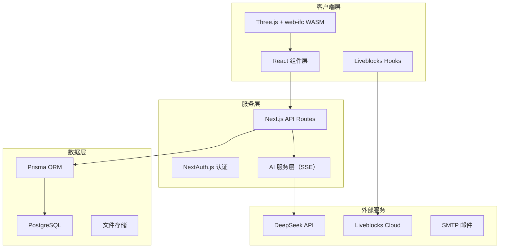
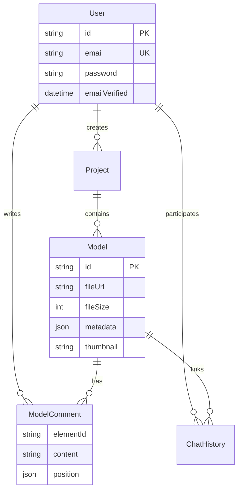
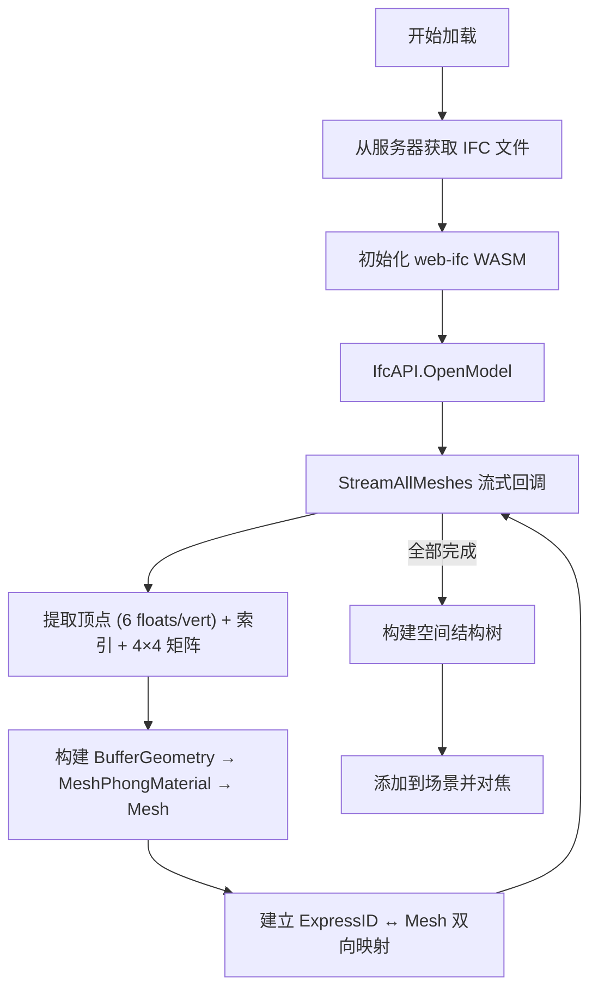
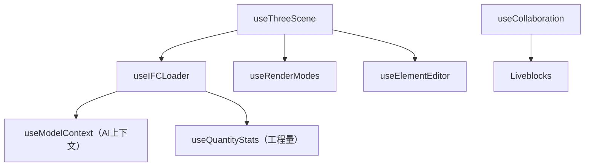
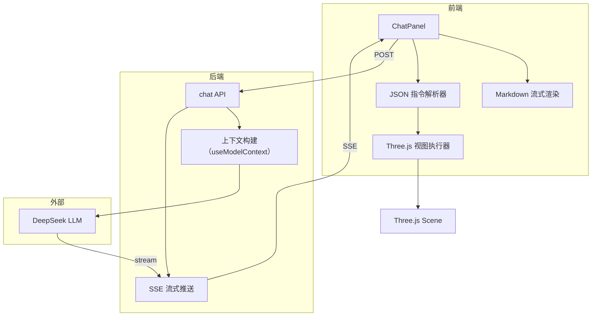
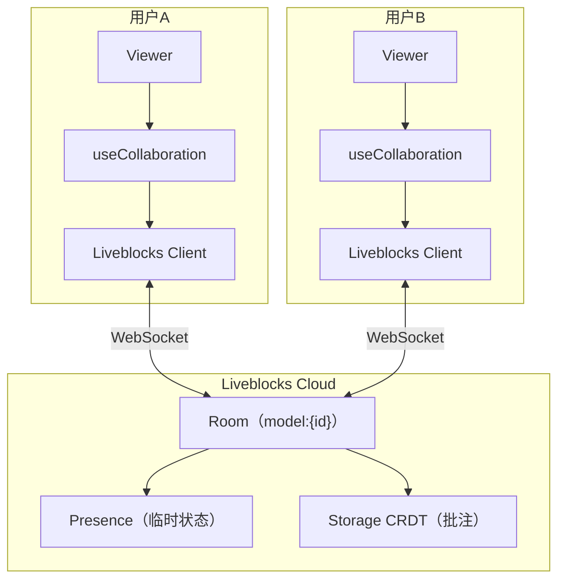

---
layout: Bg
---

<div class="font-serif text-center text-4xl mt-18">
    基于 Web 的 IFC 建筑信息模型<br>智能协作平台的设计与实现
</div>


<!--
各位老师好，我是XX，今天我汇报的题目是《基于Web的IFC建筑信息模型智能协作平台的设计与实现》。
-->

---

## 目录

<br>

<v-click>

#### 01 研究背景与意义

</v-click>

<v-click>

#### 02 系统总体设计

</v-click>

<v-click>

#### 03 IFC 三维可视化模块

</v-click>

<v-click>

#### 04 AI 智能分析模块

</v-click>

<v-click>

#### 05 实时多人协作模块

</v-click>

<v-click>

#### 06 工程量统计与数据分析

</v-click>

<v-click>

#### 07 系统测试与性能评估

</v-click>

<v-click>

#### 08 总结与展望

</v-click>

---

## 1. 研究背景与意义

<br>

<v-click>

#### BIM 技术的快速普及

- 全球 BIM 渗透率：2012 年 **36%** → 2022 年 **73%**
- 住建部《智能建造指导意见》：2025 年 BIM 应用比例达 **90%** 以上
- IFC（ISO 16739）是 BIM 数据互通的"通用语言"

</v-click>

<br>

<v-click>

#### 传统桌面 BIM 工具的痛点

- **客户端过重**：独立显卡、16 GB 内存，仅限 Windows
- **协作靠文件搬运**：邮件传 IFC 文件，版本混乱
- **智能辅助空白**：无法回答自然语言提问
- **学习曲线陡峭**：非专业人员门槛高

</v-click>

<!--
BIM技术在国内外快速普及，但主流桌面工具存在明显短板，这就是我做这个项目的动机。
-->

---

## 1. 研究背景与意义

<br>

<v-click>

#### Web 端技术拐点

- **WebGL 2.0** 全面普及，浏览器具备重度 3D 渲染能力
- **web-ifc**：将 C++ IFC 解析器编译为 **WebAssembly**，浏览器直接解析 .ifc 文件
- **DeepSeek / GPT-4** 等大语言模型跨越工程语义门槛
- **Liveblocks**：为三维协作提供实时同步基础设施

</v-click>

<br>

<v-click>

#### 本文目标

> 打开浏览器就能完成**模型查看、AI 问答、多人协同批注和工程量分析**
> ——不装软件、不传文件、不设门槛

</v-click>

---

## 1. 国内外研究现状

<br>

<div style="position:absolute;left:80px;top:130px;">

<v-click>

**Web 端 BIM 可视化**
- BIMServer：Java 后端解析，工程化程度有限
- IFC.js / @thatopen：API 耦合重，嵌入已有项目成本高
- Xeokit：大模型流式加载好，但**商业许可**
- 广联达 BIMFace：闭源付费，难以二次开发

</v-click>

</div>

<div style="position:absolute;left:520px;top:130px;">

<v-click>

**AI × BIM 交叉**
- CNN 做施工进度影像识别
- 传统 NLP 解析规范条款
- GPT 接入 IFC 问答（多停留在 demo）
- **工程落地成果极少**

</v-click>

<br>

<v-click>

**实时协作**
- Google Docs / Figma：文档/设计级
- Speckle：协作粒度在模型**版本**级
- 缺少**构件级三维实时**协作方案

</v-click>

</div>

---

## 1. 本文主要工作

<br>

<v-clicks>

- **全栈平台搭建**：Next.js 16 App Router，覆盖用户认证、项目管理、文件存储完整后端链路

- **高性能三维可视化**：web-ifc WASM 流式解析 + Three.js 渲染，6 种渲染模式（真实感、线框、X光、SSAO、描边、热力图）

- **AI Agent 管线**：上下文注入 → 流式对话 → 结构化指令解析 → 三维视图执行；配套中国建筑规范合规检查 DSL

- **三维场景级实时协作**：基于 Liveblocks，实现世界坐标光标同步、构件选择广播、CRDT 批注共享，延迟 < 250 ms

- **完整工具链**：工程量统计、造价估算、Excel 报表、性能监控、构件编辑（IFC 回写）、GLTF / OBJ / IFC 三格式导出

</v-clicks>

---

## 2. 系统总体架构

<br>

<v-click>


```mermaid
graph TB
    subgraph "客户端层"
        A["React 组件层"]
        B["Three.js + web-ifc WASM"]
        C["Liveblocks Hooks"]
    end
    subgraph "服务层"
        D["Next.js API Routes"]
        E["NextAuth.js 认证"]
        F["AI 服务层（SSE）"]
    end
    subgraph "数据层"
        G["PostgreSQL"]
        H["Prisma ORM"]
        I["文件存储"]
    end
    subgraph "外部服务"
        J["DeepSeek API"]
        K["Liveblocks Cloud"]
        L["SMTP 邮件"]
    end
    A --> D
    B --> A
    C --> K
    D --> F
    F --> J
    D --> H
    H --> G
```

</v-click>

---

## 2. 技术选型

<br>

<v-click>

<div style="display:grid;grid-template-columns:1fr 1fr;gap:24px;margin-top:8px;">

<div>

| 层 | 技术 | 版本 |
|----|------|------|
| 框架 | Next.js | 16.1.7 |
| UI | React | 19.2.3 |
| 语言 | TypeScript | 5.x |
| 样式 | Tailwind CSS | 4.x |
| 三维 | Three.js | 0.183.2 |
| IFC | web-ifc | 0.0.77 |

</div>

<div>

| 层 | 技术 | 版本 |
|----|------|------|
| 数据库 | PostgreSQL | 16 |
| ORM | Prisma | 7.5.0 |
| 认证 | NextAuth.js | 5.0-beta |
| 协作 | Liveblocks | 3.15.5 |
| AI | DeepSeek API | — |
| 图表 | Recharts | 3.8.0 |

</div>

</div>

</v-click>

---

## 2. 数据库设计

<v-click>


```mermaid {scale: 0.55}
erDiagram
    User ||--o{ Project : creates
    User ||--o{ ModelComment : writes
    User ||--o{ ChatHistory : participates
    Project ||--o{ Model : contains
    Model ||--o{ ModelComment : has
    Model ||--o{ ChatHistory : links

    User {
        string id PK
        string email UK
        string password
        datetime emailVerified
    }
    Model {
        string id PK
        string fileUrl
        int fileSize
        json metadata
        string thumbnail
    }
    ModelComment {
        string elementId
        string content
        json position
    }
```

</v-click>

<!--
数据库以PostgreSQL为基础，核心实体包括用户、项目、模型、批注和对话历史。
Model的metadata字段以JSON存放解析后的构件计数等信息，ModelComment的position字段记录三维坐标。
-->

---

## 3. IFC 三维可视化 — 加载流程

<v-click>


```mermaid {scale: 0.55}
flowchart TD
    A["开始加载"] --> B["从服务器获取 IFC 文件"]
    B --> C["初始化 web-ifc WASM"]
    C --> D["IfcAPI.OpenModel"]
    D --> E["StreamAllMeshes 流式回调"]
    E --> F["提取顶点 (6 floats/vert) + 索引 + 4×4 矩阵"]
    F --> G["构建 BufferGeometry → MeshPhongMaterial → Mesh"]
    G --> H["建立 ExpressID ↔ Mesh 双向映射"]
    H --> E
    E -->|"全部完成"| I["构建空间结构树"]
    I --> J["添加到场景并对焦"]
```

</v-click>

<v-click>

> **流式接口是性能关键** — 避免一次性将所有几何体载入内存，中型模型 ~4.2 秒完成加载

</v-click>

---

## 3. IFC 三维可视化 — 渲染引擎

<br>

<v-click>

#### 9 个自定义 Hook（约 2800 行 TypeScript）


```mermaid
graph TD
    A["useThreeScene"] --> B["useIFCLoader"]
    A --> C["useRenderModes"]
    A --> D["useElementEditor"]
    B --> E["useModelContext（AI上下文）"]
    B --> F["useQuantityStats（工程量）"]
    H["useCollaboration"] --> I["Liveblocks"]
```

</v-click>


<v-click>

#### 核心交互

- **Raycasting 构件拾取**：屏幕坐标 → NDC → 射线求交 → ExpressID → 属性面板
- **高亮效果**：克隆半透明叠加网格（`#22e1ff`，透明度 0.6）
- **剖切面**：`ClippingPlane(0,-1,0,constant)` 动态调节高度
- **预设视角**：顶视 / 前视 / 等轴测三键切换

</v-click>

---

## 3. IFC 三维可视化 — 六种渲染模式

<br>

<v-click>

| 模式 | 技术实现 | 典型用途 |
|------|---------|---------|
| Realistic | Phong 光照 + ACES 色调映射 | 日常浏览 |
| Wireframe | `material.wireframe = true` | 结构分析 |
| X-Ray | `transparent + opacity 0.15` | 透视内部 |
| SSAO | SSAOPass（后处理）kernelRadius=8 | 强化层次感 |
| Edge | Sobel 3×3 卷积描边 Shader | 图纸风格 |
| Heatmap | 属性值 → 蓝→青→绿→黄→红色阶 | 数据分析 |

</v-click>

<v-click>

**后处理管线**：RenderPass → SSAOPass → EdgePass → SectionFillPass → FXAAPass → OutputPass

> 每种模式仅激活对应 Pass，其余保持 `disabled`

</v-click>

<!--
六种渲染模式都封装在useRenderModes中，切换时先缓存原始材质，退出时自动恢复。
-->

---

## 4. AI 智能分析 — 系统架构

<v-click>

<div style="margin-top:-20px;">


```mermaid {scale: 0.6}
graph TB
    subgraph "前端"
        A["ChatPanel"] --> B["Markdown 流式渲染"]
        A --> C["JSON 指令解析器"]
        C --> D["Three.js 视图执行器"]
    end
    subgraph "后端"
        E["chat API"] --> F["上下文构建（useModelContext）"]
        E --> G["SSE 流式推送"]
    end
    subgraph "外部"
        H["DeepSeek LLM"]
    end
    A -->|POST| E
    F --> H
    H -->|stream| G
    G -->|SSE| A
    D --> I["Three.js Scene"]
```

</div>

</v-click>

---

## 4. AI 智能分析 — 自然语言指令

<br>

<v-click>

#### AI 响应中附带的 7 种结构化指令

| 指令 | 自然语言示例 | 执行效果 |
|------|-------------|---------|
| `highlightByType` | "高亮所有墙体" | 该类型构件变亮 |
| `setView` | "俯视看一下" | 相机跳到预设位置 |
| `toggleWireframe` | "打开线框" | 线框渲染 |
| `toggleXRay` | "X光模式" | 半透明 |
| `toggleClipping` | "剖开看内部" | 开启剖切 |
| `highlightElement` | "156号构件亮起来" | 单构件高亮 |
| `resetView` | "恢复默认" | 重置视图 |

</v-click>

<br>

<v-click>

**闭环**：自然语言 → 语义理解 → 结构化 JSON → 三维操控

</v-click>

---

## 4. AI 智能分析 — 合规检查 DSL

<br>

<v-click>

#### 声明式规则语法

```
IFCType.property  operator  value  unit
```

示例：
```
IfcDoor.height >= 2100 mm
IfcStairFlight.riserHeight <= 175 mm
IfcWall.fireRating exists
```

</v-click>

---

<v-click>

#### 9 条内置规则（依据中国建筑规范）

| 规则 | DSL | 规范依据 |
|------|-----|---------|
| 入户门最小高度 | `IfcDoor.height >= 2000 mm` | GB 50096 |
| 踏步最大高度 | `IfcStairFlight.riserHeight <= 175 mm` | GB 50352 |
| 最低层高 | `IfcSpace.height >= 2400 mm` | GB 50096 |
| 墙体防火等级 | `IfcWall.fireRating exists` | GB 50016 |

</v-click>

<v-click>

> 用户还可以用自然语言描述规范，AI 自动生成 DSL 规则并导入执行

</v-click>

---

## 5. 实时多人协作 — 架构

<v-click>


```mermaid {scale: 0.55}
graph TB
    subgraph "用户A"
        A1["Viewer"] --> A2["useCollaboration"]
        A2 --> A3["Liveblocks Client"]
    end
    subgraph "用户B"
        B1["Viewer"] --> B2["useCollaboration"]
        B2 --> B3["Liveblocks Client"]
    end
    subgraph "Liveblocks Cloud"
        C1["Room（model:{id}）"]
        C2["Presence（临时状态）"]
        C3["Storage CRDT（批注）"]
    end
    A3 <-->|WebSocket| C1
    B3 <-->|WebSocket| C1
    C1 --> C2
    C1 --> C3
```

</v-click>

---

## 5. 实时多人协作 — 三维光标与批注

<br>

<v-click>

#### 远程光标同步

- Presence 包含：屏幕坐标 (x, y) + **世界坐标** (worldX, worldY, worldZ) + 选中构件 ExpressID
- 鼠标移动时通过 Raycaster 求取射线与模型表面交点，把三维坐标一并广播
- 远程光标以 SVG 叠加层绘制，带颜色标签
- 若对方选中构件，本地为该构件创建带用户颜色的**半透明叠加网格**

</v-click>

<br>

<v-click>

#### 批注协作

- 批注存于 Liveblocks **Storage（CRDT LiveList）**，并发写入无冲突
- 每条批注含：作者信息 / 关联 ExpressID / 文本 / 三维坐标 / 时间戳
- 新增批注通过 **Broadcast** 即时通知所有在线用户
- 同步持久化到 PostgreSQL `ModelComment` 表

</v-click>

---

## 5. 构件编辑与多格式导出

<br>

<v-click>

#### 6 类编辑操作（useElementEditor，966 行）

- 属性修改 / 平移·旋转·缩放变换 / 隐藏·显示 / 复制 / 删除 / **撤销**

</v-click>

<br>

<v-click>

#### IFC 回写（最大技术难点）

将 Three.js 网格变换同步回 IFC 数据：

1. 计算当前矩阵与原始矩阵的差异
2. 在 web-ifc 中创建新的 `IfcCartesianPoint`、`IfcDirection`、`IfcAxis2Placement3D`
3. 更新 `IfcLocalPlacement.RelativePlacement` 引用
4. 新实体 ExpressID 从 `GetMaxExpressID() + 1` 递增分配

</v-click>

---

<v-click>

#### 三种导出格式

| 格式 | 特点 |
|------|------|
| **glTF (.glb)** | Web 3D 标准，体积最小 |
| **OBJ (.obj)** | 通用网格，兼容性广 |
| **IFC (.ifc)** | 保留完整 BIM 语义信息 |

</v-click>

---

## 6. 工程量统计与数据可视化

<br>

<v-click>

#### 自动提取指标（useQuantityStats）

- 构件总数与楼层总数
- 按 IFC 类型降序排列的构件计数（饼图）
- 按楼层聚合的构件分布（柱状图）
- 包围盒尺寸、估算表面积（叉积法）和体积

</v-click>

<br>

<v-click>

#### 造价估算

- 用户填写每种构件单价 → 自动计算分项造价与总额
- Recharts 柱状图展示各类占比

</v-click>

<br>

<v-click>

#### Excel 报表导出（SheetJS）

> Sheet 1 模型概况 · Sheet 2 构件类型统计 · Sheet 3 楼层统计 · Sheet 4 造价明细

</v-click>

---

## 6. 性能监控

<br>

<v-click>

| 类别 | 指标 | 采集方式 |
|------|------|---------|
| 帧率 | 当前 / 均值 / 极值 FPS | rAF 计数（500ms 滑动窗口）|
| 加载 | 模型加载耗时 | `performance.now` |
| AI | 响应延迟（最近/平均）| 请求计时 |
| 渲染 | Draw Calls / 三角形数 | `renderer.info` |
| 内存 | JS 堆 / 几何体 / 纹理 | `performance.memory` |

</v-click>

<br>

<v-click>

- **FPS 趋势图**：维护 120 个样本滚动窗口，Recharts AreaChart 展示
- `usePerfTracker` + `useFPSMonitor` 两个 Hook 协作采集

</v-click>

---

## 7. 系统测试 — 加载性能

<br>

<v-click>

| 模型 | 文件大小 | 构件数 | 三角面数 | 加载耗时 | 内存峰值 |
|------|---------|--------|---------|---------|---------|
| 小型住宅 | 1.2 MB | ~200 | ~50K | ~1.5 s | ~80 MB |
| 中型办公楼 | 5.8 MB | ~800 | ~200K | ~4.2 s | ~180 MB |
| 大型综合体 | 15.3 MB | ~2500 | ~600K | ~12.8 s | ~420 MB |
| 超大型项目 | 35.6 MB | ~6000 | ~1.5M | ~28.5 s | ~850 MB |

</v-click>

<br>

<v-click>

- 加载耗时与文件大小大致呈**线性关系**
- **10 MB 以下**的文件 5 秒内完成加载，满足日常工程场景

</v-click>

<!-- 可插入 benchmark 加载时间折线图截图 -->

---

## 7. 系统测试 — 渲染帧率与 AI 延迟

<br>

<div style="position:absolute;left:60px;top:120px;width:420px;">

<v-click>

#### 渲染帧率（中型办公楼 5.8 MB）

| 模式 | 平均 FPS | 最低 FPS |
|------|---------|---------|
| Realistic | 58 | 45 |
| Wireframe | 62 | 50 |
| X-Ray | 55 | 42 |
| SSAO | 42 | 32 |
| Edge | 48 | 36 |
| Heatmap | 56 | 44 |

> 所有模式均 ≥ **30 FPS**

</v-click>

</div>

<div style="position:absolute;left:530px;top:120px;width:400px;">

<v-click>

#### AI 响应延迟

| 问题类型 | 首 token | 完整 |
|---------|---------|------|
| 简单查询 | ~0.8 s | ~2.1 s |
| 统计类 | ~1.0 s | ~3.5 s |
| 指令类 | ~0.9 s | ~2.8 s |
| 合规类 | ~1.2 s | ~4.2 s |

> SSE 流式传输显著降低主观等待感

</v-click>

</div>

---

## 7. 系统测试 — 协作延迟与兼容性

<br>

<div style="position:absolute;left:60px;top:120px;width:380px;">

<v-click>

#### 协作同步延迟（局域网）

| 操作 | 平均延迟 | 最大延迟 |
|------|---------|---------|
| 光标移动 | ~80 ms | ~150 ms |
| 构件选择 | ~100 ms | ~200 ms |
| 批注发送 | ~120 ms | ~250 ms |

> 全部 ≤ **250 ms**，体验流畅

</v-click>

</div>

<div style="position:absolute;left:510px;top:120px;width:430px;">

<v-click>

#### 浏览器兼容性

| 浏览器 | 三维 | AI | 协作 |
|--------|------|-----|------|
| Chrome 124+ | ✓ | ✓ | ✓ |
| Edge 124+ | ✓ | ✓ | ✓ |
| Firefox 126+ | ✓ | ✓ | ✓ |
| Safari 17+ | △ WASM 略慢 | ✓ | ✓ |

</v-click>

<br>

<v-click>

#### 功能测试

27 个测试用例，全部**通过** ✓

</v-click>

</div>

---

## 7. 与同类平台对比

<br>

<v-click>

| 功能 | **本平台** | BIMServer | IFC.js | Xeokit | Speckle |
|------|-----------|-----------|--------|--------|---------|
| IFC 解析 + 浏览器渲染 | ✓ | ✓ | ✓ | ✓ | ✓ |
| 渲染模式（6种）| ✓ | — | 部分 | 部分 | — |
| SSAO 后处理 | ✓ | — | — | ✓ | — |
| 热力图 | ✓ | — | — | — | — |
| **AI 问答** | ✓ | — | — | — | — |
| **AI 指令驱动** | ✓ | — | — | — | — |
| 合规检查 | ✓ | 插件 | — | — | — |
| **实时多人协作** | ✓ | — | — | — | 版本级 |
| **远程 3D 光标** | ✓ | — | — | — | — |
| 构件编辑 + IFC 回写 | ✓ | — | — | — | — |
| 开源免费 | ✓ | ✓ | ✓ | 商业 | 部分 |

</v-click>

<v-click>

> 在 **AI 分析、实时协作、渲染模式丰富度**三个维度上具有明显差异化

</v-click>

---

## 8. 工作总结

<br>

<v-clicks>

- **全栈架构**：Next.js 16 App Router 打通用户注册、项目管理、文件存储到认证鉴权的完整后端链路

- **三维可视化引擎**：web-ifc WASM 流式解析 + Three.js 渲染 + 9 个自定义 Hook（~2800 行），覆盖构件拾取、空间树、剖切面、6 种渲染模式

- **AI Agent 系统**：上下文注入 → 流式对话 → 7 种结构化指令 → 合规检查 DSL，工程化落地而非 demo

- **三维实时协作**：世界坐标光标、构件选择广播、CRDT 批注，同步延迟 < 250 ms

- **完整工具链**：工程量统计、造价估算、Excel 导出、性能监控、构件编辑（含 IFC 回写）、3 种格式导出

- **系统测试**：27 个功能用例全部通过；中型模型加载 ~4.2 s，渲染帧率 ≥ 30 FPS

</v-clicks>

---

## 8. 不足与展望

<br>

<v-clicks>

- **大模型加载优化**：超 30 MB 文件加载接近半分钟，可引入 LOD 或按楼层/视野按需加载

- **AI 上下文扩容**：接入 pgvector 做 RAG，按需注入最相关的构件属性片段，避免 token 浪费

- **移动端触控适配**：平板端双指缩放、单指旋转等手势专项优化

- **离线缓存**：利用 Service Worker + IndexedDB 做模型本地缓存，支持网络不稳定场景

- **版本管理深化**：完整版本链 + GlobalId 级变更追踪，支持任意两版本差异分析

</v-clicks>

---

<div class="font-serif text-center text-5xl mt-24">
    感谢各位老师的聆听
</div>

<div class="text-center text-2xl mt-12 text-gray-300">
    请批评指正
</div>

<!--
谢谢各位老师，我的汇报到此结束，请老师们批评指正。
-->
