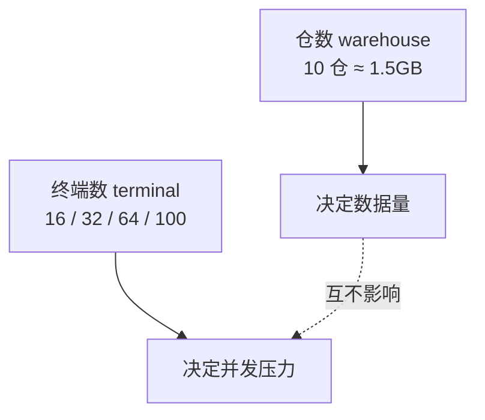
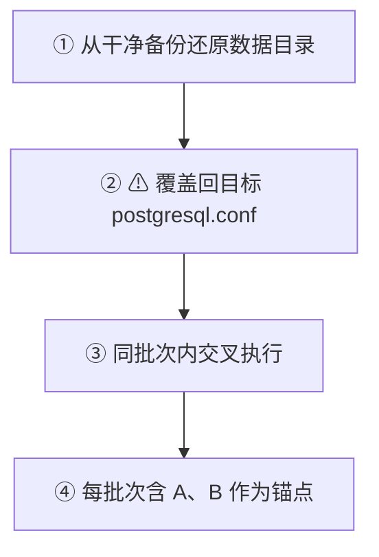
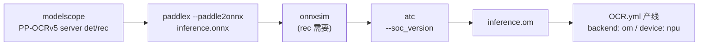
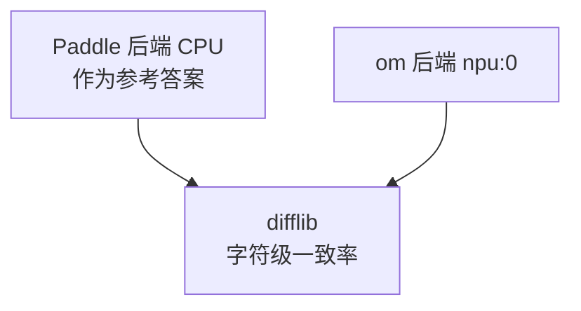

<div class="font-serif text-center text-5xl mt-40">
    新员工月度答辩
</div>

<div class="text-center text-sm opacity-60 mt-8">
    赵麟　·　2026.09
</div>

<!--
各位老师、各位同事好，我是赵麟。今天做本月的工作答辩。

本月我做了两件事：一件是 KAOT 调优模板在 openGauss 上的适配性分析，这一件已经跑完六个阶段、出了完整结论；另一件是 PaddleOCR 在昇腾平台的性能摸测，目前环境和方案已经就绪，实验正在推进。

我想先说一句话概括第一件事：它最初的结论是"调优之后性能下降 24.5%"，但这个结论被我自己推翻了两次，最终答案是"提升 116.1%"。中间隔着的不是新参数，而是实验方法。

而第二件事的方案设计，正是把第一件事踩过的坑，提前写进了实验协议里。这也是我今天想讲的主线。
-->

---

## 本月工作概览

<div class="grid grid-cols-2 gap-6 mt-5">

<v-click>

<div class="p-4 rounded-lg bg-green-400/8 border border-green-400/25 h-[250px]">

<div class="flex items-baseline gap-3">
<span class="text-green-400 font-bold">项目一</span>
<span class="text-xs px-2 py-0.5 rounded bg-green-400/20 text-green-300">已闭环</span>
</div>

<div class="font-bold mt-2">KAOT 模板在小规模 TPC-C 场景下的适配性分析</div>

<div class="text-sm mt-3 leading-relaxed opacity-85">

- Kunpeng 920 / openEuler / openGauss
- BenchmarkSQL TPC-C，六个阶段，14 天
- 9 类配置 × 4 个并发点 × 7 个容量点
- **结论被自己推翻两次**

</div>

<div class="text-xs mt-3 text-green-300">→ 完整数据、结论、推荐配置与工具改进建议</div>

</div>

</v-click>

<v-click>

<div class="p-4 rounded-lg bg-sky-400/8 border border-sky-400/25 h-[250px]">

<div class="flex items-baseline gap-3">
<span class="text-sky-300 font-bold">项目二</span>
<span class="text-xs px-2 py-0.5 rounded bg-sky-400/20 text-sky-200">进行中</span>
</div>

<div class="font-bold mt-2">PaddleOCR 昇腾平台性能摸测与算力切分</div>

<div class="text-sm mt-3 leading-relaxed opacity-85">

- Atlas 8 × 910B4-1 / PP-OCRv5 / om 后端
- 用户真实数据集（招投标扫描件）
- 环境、画像、方案已就绪；**方案已迭代两版**
- 摸测实验推进中

</div>

<div class="text-xs mt-3 text-sky-200">→ 本次汇报方案设计与当前进展，不报未实测的数字</div>

</div>

</v-click>

</div>

<v-click>

<div class="mt-5 p-3 rounded-lg bg-white/5 border border-white/10 text-sm text-center">

<span class="opacity-70">贯穿两个项目的一条主线：</span>**项目一用四次返工换来的实验纪律，直接写进了项目二的方案设计。**

</div>

</v-click>

<!--
本月工作分成两块。

左边是项目一，KAOT 模板在小规模 TPC-C 场景下的适配性分析。这一块已经闭环：六个阶段、14 天，覆盖 9 类配置、4 个并发点、7 个容量点，有完整的数据、结论、推荐配置，以及我对工具本身的改进建议。这件事最值得讲的地方是——结论被我自己推翻了两次。

右边是项目二，PaddleOCR 在昇腾平台的性能摸测和算力切分。这一块目前的状态是：环境镜像构建完成、8 张卡清空独享、用户数据集画像做完、实验方案已经迭代到第二版。摸测实验正在推进中。

这里我要先说明一点：项目二的实测数据还没有出来，所以今天这部分我汇报的是方案设计和当前进展，**不会报任何没有实测的数字**。后面涉及到预期的地方，我都会明确标出来。

最后是贯穿两个项目的一条主线，也是我这个月最大的收获：项目一用四次返工换来的实验纪律，我把它直接写进了项目二的方案设计里。最后一页我会专门讲这个迁移。
-->

---
layout: section
---

# 项目一

## KAOT 模板在小规模 TPC-C 场景下的适配性分析

<div class="text-sm opacity-60 mt-4">

Kunpeng 920 7260 · openEuler 22.03 · openGauss · BenchmarkSQL 5.0 · 2026-09-02 ~ 09-16

</div>

<!--
先讲项目一。
-->

---

## 1. 背景与任务定位

<div class="grid grid-cols-2 gap-8 mt-4">

<div>

<v-click>

#### 任务

在鲲鹏平台上验证 **KAOT** 的 `opengauss_database` 调优模板，回答两个问题：

- 这份模板在我们的机型 + 负载上**有没有效**？
- 有效或无效，**是哪些参数在起作用**？

</v-click>

<br>

<v-click>

#### KAOT 是「规则式」调优工具

识别环境 → 匹配预置场景 → 下发一份实验室验证过的参数模板。**不做搜索寻优。**

</v-click>

<v-click>


```mermaid {scale: 0.55}
flowchart LR
    A["basecfg<br/>采集基线"] --> B["generate<br/>生成调优单"] --> C["execute<br/>使能"]
    C --> D["postgresql.conf<br/>40+ 项一次性下发"]
```

</v-click>

</div>

<div>

<v-click>

#### TPC-C 的两个**独立**的轴


```mermaid {scale: 0.55}
flowchart TB
    W["仓数 warehouse<br/>10 仓 ≈ 1.5GB"] --> D["决定数据量"]
    T["终端数 terminal<br/>16 / 32 / 64 / 100"] --> C["决定并发压力"]
    D -.->|互不影响| C
```

</v-click>

<v-click>

<div class="text-sm mt-2 p-3 rounded bg-green-400/8 border border-green-400/25">

加终端**不会**增加数据量，加仓数**不会**自动增加并发。<br>
本实验后期正是靠**分离这两个轴**才定位到真正的规律。

</div>

</v-click>

<v-click>

<div class="text-xs mt-3 opacity-70">

`opengauss_database` 场景只含 `optimize_opengauss_database_config` 一项，不含网卡绑核、IO 调度等 OS 层调优 —— 变量被限制在 `postgresql.conf` 内。

</div>

</v-click>

</div>

</div>

<!--
KAOT 全称是鲲鹏与昇腾优化工具，是 BoostKit 下面的一个调优工具。它的定位是"规则式"调优——注意不是自动寻优，它不做搜索，而是识别你的硬件和软件环境，匹配一个预置场景，然后下发一份华为实验室已经验证过的参数模板。三个子命令：basecfg 采集基线，generate 生成调优单，execute 使能。

我要回答的问题有两个：第一，这份模板在我们这台鲲鹏 920 加 openGauss 的组合上到底有没有效；第二，也是更重要的，到底是模板里哪些参数在起作用。一次性下发 40 多项参数，这也埋下了后面归因的难题。

右边这一块很关键，它是我后期能定位到规律的前提。

TPC-C 有两个独立的轴：仓数决定数据量，每仓约 100MB，10 仓算上索引大概 1.5 到 2GB；终端数决定并发压力，规范要求每仓最多 10 个终端，所以 10 仓上限是 100 终端。

关键在于这两者互不影响。我前三个阶段全部固定在 16 终端，正是因为没有把这两个轴分开考虑，才在一个"看不出模板价值"的区间里反复打转。

最后补一句，这个场景只改数据库配置文件，不含操作系统层的调优项，所以变量很干净。
-->

---

## 2. 实验设计：分组与协议

<style>
.slidev-layout table { font-size: 0.72rem; line-height: 1.28; }
.slidev-layout th, .slidev-layout td { padding: 3px 9px !important; }
</style>

<div class="grid grid-cols-2 gap-6 mt-3">

<div>

<v-click>

| 组 | 配置说明 | shared_buffers |
|----|---------|----------------|
| **A** | 默认参数（基准） | 1024MB |
| **B** | KAOT 全量模板 | 151GB |
| **C1** | B，**仅**将 buffer 改小 | 8GB |
| **C2** | B，**仅**降刷盘频率 | 151GB |
| **D** | C1 + `wal_level` / `max_connections` | 8GB |
| **E / E'** | 安全子集，FPW off / on | 4GB |
| **F** | A，**仅**改 buffer | 8GB |
| **G** | A，**仅**改 `xloginsert_locks=48` | 1024MB |
| **SBxx** | A，仅改 buffer 为 2/4/16/32/151GB | 见组名 |

</v-click>

<v-click>

<div class="text-xs mt-2 p-2 rounded bg-green-400/8 border border-green-400/25">

先记住三组：**A** 基准、**B** KAOT 全量、**F** 只改一个 buffer —— 最终结论几乎完全由这三组决定。

</div>

</v-click>

</div>

<div class="text-sm">

<v-click>


```mermaid {scale: 0.5}
flowchart TB
    S["① 从干净备份还原数据目录"] --> K["② ⚠ 覆盖回目标 postgresql.conf"]
    K --> R["③ 同批次内交叉执行"]
    R --> M["④ 每批次含 A、B 作为锚点"]
```

</v-click>

<v-click>

<div class="p-3 rounded-lg bg-red-400/8 border border-red-400/25 mt-2 text-xs">

**② 是最易踩的坑**　`postgresql.conf` 就在数据目录里 —— 还原数据会把配置**一并还原**。漏掉这一步，你以为在测 B 组，实际测的还是 A 组。

</div>

</v-click>

<v-click>

<div class="text-xs mt-2 leading-relaxed opacity-80">

③ A、B 交替跑而非分段跑，机器状态漂移不会系统性偏向某一组。<br>
④ 锚点组用于识别批次间漂移，代价是每批次多花约 1/3 机时。<br>
10 仓数据仅 1.5GB，**还原一次只需数十秒** —— 协议成本远低于它挡掉的错误。

</div>

</v-click>

</div>

</div>

<!--
左边是配置分组。这些分组不是随便列的，每一组都对应一个要回答的问题。

C1 和 C2 是一个判别对：C1 拿 KAOT 全量模板只把 buffer 改小，C2 保留 151GB 只把刷盘频率降回默认。这一对用来在"容量"和"刷盘"这两个竞争假设之间做判别。

F 和 G 是单参数组，在默认配置上只动一个参数，这是把 40 多项模板拆开做归因的唯一手段。

SBxx 是容量扫描，固定其他一切，只扫 shared_buffers 的取值曲线。

大家听后面的数据时，先记住三组就够了：A 基准、B KAOT 全量、F 只改一个 buffer。

右边是实验协议，这是阶段三之后才启用的，也是这次工作方法上最重要的修正。

第一步，每轮压测前从干净备份还原数据目录。第二步，还原之后必须把目标配置文件覆盖回去——postgresql.conf 就躺在数据目录里面，你还原数据目录，配置文件会被一起还原。漏掉这一步，你以为在测 B 组，实际测的还是 A 组。我一开始就在这里吃了亏。

第三步，同批次内交叉执行，A 跑一轮 B 跑一轮，而不是 A 全跑完再跑 B。第四步，每个批次都包含 A、B 作为锚点，用来识别批次间漂移。

成本方面：10 仓数据只有 1.5GB，还原一次几十秒。这条协议的成本，远低于它挡掉的错误。
-->

---

## 3. 阶段一：全量套用 KAOT（16 终端 · 未还原数据）

<div class="flex justify-center mt-1">

</div>

<!--
这是最初的结论。

基线三轮，tpmC 均值 47,153，变异系数 4.2%。KAOT 三轮，均值 35,600，变异系数 6.4%。下降 24.5%，Welch t 检验 t=6.64，p 约等于 0.003，统计上显著。

当时我的归因是 shared_buffers=151GB 引入了 NUMA 跨节点访问和 buffer 管理开销。这个方向后来证明是对的，但量级完全不对。

因为有三个疑点我没排除：第一，基线三次成绩逐次下降约 3%，提示数据在被压测磨损；第二，两组测试整整隔了两天，机器是共用的；第三，最要命的是，我当时没记录基线的 shared_buffers 实际值。

这三个疑点，每一个都足以推翻这个结论。
-->

---

## 4. 阶段二：方法论修正 —— 结论第一次被推翻

<style>
.slidev-layout table { font-size: 0.68rem; line-height: 1.25; }
.slidev-layout th, .slidev-layout td { padding: 3px 12px !important; }
</style>

<div class="flex justify-center mt-0">

</div>

<v-click>

<div class="flex justify-center mt-1">

<div class="opacity-85">

| 批次（均为 16 终端） | A | B | B / A |
|---|---|---|---|
| 阶段一（9/4，未还原） | 47,153 | 35,600 | <span class="text-red-400 font-bold">−24.5%</span> |
| 阶段三（已还原，n=2） | 51,579 | 48,883 | <span class="text-red-400 font-bold">−5.2%</span> |
| 阶段四（已还原，n=1） | 55,840 | 59,226 | <span class="text-green-400 font-bold">+6.1%</span> |

</div>

</div>

</v-click>

<!--
阶段二我先补查了基线的 shared_buffers，是 1024MB。

有了这个数字就能量化了。openGauss 页大小 8KB，基线 buffer 数是 13 万个；数据实际只有约 1.5GB，折合 19.6 万页。而 KAOT 给的 151GB 换算下来是 1,979 万个 buffer，有效利用率只有 0.99%——99% 的 buffer 是空的。光这些空 buffer 的描述符数组就要占 1.27GB，151GB 用 4KB 页映射的页表项有 3,958 万个。

然后是这一页的核心。引入"每轮还原数据"重新测：同一份 KAOT 配置从 35,600 涨到 48,883，涨了 37.3%；而默认配置只从 47,153 涨到 51,579，涨 9.4%。

为什么 KAOT 涨得多这么多？因为 9 月 4 号跑 KAOT 时，数据已经被 9 月 2 号的三轮压测磨损过，它受的损害远比基线严重。

所以阶段一的 −24.5%，绝大部分来自测试方法缺陷，而不是参数。修正后同口径复测是 −5.2%。

下面这张表更严重。三个批次都是 16 终端，后两个批次方法完全一样，但结论符号是相反的：一个 −5.2%，一个 +6.1%。而且 B 组的批次间波动是 21.2%，A 组只有 8.3%。

所以我定了一条硬规矩：跨批次数据不可直接比较，本报告所有核心结论都基于同一批次内的对比。
-->

---

## 5. 阶段三：16 终端消融实验

<div class="flex justify-center mt-1">

</div>

<!--
阶段三做了七组配置，每组两轮，同批次交叉执行。

这一页的核心是被框起来的 C1 和 C2 这一对判别对。

C1：拿 KAOT 全量模板，只把 shared_buffers 从 151GB 改成 8GB，其他四十多个参数一个不动。结果 +14.6%，不但把 B 组丢掉的 5.2% 全收回来，还反超了基准。

C2：保留 151GB 不动，只把刷盘频率降回默认——bgwriter_delay 从 5 毫秒改成 2000 毫秒，pagewriter_sleep 从 100 毫秒改成 2 秒。结果 −7.5%，毫无改善。

我原先的假设是"大 buffer 池加高频 bgwriter 扫描，组合失配"。如果这个假设成立，C2 应该有明显改善，但没有。

所以判定很清楚：问题出在 buffer 池容量本身，跟刷盘频率无关。

另外这里还有一个顺带发现：E 和 E' 这两组只差 full_page_writes 一个开关，开着 FPW 的 E' 反而比关掉的 E 高 3.2%，两组变异系数都只有 0.1%。这跟 PostgreSQL 上"关 FPW 提性能"的常识是反的。原因是 openGauss 开了 double-write，在增量检查点模式下已经靠它防半页写，关掉 FPW 不减少 WAL 写入量，反而多走一层。而 KAOT 模板恰好把它设成了 off。
-->

---

## 6. 阶段四：并发扫描 —— 结论第二次被推翻

<div class="flex justify-center mt-1">

</div>

<!--
阶段四是整个工作的转折点。A、B、C1 三组分别在 16、32、64、100 四个并发点各跑一轮。

第一个发现：KAOT 的价值高度依赖并发量级。16 终端时三组基本持平；32 终端起迅速拉开，B 比 A 高 66.9%；64 终端高 100.7%；100 终端高 108.1%。

我用黄色标出来的那条竖带就是 16 终端——我前面三个阶段全部在这一个点上做，而这个点恰恰是整条曲线上唯一看不出模板价值的区间。

这是结论第二次被推翻。前三个阶段不是做错了，是问错了问题。

第二个发现：151GB 的惩罚在高并发下消失了，100 终端时 B 和 C1 只差 0.3%。因为大 buffer 池的管理开销是固定成本，吞吐涨到 2.9 倍之后被摊薄到看不见。

右边是扩展性。16 到 100 终端是 6.25 倍并发，A 组只涨 1.47 倍，在约 8.2 万 tpmC 处撞墙；B 和 C1 分别涨 2.88 和 2.80 倍。

不过要说明：三组在 64 到 100 这一段涨幅都只有 9 到 10%，都已接近饱和，这一段更可能受 10 仓的 warehouse 行锁争用限制。
-->

---

## 7. 机制：1 个百分点的命中率，7.5 倍的物理读

<div class="flex justify-center mt-2">

</div>

<v-click>

<div class="text-center mt-2 text-sm">

小 buffer 的代价不是「慢一点」，而是<span class="text-amber-300 font-bold">多出一段串行路径</span> —— 串行瓶颈在低并发下隐形、在高并发下即天花板

</div>

</v-click>

<!--
为什么同一个参数在 16 终端无关紧要、在 100 终端价值翻倍？这一页回答。

100 终端下，A 组命中率 98.953%，B 组 99.934%，差约 1 个百分点。听起来微不足道，但命中率从 98.95% 提到 99.93%，未命中率是从 1.05% 降到 0.07%，降了 15 倍。

换算成绝对数字：A 组一轮物理读 454 万次，B 组 60 万次，差 7.5 倍。折合每秒，A 组约 15,140 次，B 组约 2,000 次。

右边是关键机制。每一次缺页，数据库要做三件事：走 clock-sweep 挑一个牺牲页换出去、如果是脏页先刷盘、最后修改全局的 buffer 映射哈希表——而这一步需要加锁。这把锁被所有连接共用。

16 终端时，每秒两三千次缺页分摊到 16 个线程，撞锁概率很低，一次缺页的成本基本就是内存拷贝，可以忽略。这也是为什么 16 终端下大 buffer 省下的开销恰好被 151GB 的固定管理成本抵消，两组打平。

100 终端时，每秒 1.5 万次缺页、100 个线程争同一把锁，排队时间随并发超线性增长，它就成了吞吐的天花板。

所以小 buffer 的代价不是"每次读盘慢一点"这种线性代价，而是多出了一段串行路径。阿姆达尔定律告诉我们，任何一段串行路径都会成为并发扩展的上限。
-->

---

## 8. 阶段五：单参数隔离（100 终端）

<div class="flex justify-center mt-1">

</div>

<!--
阶段五是本报告证据强度最高的一组：六组配置，同一批次执行，各一轮，全部 100 终端。

A 组默认 1GB，82,726，基准。

G 组：只改 xloginsert_locks 到 48。这个参数原本是我的重点怀疑对象——WAL 插入锁竞争是 PostgreSQL 系数据库高并发下的经典瓶颈。但实测只有 +2.6%，在噪声量级内。

F 组是重点，虚线框出来的：在默认配置上只改一个 shared_buffers，1GB 改到 8GB，其他什么都不动。结果 +104.8%。

D 组 8GB 再加 wal_level 和 max_connections，+112.8%。B 组 KAOT 全量，+116.1%。

F 组一个参数就拿到 169,457，占全量模板绝对吞吐 178,780 的 94.8%。

还有一个交叉印证：阶段四里的 C1@100，也就是 8GB 加 KAOT 全部其他参数，是 169,968；而 F 组 8GB 什么都不加是 169,457。两次独立测量相差 0.3%。

这说明：在 8GB buffer 的基础上，KAOT 其余四十多个参数几乎不产生额外收益。
-->

---

## 9. 增益归因：+96,054 tpmC 从哪里来？

<div class="flex justify-center mt-6">

</div>

<!--
把阶段五的数据做成归因就是这张图。

总增量是 178,780 减 82,726，等于 96,054 tpmC，涨幅 116.1%。分成三份：

shared_buffers 从 1GB 到 8GB，贡献 86,731，占 90.3%；
wal_level 改 minimal 加 max_connections 改 200，贡献 6,540，占 6.8%；
KAOT 模板里其余全部四十多项参数，合计 2,783，占 2.9%。

我想强调，这不是在否定 KAOT——+116.1% 是实打实的。但它有效的原因，和模板设计者可能预期的原因不一样。

模板里那些精细的参数——checkpoint_segments、wal_buffers、autovacuum 的一堆系数、advance_xlog_file_num、pagewriter_thread_num——加在一起只贡献了不到 3%。
-->

---

## 10. 阶段六：`shared_buffers` 容量扫描（100 终端）

<div class="flex justify-center mt-1">

</div>

<!--
既然 90% 的收益来自一个参数，那这个参数的最优值是多少？KAOT 给的 151GB 对不对？

在 100 终端下扫了 7 个容量点。

第一个结论：这是悬崖，不是缓坡。1GB 是 82,726，2GB 直接跳到 169,604，吞吐翻倍。然后 2GB 到 16GB 四个点落在 168,538 到 170,730，极差只有 1.3%，是一个平台。

第二个结论：尾部是下降的。从 16GB 峰值 170,730 到 32GB 的 166,236 再到 151GB 的 164,932，单调下降。KAOT 推荐的 151GB 是这次扫描里表现最差的一档，比峰值低 3.4%。

但这里必须谨慎表述：这些点都是单次测量，历史变异系数是 4 到 6%，3.4% 落在单次测量误差范围之内。所以我只能说"呈轻微下降趋势，方向与固定管理开销随容量增长的解释一致"，不能当定量结论。

黄色虚线是物理读每秒。1GB 是 15,140 次，2GB 降到 4,282，4GB 降到 2,147，之后触底在 1,970 左右。

这条线解释了为什么推荐值不是 2GB：2GB 虽然吞吐已经满了，但物理读仍是平台底值的 2.2 倍，缓存并没有饱和。2GB 刚好踩在悬崖边缘——数据集稍有增长就可能跌回去。所以推荐 4 到 8GB，相对 1.5 到 2GB 的热点工作集留 2 到 4 倍余量。
-->

---

## 11. 项目一结论

<div class="flex justify-center mt-2">

</div>

<div class="text-[13px] leading-relaxed mt-1">

<v-click>

**1.** KAOT 模板在本机型、100 并发下**有效**，tpmC <span class="text-green-400 font-bold">+116.1%</span>（82,726 → 178,780）；其中 <span class="text-green-400 font-bold">90.3%</span> 由 `shared_buffers` 1GB→8GB **单独贡献**，其余四十余项合计 2.9%。

</v-click>

<v-click>

**2.** KAOT 推荐的 `151GB` 位于容量扫描曲线**最低点**，本负载合理区间为 <span class="text-sky-300 font-bold">4~8GB</span>（大 19~38 倍）；`full_page_writes=off` 在 openGauss 上为**负收益**（−3.2%）。

</v-click>

<v-click>

**3.** 模板收益**高度依赖并发量级**：16 终端无显著差异，32 终端起显现，100 终端达峰 —— 严格适用范围是 **10 仓（约 1.5GB）数据集**。

</v-click>

</div>

<!--
回头看整个过程，结论被修正了三次。

阶段一：下降 24.5%。阶段二：引入数据还原后同口径复测变成 −5.2%。阶段三：定位到元凶是 shared_buffers=151GB，改 8GB 可 +14.6%，但只在 16 终端成立。阶段四到六：把并发拉上去，发现 100 终端下实际提升 +116.1%，其中 90.3% 来自一个参数。

三条主结论：

第一，KAOT 模板在本机型、100 并发下有效，tpmC 提升 116.1%。其中 90.3% 由 shared_buffers 从 1GB 提到 8GB 单独贡献，其余四十多项合计只有 2.9%。

第二，KAOT 推荐的 151GB 位于容量扫描曲线的最低点，本负载合理区间是 4 到 8GB，151GB 比这个区间大 19 到 38 倍。另外 full_page_writes 关掉在 openGauss 上是负收益。

第三，模板收益高度依赖并发量级。这一条对使用者很重要——如果实际业务并发只有十几，这份模板基本没有价值。

最后必须说清适用边界：本结论严格适用范围是 10 仓、约 1.5GB 数据集。shared_buffers 的需求上限由数据量本身限制，我们的数据只有 1.5GB，151GB 里 99% 永远是空的。KAOT 按 502GB 物理内存推导 151GB，它的假设场景是数据集达到百 GB 量级。所以严格说，我证明的不是"KAOT 错了"，而是"KAOT 的假设和我们的场景不匹配"。
-->

---

## 12. 推荐配置与对 KAOT 的改进建议

<div class="grid grid-cols-2 gap-6 mt-3">

<div>

<v-click>

#### 推荐配置（本负载）

```ini
shared_buffers   = 4GB      # 数据集 ~1.5GB，留 2-3 倍余量
wal_level        = minimal  # 单机无备机
hot_standby      = off
max_connections  = 200      # 按实际并发 + 余量，非 2048
full_page_writes = on       # openGauss 上不要关
```

</v-click>

<v-click>

<div class="mt-3 p-3 rounded bg-green-400/8 border border-green-400/25 text-sm">

以上**五项**即可获得约 <span class="text-green-400 font-bold">+112%</span> 的收益（对应 D 组），**无需下发全量模板**。

</div>

</v-click>

</div>

<div class="text-xs">

<v-click>

<div class="p-2 rounded bg-white/5 border border-white/10">

**① `shared_buffers` 应按<u>数据集规模</u>推导** —— 当前按物理内存 30% 计算，小数据集下推荐值可高出合理区间一个数量级。建议增加数据量探测或分档推荐。

</div>

</v-click>

<v-click>

<div class="p-2 rounded bg-white/5 border border-white/10 mt-1.5">

**② 模板应<u>声明适用条件</u>** —— 建议 `generate` 时输出该模板验证时的数据规模与并发量级。本实验中 16 终端下模板价值为零，而使用者无从得知。

</div>

</v-click>

<v-click>

<div class="p-2 rounded bg-white/5 border border-white/10 mt-1.5">

**③ 大内存配置缺少<u>配套大页设置</u>** —— 场景不含 `config_hugepages`，151GB 以 4KB 页映射产生约 3,958 万页表项。建议两者联动。

</div>

</v-click>

<v-click>

<div class="p-2 rounded bg-white/5 border border-white/10 mt-1.5">

**④ `full_page_writes=off` 应重新评估** —— 与 **double-write** 功能重叠，实测负收益 **−3.2%**（E/E' 两组 CV 均 0.1%）。该项沿用了 PostgreSQL 经验，但 openGauss 增量检查点路径不同。

</div>

</v-click>

</div>

</div>

<!--
左边是推荐配置，五项：shared_buffers 设 4GB；wal_level 设 minimal，因为单机无备机；hot_standby 关掉；max_connections 设 200 而不是 KAOT 给的 2048；full_page_writes 保持 on。这五项就能拿到约 +112% 的收益，对应实验里的 D 组，不需要下发全量模板的四十多项。

右边是我给 KAOT 提的四条改进建议。

第一条最重要：shared_buffers 应该按数据集规模推导，而不是按物理内存比例。数据库需要多大 buffer，取决于热点数据有多大，跟机器插了多少内存没有直接关系。建议在 generate 阶段增加一次数据量探测，或者提供按数据规模分档的推荐值。

第二条，模板应该声明适用条件。建议 generate 时输出这份模板验证时的数据规模和并发量级。我们这次 16 终端下模板价值为零，但使用者无从得知——他会觉得工具没用，实际上是场景不匹配。

第三条，大内存配置缺少配套大页设置。151GB 用 4KB 页映射，页表项 3,958 万个，TLB 压力很大。建议这两项联动下发。

第四条，full_page_writes=off 应该在 openGauss 上重新评估。这一项明显沿用了 PostgreSQL 的经验，但 openGauss 有 double-write 兜底。
-->

---
layout: section
---

# 项目二

## PaddleOCR 昇腾平台性能摸测与算力切分

<div class="text-sm opacity-60 mt-4">

Atlas 8 × Ascend 910B4-1 · PP-OCRv5 server det/rec · om 后端 · <span class="text-sky-300">实验推进中</span>

</div>

<!--
下面讲项目二。

先声明一次：这个项目的实测数据还没有出来，所以接下来我汇报的是任务拆解、数据集画像、技术链路和方案设计，以及当前进展。涉及预期的地方我都会标出来，不会报没有实测的数字。
-->

---

## 13. 任务拆解与交付物

<div class="grid grid-cols-2 gap-6 mt-4">

<v-click>

<div class="p-4 rounded-lg bg-white/5 border border-white/10 h-[170px]">

<div class="text-sky-300 font-bold">任务一　基于用户数据集摸测</div>

<div class="text-sm mt-3 leading-relaxed opacity-85">

**要回答**：单实例在**真实数据**上的端到端时延、吞吐、精度是否可接受；瓶颈在 CPU 前后处理还是 NPU。

**交付**：数据集画像 + 单实例基线数据表

</div>

</div>

</v-click>

<v-click>

<div class="p-4 rounded-lg bg-white/5 border border-white/10 h-[170px]">

<div class="text-sky-300 font-bold">任务二　算力切分多实例吞吐</div>

<div class="text-sm mt-3 leading-relaxed opacity-85">

**要回答**：一张卡（或整机）切成几份、每份配多少 CPU 核时，**整机吞吐最高**。

**交付**：吞吐-并发爬坡曲线 + 最优配置结论

</div>

</div>

</v-click>

</div>

<v-click>

<div class="mt-5">


```mermaid {scale: 0.52}
flowchart LR
    A["环境搭建<br/>1~2 天"] --> B["数据集画像<br/>0.5 天"] --> C["模型转换<br/>0.5 天"] --> D["单实例基线<br/>1 天"]
    D --> E["单卡多实例爬坡<br/>1 天"] --> F["vNPU 切分对比<br/>1 天"] --> G["整机满配 + 报告<br/>1 天"]
```

</div>

</v-click>

<v-click>

<div class="mt-3 p-3 rounded-lg bg-amber-400/8 border border-amber-400/25 text-sm">

**一个容易踩的坑**：这类任务的结论往往不是「NPU 能跑多快」，而是「**CPU 前后处理先饱和**」。PP-OCRv5 产线里 det 的后处理（DB 后处理、轮廓提取）和 rec 的前处理（crop + resize + 归一化）**全在 CPU 上** —— 所以记录时必须同时采 `npu-smi` 的 AICore% 和 `top` 的 CPU%。

</div>

</v-click>

<!--
PL 交代的两句话，对应两个实际交付物。

任务一是基于用户数据集摸测。要回答的是：单实例在真实数据上的端到端时延、吞吐、精度能不能接受；以及瓶颈到底在 CPU 前后处理还是在 NPU。交付物是数据集画像加单实例基线数据表。

任务二是算力切分多实例。要回答的是：一张卡或者整机切成几份、每份配多少 CPU 核的时候，整机吞吐最高。交付物是吞吐-并发爬坡曲线和最优配置结论。

中间是整体节奏，大概一周左右：环境搭建、数据集画像、模型转换、单实例基线、单卡多实例爬坡、vNPU 切分对比、整机满配出报告。

下面这个框是我在做方案时特别标出来的一个预判。

这类任务的结论，往往不是"NPU 能跑多快"，而是"CPU 前后处理先饱和"。原因是 PP-OCRv5 产线里，det 的后处理——DB 后处理、轮廓提取，还有 rec 的前处理——crop、resize、归一化，这些全都跑在 CPU 上。NPU 只负责两次矩阵计算。

所以算力切分之后，CPU 核数怎么分配往往比 NPU 切几份更决定吞吐。这直接影响我采数据的方式：必须同时采 npu-smi 的 AICore 利用率和 top 的 CPU 利用率，只采一个会得出错误结论。
-->

---

## 14. 数据集画像 —— 它决定后面所有参数取值

<div class="flex justify-center mt-2">

</div>

<!--
这是用户数据集的画像。我想强调，这一步不能跳，因为动态 shape 的 input_shape 范围、limit_side_len、rec 的 batch_size，全部由这一步的结论决定。

数据集是 104 张 png，分在 4 个目录里，全部是 RGB，尺寸只有两种：1449×2048 的竖版和 2048×1449 的横版，是 A4 扫描件，大约 175 DPI。内容是招投标文档，也就是密集文本长页。

从画像里读出了三条结论。

第一，4 个目录的尺寸完全一致，所以不必分目录测，跑混合就行。这一条直接推翻了我上一版方案里"4 个目录分开跑"的设计——尺寸一样，分开跑没有区分度。

第二，也是最重要的一条：这个数据集的关键性能变量不是图片分辨率，而是每页的文本行数。因为 det 检出多少个框，rec 就要跑多少次。一页招投标文档有几十上百行文字，rec 的调用次数才是耗时主因。而这一点在原来的画像脚本里完全没有体现，所以我专门补了一个文本密度统计的步骤。

第三，样本量 104 张偏少。单实例跑 104 张可能十几秒就完了，数据不稳，需要用循环凑够时长，但这会引入 page cache 效应，让结果偏乐观。这一点我已经跟 PL 提了，同时也会在报告里明确注明。我的想法是这种话早说是尽责，等出报告的时候被问就被动了。
-->

---

## 15. 关键修正：`input_shape` 该按哪个尺寸推导？

<style>
.slidev-layout table { font-size: 0.66rem; line-height: 1.25; }
.slidev-layout th, .slidev-layout td { padding: 3px 8px !important; }
</style>

<div class="flex justify-center mt-0">

</div>

<v-click>

<div class="mt-1 opacity-85">

| 项 | 上一版方案 | 本版 | 原因 |
|---|---|---|---|
| det `input_shape` | `32~1600` / `1440~2080` | **`320~1408`** | det 看到的是**缩放后**尺寸，不是原图 2048 |
| 分目录测 | 4 个目录分开跑 | **不用分**，跑混合 | 4 个目录尺寸完全一致，没区分度 |
| 关键性能变量 | 图片分辨率 | **每页文本行数** | rec 调用次数才是耗时主因 |

</div>

</v-click>

<!--
这一页讲方案从第一版到第二版的三处修正，其中最关键的是 det 的 input_shape。

上一版我给的是 32~1600 和 1440~2080，是按原图尺寸 2048 推导的。这是错的。

正确的链路是这样：PaddleX 的前处理会先按 limit_type=max 加 limit_side_len 做缩放，再对齐到 32 的倍数，然后才喂给 det。所以 det 看到的根本不是 2048，而是缩放之后的尺寸。

中间这张表算了三个档位：limit_side_len 取 736 的时候，竖版变成 512×736，横版变成 736×512；取 960 的时候是 672×960 和 960×672；取 1280 的时候是 896×1280 和 1280×896。

我要扫的是 736 到 1280 这三档，所以 det 的实际输入范围是 512 到 1280。取 320~1408 留一点余量就够了。

按原图推导的后果有两个：一是档位过多，ATC 的 range 模式档位越多运行时开销越大；二是下界写了 1440，而实际最小输入只有 512，这个下界根本用不到，等于范围完全错位。

下面表格里另外两条修正前面提过：4 个目录不用分开测；关键变量是每页文本行数不是分辨率。

这三条都是在写方案的过程中自己发现并改掉的，还没有真正开始跑实验——我觉得这种在动手前就把假设算一遍的习惯，是上一个项目给我最大的收获。
-->

---

## 16. 技术链路：从模型到 om

<div class="mt-3">

<v-click>


```mermaid {scale: 0.5}
flowchart LR
    A["modelscope<br/>PP-OCRv5 server det/rec"] --> B["paddlex --paddle2onnx<br/>inference.onnx"]
    B --> C["onnxsim<br/>(rec 需要)"] --> D["atc<br/>--soc_version"] --> E["inference.om"]
    E --> F["OCR.yml 产线<br/>backend: om / device: npu"]
```

</v-click>

</div>

<div class="grid grid-cols-2 gap-5 mt-4 text-xs">

<v-click>

<div class="p-3 rounded bg-white/5 border border-white/10 h-[140px]">

<div class="font-bold text-amber-300">先确认 `soc_version`，只花两分钟</div>

<div class="mt-2 leading-relaxed opacity-85">

芯片是 `910B4-1`，**不是**文档里的 `910B4`。先用一次静态 shape 快速试出正确写法 —— 别等两个模型都转完才发现 om 加载不了。

</div>

</div>

</v-click>

<v-click>

<div class="p-3 rounded bg-white/5 border border-white/10 h-[140px]">

<div class="font-bold text-amber-300">两个必设的环境变量</div>

<div class="mt-2 leading-relaxed opacity-85">

`ASCEND_OM_OUTPUTSIZE=256` —— 动态 shape 输出内存是预分配的，默认 64MB 会报 infer failed。<br>
`PADDLE_PDX_DISABLE_MODEL_SOURCE_CHECK=True` —— 否则每次 `create_pipeline` 发网络检查，**污染时延数据**。

</div>

</div>

</v-click>

<v-click>

<div class="p-3 rounded bg-white/5 border border-white/10 h-[140px]">

<div class="font-bold text-sky-300">rec 的 batch 上界锁死在 8</div>

<div class="mt-2 leading-relaxed opacity-85">

`atc --input_shape="x:1~8,3,48,160~3200"` —— 转换时定下的上界，产线 `OCR.yml` 里 rec 的 `batch_size` **不能超过它**，超了直接报错。

</div>

</div>

</v-click>

<v-click>

<div class="p-3 rounded bg-green-400/8 border border-green-400/25 h-[140px]">

<div class="font-bold text-green-400">静态 shape 专项优化（本数据集特有）</div>

<div class="mt-2 leading-relaxed opacity-85">

数据只有两种尺寸 → 固定 `limit_side_len=960` 后 det 输入**只有 `672×960` 和 `960×672`**。ATC range 模式有运行时开销，已转出两个静态 om 待做 A/B —— 这是**通用配置 vs 场景化配置**的对比。

</div>

</div>

</v-click>

</div>

<!--
这是从模型到 om 的技术链路：从 modelscope 下载 PP-OCRv5 的 server det 和 rec，用 paddlex 转 onnx，rec 还要过一遍 onnxsim 做简化，然后用 atc 转成 om，最后在 OCR.yml 产线配置里把 backend 指定成 om、device 指定成 npu。

下面四个框是链路上四个值得说的点。

第一，先确认 soc_version。我们的芯片是 910B4-1，不是文档里写的 910B4。我的做法是先用一次静态 shape 花两分钟试出正确写法，而不是等两个模型都转完了才发现 om 加载不了。这是很小的一件事，但能省掉半小时返工。

第二，两个必设的环境变量。ASCEND_OM_OUTPUTSIZE 要设成 256，因为动态 shape 下输出内存是预分配的，默认 64MB 遇到大图会报 infer failed。另一个是 PADDLE_PDX_DISABLE_MODEL_SOURCE_CHECK，即使能联网也要设——它在每次 create_pipeline 的时候都会发起网络检查，压测循环里跑几十轮会污染时延数据。这一条是我从上个项目学到的：任何会引入不可控延迟的东西，都要在压测前关掉。

第三，rec 的 batch 上界在转换时就锁死在 8 了，产线配置里 batch_size 不能超过这个数，超了直接报错。这是一个容易在调参时踩到的约束。

第四，是一个针对这个数据集的专项优化。因为数据只有两种尺寸，固定 limit_side_len=960 之后，det 的输入就只有 672×960 和 960×672 两种。ATC 的 range 模式是有运行时开销的，静态通常更快。所以我已经额外转出了两个静态 om，准备做 A/B 对比。如果结论是静态更快，这就是一条"通用配置 vs 场景化配置"的对比，是有分量的结论。
-->

---

## 17. 单实例摸测：方法设计

<div class="grid grid-cols-2 gap-6 mt-3">

<div>

<v-click>

#### 精度校验（前置，不是可选项）


```mermaid {scale: 0.48}
flowchart TB
    R["Paddle 后端 CPU<br/>作为参考答案"] --> C["difflib<br/>字符级一致率"]
    O["om 后端 npu:0"] --> C
```

</v-click>

<v-click>

<div class="text-xs mt-2">

| 平均字符一致率 | 结论 |
|---|---|
| **> 99%** | 通过，继续 |
| 95 ~ 99% | 看差异是否集中在某类图，可能要调 `limit_side_len` |
| **< 95%** | **停下** —— det shape 范围可能过窄导致过度缩放 |

</div>

</v-click>

<v-click>

<div class="text-xs mt-3 p-2.5 rounded bg-red-400/8 border border-red-400/25">

没有这一步，性能数据 PL 不会认。**只报 QPS 不报精度是有误导性的** —— 招投标文档字小且密，`limit_side_len=736` 很可能掉精度。

</div>

</v-click>

</div>

<div>

<v-click>

#### 单变量扫描矩阵（一次只改一个）

<div class="text-xs mt-2">

| 变量 | 取值 | 关注点 |
|---|---|---|
| `limit_side_len` | 736 / 960 / 1280 | **性能与精度必须成对测** |
| rec `batch_size` | 1 / 2 / 4 / 8 | 受 atc 上界；结合文本密度定 |
| 绑核范围 | 不绑 / 半核 / 全核 | 亲和 NUMA |
| **跨 NUMA** | 故意跨节点 | **反例**，几分钟的事 |
| shape 模式 | 动态 vs 静态 | 本数据集专项 |

</div>

</v-click>

<v-click>

<div class="text-xs mt-3 p-2.5 rounded bg-green-400/8 border border-green-400/25">

**每组跑三次取中位数**；三次 QPS 差异 > 10% 就加大 `--limit`。<br>
所有结果落 `results/*.json`，用脚本汇总成表 —— 跑几十轮很正常，靠截图和记忆一定会乱。

</div>

</v-click>

</div>

</div>

<!--
这一页是单实例摸测的方法设计，分两块。

左边是精度校验。我把它放在性能测试之前，而且认为它不是可选项。

做法是用 Paddle 后端跑 CPU 的输出作为参考答案，om 后端的输出跟它比，用 difflib 算字符级一致率。判读标准：超过 99% 通过；95 到 99% 要去看差异是不是集中在某一类图，可能要调 limit_side_len；低于 95% 就停下来，因为很可能是 det 的 shape 范围太窄导致过度缩放。

为什么强调这一步？因为没有精度数据，性能数据 PL 是不会认的。而且只报 QPS 不报精度是有误导性的——招投标文档字小又密，limit_side_len 调到 736 肯定更快，但很可能漏检小字。这一条也是从上个项目来的：我在 KAOT 那边最后能站住脚的，恰恰是把负面结果和局限性都如实写出来。

右边是单变量扫描矩阵，核心原则是一次只改一个变量。

要扫的变量有五个：limit_side_len 三档，而且每一档都要配套做精度校验；rec 的 batch_size，受 atc 上界约束最多到 8；绑核范围；然后是一个故意跨 NUMA 的反例——这个只要几分钟，但放在报告里很有说服力；最后是动态 shape 和静态 shape 的对比。

纪律方面：每组跑三次取中位数，三次 QPS 差异超过 10% 就加大样本量。所有结果落到 json 文件里，最后用脚本汇总成表——摸测跑几十轮是很正常的，靠截图和记忆一定会乱。这一条也是上个项目的教训，我当时就吃过手抄数据出错的亏。

最后一句，batch_size 要结合文本密度看：如果每页均值 80 行，batch 从 4 调到 8 意味着 rec 批次从 20 降到 10，收益才显著。
-->

---

## 18. 算力切分：vNPU 方案对比矩阵

<style>
.slidev-layout table { font-size: 0.74rem; }
.slidev-layout th, .slidev-layout td { padding: 4px 10px !important; }
</style>

<div class="grid grid-cols-2 gap-6 mt-3">

<div>

<v-click>

| 方案 | vNPU 数 | 实例数 | 每实例 CPU 核 |
|---|---|---|---|
| 不切分，单进程 | — | 1 | 31 |
| 不切分，多进程 | — | 2 | 15 |
| 不切分，多进程 | — | 4 | 7 |
| `vir04` | 2 | 2 | 15 |
| `vir02` | 4 | 4 | 7 |
| `vir01` | 8 | 8 | 3 |

</v-click>

<v-click>

<div class="text-xs mt-2 opacity-75">

模板名**不凭记忆写**：`npu-smi info -t template-info` 查本机实际支持的规格，不同芯片不一样。

</div>

</v-click>

</div>

<div class="text-sm">

<v-click>

<div class="p-3 rounded-lg bg-amber-400/8 border border-amber-400/25">

**一个预设的可能结论**

如果「不切分 + 多进程」的吞吐和「vNPU 切分 + 多进程」**差不多甚至更高**，说明这个负载下切分**对吞吐没有收益**。

这本身就是一个有价值的结论 —— 切分的价值主要在**多租户隔离**和 **QoS 保障**，不一定是提吞吐。

</div>

</v-click>

<v-click>

<div class="p-3 rounded-lg bg-red-400/8 border border-red-400/25 mt-3 text-xs">

**操作风险**：`npu-smi set -t vnpu-mode` 切换虚拟化模式会**影响整机**，且需要重启 device。共享服务器上必须先跟 PL 和其他使用者打招呼。

</div>

</v-click>

<v-click>

<div class="text-xs mt-3 opacity-75">

摸测阶段用**进程级**绑定（`ASCEND_RT_VISIBLE_DEVICES`）改起来快；容器级绑定（`--device=/dev/vdavinciXXX`）更接近真实部署，留到最后验证。

</div>

</v-click>

</div>

</div>

<!--
任务二的核心产出是这张方案对比矩阵。以单卡为例，要对比六种配置：不切分单进程、不切分多进程 2 个和 4 个、以及 vir04 切 2 份、vir02 切 4 份、vir01 切 8 份。每种配置对应不同的每实例 CPU 核数。

这里有个实操细节：vNPU 的模板名不要凭记忆写，不同芯片支持的规格不一样，要用 npu-smi info -t template-info 查本机实际支持什么。

右边第一个框是我预设的一个可能结论，我觉得值得提前说。

如果测下来发现"不切分加多进程"的吞吐，和"vNPU 切分加多进程"差不多，甚至更高，那说明这个负载下切分对吞吐是没有收益的。

这个结论听起来像是"白做了"，但它本身很有价值——因为算力切分的价值主要在多租户隔离和 QoS 保障，本来就不一定是提吞吐。如果测出来是这样，报告里要把这一点讲清楚，而不是硬去找一个能让切分显得有用的配置。

这也是上个项目给我的一个认识：一个方向明确的负面结论，比一个勉强凑出来的正面结论有价值。

第二个框是操作风险。切换 vnpu-mode 会影响整机，而且需要重启 device。这是共享服务器，所以必须先跟 PL 和其他使用者打招呼，不能自己直接切。

最后，摸测阶段我打算用进程级绑定，因为改起来快；容器级绑定更接近真实部署，留到最后做验证。
-->

---

## 19. 多实例吞吐爬坡与判读

<div class="flex justify-center mt-2">

</div>

<v-click>

<div class="mt-3 text-center text-sm">

<span class="opacity-70">这些判据是在开测<strong>之前</strong>写下的 ——</span> 先定判据、再看数据，结论才不会被数据牵着走。

</div>

</v-click>

<!--
这是任务二的第二块：多实例吞吐爬坡。

做法是实例数从 1、2、3、4、6、8、12 一路爬到 16，每一轮同时记录聚合 QPS、单实例 QPS、时延分位、AICore 利用率、CPU 利用率和显存。

左边这张图我要特别说明：**这是判读示意图，不是实测数据**，实验还没执行。我画它是为了说明我准备怎么读这条曲线。

灰色虚线是理想线性，也就是实例数翻倍吞吐就翻倍——实际不可能。绿色是饱和型，上升到某一点之后持平，那个拐点就是最优并发，也是这台机器的吞吐上限。红色是过并发劣化型，超过拐点之后聚合吞吐反而下降，通常是 CPU 核不够分了，或者出现了跨 NUMA 访问。

右边是四条判读规则：

第一条，聚合 QPS 持平或下降的那个点，就是整机吞吐上限。

第二条，如果 AICore 利用率超过 90% 而 CPU 没满，是 NPU 瓶颈，应该往减小 limit_side_len、增大 batch 这个方向优化。

第三条，如果 CPU 满了而 AICore 只有 30 到 50%，那就是 CPU 前后处理瓶颈——这是 PP-OCR 最常见的情况。这时候应该加 CPU 核、开 KPCV、减少图片解码开销，切更多 vNPU 是没用的。

第四条，显存会随实例数线性涨，要注意 OOM，每个实例大约要模型权重加上 OUTPUTSIZE 的两倍。

我把这些规则提前写下来，是因为上个项目的教训：如果等数据出来了再想怎么解释，很容易被数据牵着走，挑一个看起来顺眼的解释。先定判据，再看数据，结论才站得住。
-->

---

## 20. 当前进展与下一步

<div class="grid grid-cols-3 gap-4 mt-6 text-sm">

<v-click>

<div class="p-4 rounded-lg bg-green-400/8 border border-green-400/25 h-[230px]">

<div class="text-green-400 font-bold">已完成</div>

<div class="mt-3 leading-relaxed opacity-85">

- 镜像 `paddlex` 构建，patch 生效
- 8 张 910B4-1 清空独享
- 数据集画像（104 张 / 2 尺寸 / 4 目录）
- **方案迭代两版，三处关键修正**
- 压测 / 精度 / 汇总脚本就位

</div>

</div>

</v-click>

<v-click>

<div class="p-4 rounded-lg bg-sky-400/8 border border-sky-400/25 h-[230px]">

<div class="text-sky-300 font-bold">进行中</div>

<div class="mt-3 leading-relaxed opacity-85">

- 模型下载与 onnx / om 转换
- `soc_version` 确认
- 横竖两种 shape 的冒烟测试
- 文本密度统计（每页行数分布）

</div>

</div>

</v-click>

<v-click>

<div class="p-4 rounded-lg bg-white/5 border border-white/10 h-[230px]">

<div class="text-amber-300 font-bold">待执行</div>

<div class="mt-3 leading-relaxed opacity-85">

1. 精度基线（om vs Paddle）
2. 单实例基线 + 瓶颈判断
3. 单变量扫描（5 个变量）
4. vNPU 切分对比
5. 多实例爬坡找拐点
6. 整机满配 + 出报告

</div>

</div>

</v-click>

</div>

<v-click>

<div class="mt-4 p-3 rounded-lg bg-red-400/8 border border-red-400/25 text-sm">

**已识别并前置上报的风险**：① 样本量 104 张偏少，需 `--loop` 循环凑时长，会引入 page cache 效应（**已向 PL 提出补充数据**）；② 共享服务器，BIOS 性能模式未开，报告中将注明；③ CPU/NPU 采集口径需在开测前确认 —— 上个项目正是栽在采集口径上。

</div>

</v-click>

<!--
这是项目二的当前进展。

已完成的部分：paddlex 镜像构建好了，patch 生效；8 张 910B4-1 已经清空独享；数据集画像做完了；实验方案迭代了两版，做出前面讲的三处关键修正；压测、精度校验、结果汇总这几个脚本也都写好了。

进行中的：模型下载和 onnx、om 转换，soc_version 的确认，横竖两种 shape 的冒烟测试，以及文本密度统计。

待执行的六步：精度基线、单实例基线加瓶颈判断、五个变量的单变量扫描、vNPU 切分对比、多实例爬坡找拐点，最后整机满配出报告。

下面是我已经识别并且提前上报的三个风险。

第一，样本量 104 张偏少，需要用 loop 循环凑时长，这会引入 page cache 效应让数据偏乐观。这一条我已经跟 PL 提了，申请补充数据。我的判断是这种话必须早说——等出报告的时候被问到就很被动了。

第二，这是共享服务器，BIOS 的性能模式没有开，报告里会注明"未开性能模式"。

第三，CPU 和 NPU 的采集口径需要在开测前确认好。这一条是有切肤之痛的——上个项目我的 CPU 利用率数据就是因为读 /proc/stat 漏了几个字段而整段作废。这次我会在正式开测之前先验证采集脚本的正确性。
-->

---

## 21. 方法迁移：项目一的教训如何进入项目二

<style>
.slidev-layout table { font-size: 0.76rem; line-height: 1.35; }
.slidev-layout th, .slidev-layout td { padding: 6px 10px !important; }
</style>

<v-click>

| 项目一踩过的坑 | 得到的纪律 | 在项目二的落地 |
|---|---|---|
| 未还原数据 → 结果被磨损污染，−24.5% 严重高估 | **每轮都从干净基线开始** | 固定数据集只读；warmup 必须覆盖横竖两种 shape |
| 跨批次相减 → 三个批次符号都不同 | **同批次 + 锚点组** | 每组配置三次取中位数，同批次内跑完；差异 >10% 就加样本 |
| 只在单一并发点测 → 恰好落在价值为零的区间 | **必须扫参数空间** | 并发爬坡 1→16 找拐点；`limit_side_len` 三档全扫 |
| 只测「全量 vs 默认」→ 无法归因 | **单变量隔离** | 一次只改一个变量，产出收益拆解表 |
| 只报性能不报精度 | **结论必须带边界** | `limit_side_len` 每改一次都配套精度校验 |
| CPU 采集漏字段 → 数据整段作废 | **坏数据整段弃用，先验采集口径** | 开测前先验证 `npu-smi` / `top` 采集脚本的正确性 |

</v-click>

<v-click>

<div class="mt-5 text-center text-base">

项目一的六条教训，我没有写成总结放着 —— <span class="text-green-400 font-bold">它们是项目二实验协议的逐条来源。</span>

</div>

</v-click>

<!--
这一页是我认为本月最值得讲的一页。

左边一列是项目一实际踩过的坑，中间是从坑里提炼出的纪律，右边是这些纪律在项目二的具体落地。

第一行，没还原数据导致结果被磨损污染，−24.5% 严重高估。得到的纪律是每轮都要从干净基线开始。落到项目二，就是数据集目录只读、每轮压测条件一致，而且 warmup 必须覆盖横竖两种 shape，不能只热横版。

第二行，跨批次相减，三个批次跑出三种符号。纪律是同批次加锚点组。落到项目二，就是每组配置三次取中位数、同批次内跑完，三次差异超过 10% 就加大样本量。

第三行，只在单一并发点测，恰好落在模板价值为零的区间。纪律是必须扫参数空间。落到项目二，就是并发从 1 爬到 16 找拐点，limit_side_len 三档全扫。

第四行，只测全量 vs 默认，无法归因。纪律是单变量隔离。落到项目二，就是一次只改一个变量，最后产出收益拆解表。

第五行，只报性能不报精度。纪律是结论必须带边界。落到项目二，就是 limit_side_len 每改一次都配套做精度校验。

第六行，CPU 采集漏字段导致数据整段作废。纪律有两条：坏数据整段弃用，以及先验采集口径。落到项目二，就是正式开测前先验证采集脚本。

我想说的是：项目一的这六条教训，我没有把它们写成一份总结放在那里。它们是项目二实验协议的逐条来源——这份协议里的每一条，背后都有一次具体的返工。
-->

---

## 22. 本月总结

<div class="grid grid-cols-3 gap-5 mt-6 text-sm">

<v-click>

<div class="p-4 rounded-lg bg-white/5 border border-white/10 h-[250px]">

<div class="text-green-400 font-bold text-base">交付</div>

<div class="mt-3 leading-relaxed opacity-85">

**项目一**（闭环）
- 六阶段实验，14 天
- 9 类配置 × 4 并发点 × 7 容量点
- 五项即得 +112% 的推荐配置
- 四条可落地的工具改进建议

**项目二**（进行中）
- 环境 + 画像 + 方案（两版）
- 完整脚本链与实验协议

</div>

</div>

</v-click>

<v-click>

<div class="p-4 rounded-lg bg-white/5 border border-white/10 h-[250px]">

<div class="text-sky-300 font-bold text-base">方法</div>

<div class="mt-3 leading-relaxed opacity-85">

- 建立「**同批次 + 锚点组**」比较纪律
- 用**判别对**排除竞争假设（C1 / C2）
- 用**单参数隔离**完成增益归因
- 发现坏数据后**整段弃用**，不修补后继续用
- **先定判据，再看数据**

</div>

</div>

</v-click>

<v-click>

<div class="p-4 rounded-lg bg-white/5 border border-white/10 h-[250px]">

<div class="text-amber-300 font-bold text-base">认识</div>

<div class="mt-3 leading-relaxed opacity-85">

- 结论被自己推翻**两次**，是本月最有价值的部分
- 性能问题要落到**机制**：串行路径 / 阿姆达尔定律
- 结论必须带**适用边界**
- 方向明确的**负面结论**，比勉强凑出的正面结论有价值
- **风险早说是尽责**，不是示弱

</div>

</div>

</v-click>

</div>

<!--
最后做个总结，分交付、方法、认识三块。

交付方面：项目一完成了六个阶段的完整实验，14 天，覆盖 9 类配置、4 个并发点、7 个容量点，产出了一份五项参数即得 +112% 的推荐配置，以及四条可落地的工具改进建议。项目二完成了环境搭建、数据集画像和两版实验方案，以及完整的脚本链和实验协议。

方法方面有五点是这个月真正建立起来的：同批次加锚点组的比较纪律；用判别对排除竞争假设；用单参数隔离完成归因；发现坏数据后整段弃用而不是修补后继续用；以及先定判据再看数据。

认识方面：

第一，结论被自己推翻两次，我认为是本月最有价值的部分。如果我在阶段一就把 −24.5% 报上去，那就是一个错误的结论，而且会一直错下去。

第二，性能问题最终要落到机制上。"buffer 太小所以慢"这句话是不够的，真正的解释是"buffer 不足会多出一段串行路径，而串行路径在高并发下会成为天花板"。只有落到这一层，才能解释同一个参数在两个并发点下为什么有完全相反的结论。

第三，结论必须带适用边界。不写边界的结论，迟早会被下一个场景推翻。

第四，一个方向明确的负面结论，比一个勉强凑出来的正面结论有价值。这一点在项目二的 vNPU 切分上大概率还会再遇到一次。

第五，风险早说是尽责，不是示弱。样本量偏少这件事，我选择在开测之前就跟 PL 提出来。

以上就是我本月的汇报，请各位老师和同事批评指正，谢谢。
-->

---
layout: Ballpit
---

<!--
汇报到此结束，感谢各位的聆听，欢迎提问和指正。
-->
