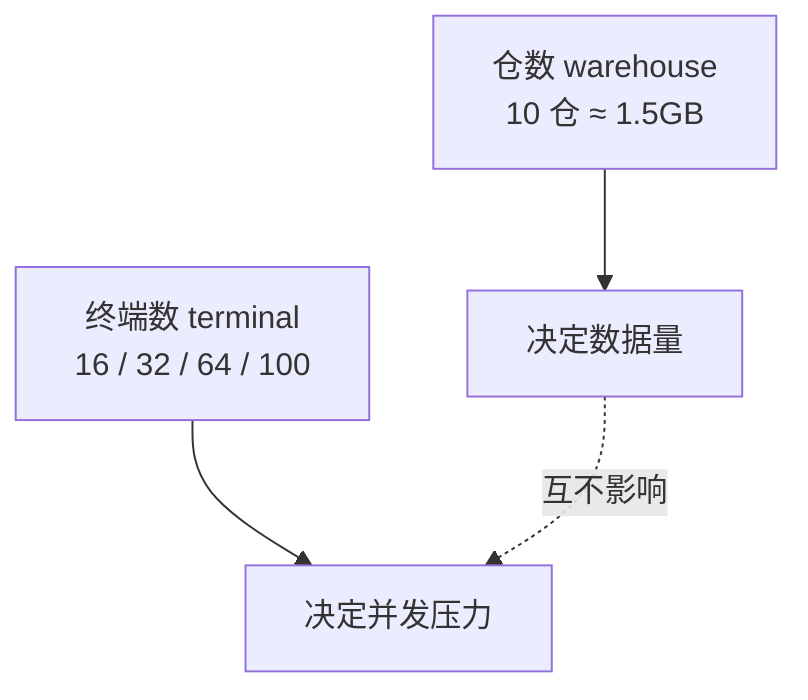
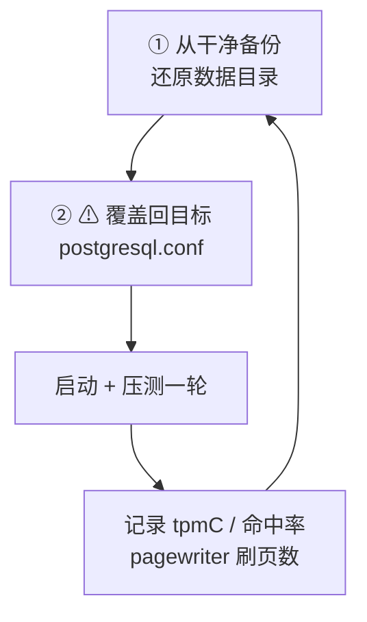
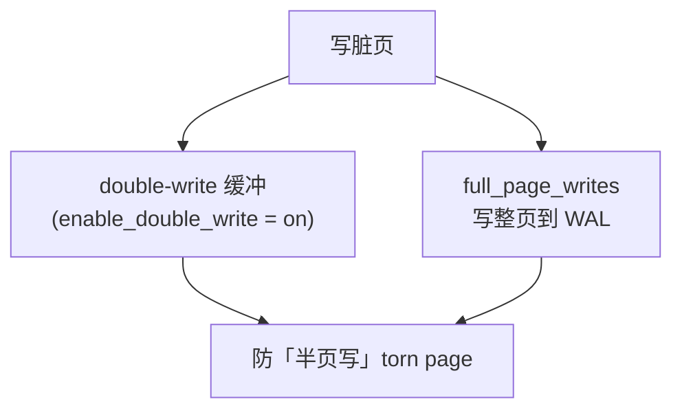
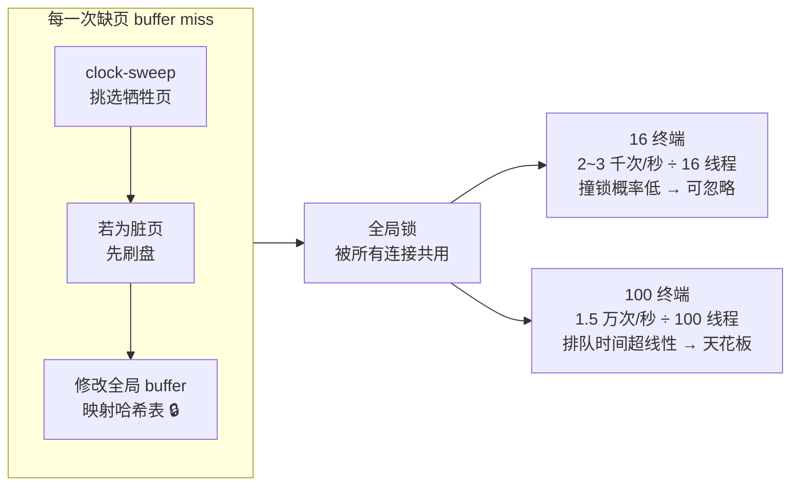

<div class="font-serif text-center text-4xl mt-40">
    KAOT 模板在小规模 TPC-C 场景下的<br>适配性分析
</div>

<div class="text-center text-sm opacity-60 mt-8">
    试用期阶段工作答辩　·　赵麟　·　2026.09
</div>

<!--
各位老师、各位同事好，我是赵麟。今天汇报的是我试用期阶段的主要工作：KAOT 调优模板在小规模 TPC-C 场景下的适配性分析。

这项工作从 9 月 2 号做到 9 月 16 号，一共六个阶段。我想先说一句话概括它：这个实验最初得出的结论是"KAOT 调优之后性能下降 24.5%"，但这个结论后来被我自己推翻了两次，最终的答案是"提升 116.1%"。

一个结论从负 24.5% 翻到正 116.1%，中间隔着的不是新参数，而是实验方法。这也是我今天最想讲清楚的部分。
-->

---

## 目录

<br>

<div class="grid grid-cols-2 gap-x-10 gap-y-1">

<div>

<v-click>

#### 01　工作背景与任务定位

</v-click>

<v-click>

#### 02　本次工作的三个难点

</v-click>

<v-click>

#### 03　实验环境与方法设计

</v-click>

<v-click>

#### 04　阶段一~二：结论与方法论修正

</v-click>

</div>

<div>

<v-click>

#### 05　阶段三~四：消融与并发扫描

</v-click>

<v-click>

#### 06　阶段五~六：归因与容量扫描

</v-click>

<v-click>

#### 07　结论、推荐配置与工具建议

</v-click>

<v-click>

#### 08　局限、后续工作与方法论收获

</v-click>

</div>

</div>

<!--
汇报分八个部分，大约十五分钟。

第一部分交代任务背景，说明 KAOT 是什么、我要回答什么问题；
第二部分把这次工作的三个难点先摆出来，后面的实验设计都是围绕这三个难点展开的；
第三部分是实验环境和方法设计，其中"实验协议"这一页是整个工作的转折点；
第四到第六部分是六个阶段的实验数据，这是主体；
第七部分给出最终结论、推荐配置，以及我对 KAOT 这个工具本身的四条改进建议；
最后第八部分讲局限性和方法论上的收获。
-->

---

## 1. 工作背景与任务定位

<br>

<v-click>

#### 任务来源

在鲲鹏平台上验证 **KAOT（Kunpeng & Ascend Optimization Tool）** 的 `opengauss_database` 调优模板，回答两个问题：

- 这份模板在我们的机型 + 负载上**有没有效**？
- 如果有效或无效，**是哪些参数在起作用**？

</v-click>

<br>

<v-click>

#### KAOT 是一个「规则式」调优工具

识别环境 → 匹配预置场景 → 下发一份实验室验证过的参数模板，三个子命令：

</v-click>

<v-click>


```mermaid {scale: 0.72}
flowchart LR
    A["kaot basecfg<br/>采集基线"] --> B["kaot generate<br/>生成调优单"] --> C["kaot execute<br/>使能参数"]
    C --> D["postgresql.conf<br/>40+ 项参数一次性下发"]
```

</v-click>

<!--
先说任务来源。

KAOT 是 BoostKit 下面的一个调优工具，全称是鲲鹏与昇腾优化工具。它的定位是"规则式"调优——注意不是自动寻优，它不做搜索，而是识别你的硬件和软件环境，匹配一个预置场景，然后下发一份华为实验室已经验证过的参数模板。

它有三个子命令：basecfg 采集当前基线，generate 生成调优单，execute 把参数真正写进配置文件并使能。

我这次要回答的问题有两个：第一，这份模板在我们这台鲲鹏 920 加 openGauss 的组合上到底有没有效；第二，也是更重要的，如果有效或者无效，到底是模板里哪些参数在起作用。

这里要特别说明一点：opengauss_database 这个场景只包含 optimize_opengauss_database_config 一个调优项，也就是只改数据库配置文件，不含网卡绑核、IO 调度这些操作系统层的调优——kingbase 和 dameng 的场景才有那些。所以这次实验的变量被限制得很干净，全部在 postgresql.conf 里面。

一次性下发 40 多项参数，这也埋下了后面归因的难题。
-->

---

## 2. 本次工作的三个难点

<div class="grid grid-cols-3 gap-4 mt-6">

<v-click>

<div class="p-4 rounded-lg bg-red-400/8 border border-red-400/25 h-[300px]">

<div class="text-red-300 font-bold text-sm">难点一　方法陷阱</div>

<div class="text-xs opacity-75 mt-1">测试环境本身不可重复</div>

<div class="text-sm mt-4 leading-relaxed">

- 压测会**磨损数据**，同一配置越跑越慢
- 跨时段、跨批次的机器状态**系统性漂移**
- 还原数据目录会**连带还原配置文件**

</div>

<div class="text-xs mt-4 text-red-300">→ 阶段一的 −24.5% 大部分是假的</div>

</div>

</v-click>

<v-click>

<div class="p-4 rounded-lg bg-amber-400/8 border border-amber-400/25 h-[300px]">

<div class="text-amber-300 font-bold text-sm">难点二　归因难题</div>

<div class="text-xs opacity-75 mt-1">40+ 参数一次性下发</div>

<div class="text-sm mt-4 leading-relaxed">

- 模板是**一个整体**，只能测"全量 vs 默认"
- 单点对比只能回答"有没有效"
- 回答不了"**为什么**"和"**靠哪个参数**"

</div>

<div class="text-xs mt-4 text-amber-300">→ 需要消融 + 单参数隔离 + 容量扫描</div>

</div>

</v-click>

<v-click>

<div class="p-4 rounded-lg bg-sky-400/8 border border-sky-400/25 h-[300px]">

<div class="text-sky-300 font-bold text-sm">难点三　机制解释</div>

<div class="text-xs opacity-75 mt-1">同一参数，两种结论</div>

<div class="text-sm mt-4 leading-relaxed">

- 16 终端下 `shared_buffers` 几乎无关紧要
- 100 终端下同一参数贡献 **90.3%** 的增益
- 命中率只差 **1 个百分点**，结果差一倍

</div>

<div class="text-xs mt-4 text-sky-300">→ 串行路径 / 阿姆达尔定律</div>

</div>

</v-click>

</div>

<!--
在讲数据之前，我想先把这次工作的三个难点摆出来。后面所有的实验设计，都是围绕这三个难点展开的。

难点一是方法陷阱。数据库压测这件事，测试环境本身是不可重复的：TPC-C 会持续往表里写数据、产生死元组，所以同一份配置，跑的轮次越多成绩越差，我把它叫做"数据磨损"。另外机器是共用的，跨时段跑会有系统性漂移。还有一个最容易踩的坑——你从备份还原数据目录的时候，postgresql.conf 就躺在数据目录里面，会被一起还原回去，如果不注意，你以为在测 KAOT，实际上测的是默认配置。阶段一的负 24.5%，绝大部分就是这么来的。

难点二是归因难题。KAOT 是一次性下发 40 多个参数，它是一个整体。如果你只做"全量 vs 默认"的对比，最多只能得到"有没有效"这一个 bit 的信息，回答不了"为什么"，更回答不了"能不能只改一个参数就拿到大部分收益"。

难点三是机制解释。这是我觉得最有意思的部分：同一个 shared_buffers 参数，在 16 个终端下几乎无关紧要，在 100 个终端下却贡献了 90.3% 的增益。而且两组的缓存命中率只差 1 个百分点——98.95% 对 99.93%，听起来微不足道，但吞吐差了一倍。为什么？这个后面我会专门用两页讲。
-->

---

## 3. 实验环境

<style>
.slidev-layout table { font-size: 0.74rem; line-height: 1.35; }
.slidev-layout th, .slidev-layout td { padding: 4px 10px !important; }
</style>

<div class="grid grid-cols-2 gap-8 mt-3">

<div>

<v-click>

| 项目 | 值 |
|------|-----|
| CPU | Kunpeng 920 7260（aarch64，64 核） |
| 内存 | 502.36 GB |
| OS / 内核 | openEuler 22.03 LTS-SP4 / 5.10.0-216 |
| 数据库 | openGauss 极简版，单机，:5432 |
| 压测 | BenchmarkSQL 5.0 + JDK 11 + PG JDBC |
| 调优 | KAOT 1.0.0 / `opengauss_database` |
| 负载 | TPC-C，10 仓，5–10 分钟 / 轮 |

</v-click>

</div>

<div>

<v-click>

#### TPC-C 的两个**独立**的轴

</v-click>

<v-click>


```mermaid {scale: 0.62}
flowchart TB
    W["仓数 warehouse<br/>10 仓 ≈ 1.5GB"] --> D["决定数据量"]
    T["终端数 terminal<br/>16 / 32 / 64 / 100"] --> C["决定并发压力"]
    D -.->|互不影响| C
```

</v-click>

<v-click>

<div class="text-sm mt-2 p-3 rounded bg-green-400/8 border border-green-400/25">

加终端**不会**增加数据量，加仓数**不会**自动增加并发。<br>
本实验后期正是靠**分离这两个轴**才定位到真正的规律。

</div>

</v-click>

</div>

</div>

<!--
这是实验环境。机器是鲲鹏 920 7260，64 核的 aarch64 架构，双路 128 核，内存 502 GB——这个内存数字后面很关键。操作系统是 openEuler 22.03，数据库是 openGauss 极简版单机部署。

因为 openGauss 是从 PostgreSQL 9.2.4 内核演化来的，语法、驱动、配置文件高度相似，所以 BenchmarkSQL 直接用 PostgreSQL 的 JDBC 驱动就能压，配置文件也还叫 postgresql.conf。

右边这一块我要特别强调，因为它是我后期能定位到规律的关键。

TPC-C 有两个独立的轴：仓数和终端数。仓数决定数据量，每仓大约 100 MB 原始数据，10 仓算上索引大概 1.5 到 2 GB；终端数决定并发压力，TPC-C 规范要求每仓最多 10 个终端，所以 10 仓的上限是 100 个终端。

关键在于这两者互不影响——加终端不会让数据变多，加仓数也不会自动提高并发。

我前三个阶段全部固定在 16 终端下做，正是因为没有把这两个轴分开考虑，才在一个"看不出模板价值"的区间里反复打转。
-->

---

## 3. 配置分组 —— 为「归因」而设计

<style>
.slidev-layout table { font-size: 0.76rem; line-height: 1.3; }
.slidev-layout th, .slidev-layout td { padding: 3px 10px !important; }
</style>

<div class="grid grid-cols-2 gap-8 mt-3">

<div>

<v-click>

| 组 | 配置说明 | shared_buffers |
|----|---------|----------------|
| **A** | 默认参数（基准） | 1024MB |
| **B** | KAOT 全量模板 | 151GB |
| **C1** | B，**仅**将 buffer 改小 | 8GB |
| **C2** | B，**仅**降刷盘频率 | 151GB |
| **D** | C1 + `wal_level` / `max_connections` | 8GB |
| **E / E'** | 安全子集，FPW off / on | 4GB |
| **F** | A，**仅**改 buffer | 8GB |
| **G** | A，**仅**改 `xloginsert_locks=48` | 1024MB |
| **SBxx** | A，仅改 buffer 为 2/4/16/32/151GB | 见组名 |

</v-click>

</div>

<div class="text-sm">

<v-click>

<div class="p-3 rounded-lg bg-white/5 border border-white/10">

**判别对 C1 / C2** —— 一个只改 buffer，一个只改刷盘频率。用来在「容量」与「刷盘」两个竞争假设之间做出判别。

</div>

</v-click>

<v-click>

<div class="p-3 rounded-lg bg-white/5 border border-white/10 mt-3">

**单参数组 F / G** —— 在默认配置上只动**一个**参数。这是把 40+ 项模板拆开、完成增益归因的唯一手段。

</div>

</v-click>

<v-click>

<div class="p-3 rounded-lg bg-white/5 border border-white/10 mt-3">

**容量扫描 SBxx** —— 固定其他一切，只扫 `shared_buffers` 的取值曲线，用来回答「最优值是多少」。

</div>

</v-click>

<v-click>

<div class="p-3 rounded-lg bg-green-400/8 border border-green-400/25 mt-3">

先记住三组：<strong>A</strong> 基准、<strong>B</strong> KAOT 全量、<strong>F</strong> 只改一个 buffer —— 最终结论几乎完全由这三组决定。

</div>

</v-click>

</div>

</div>

<!--
这一页是配置分组，我想说明的是：这些分组不是随便列的，每一组都对应一个要回答的问题。

左边的表格里，A 是默认参数作为基准，shared_buffers 是 1GB；B 是 KAOT 全量模板，shared_buffers 被设成了 151GB。

右边我把设计意图分成三类。

第一类是判别对，也就是 C1 和 C2。C1 是拿 KAOT 全量模板只把 buffer 改小，C2 是保留 151GB 只把刷盘频率降回默认。这一对的作用是在"容量"和"刷盘"这两个竞争假设之间做出判别——如果问题出在刷盘，C2 应该有改善；如果问题出在容量，C1 应该有改善。两者必居其一。

第二类是单参数组 F 和 G。它们是在默认配置上只动一个参数。这是把 40 多项的模板拆开、完成增益归因的唯一手段——你只有让其他一切都不变，才能说"这个数字是这一个参数带来的"。

第三类是容量扫描 SBxx，固定其他一切，只扫 shared_buffers 的取值曲线，回答"最优值到底是多少"。

大家听后面的数据时，先记住三组就够了：A 是基准，B 是 KAOT 全量，F 是只改一个 buffer。最终的结论几乎完全由这三组决定。
-->

---

## 3. 实验协议 —— 阶段三起启用

<div class="grid grid-cols-2 gap-8 mt-4">

<div>

<v-click>


```mermaid {scale: 0.62}
flowchart TB
    S["① 从干净备份<br/>还原数据目录"] --> K["② ⚠ 覆盖回目标<br/>postgresql.conf"]
    K --> R["启动 + 压测一轮"]
    R --> M["记录 tpmC / 命中率<br/>pagewriter 刷页数"]
    M --> S
```

</v-click>

</div>

<div class="text-sm">

<v-click>

<div class="p-3 rounded-lg bg-red-400/8 border border-red-400/25">

**② 是最易踩的坑**

`postgresql.conf` 就在数据目录里 —— 还原数据会把配置**一并还原**。漏掉这一步，你以为在测 B 组，实际测的还是 A 组。

</div>

</v-click>

<v-click>

<div class="mt-3 leading-relaxed">

**③ 同批次内交叉执行**<br>
<span class="opacity-75">A、B 交替跑，而非 A 全跑完再跑 B —— 机器状态漂移不会系统性偏向某一组。</span>

</div>

</v-click>

<v-click>

<div class="mt-3 leading-relaxed">

**④ 每批次含 A、B 作为锚点**<br>
<span class="opacity-75">用于识别批次间漂移。代价是每批次多花约 1/3 机时，但没有它就无法判断结论该信哪一次。</span>

</div>

</v-click>

<v-click>

<div class="mt-4 p-3 rounded bg-white/5 border border-white/10 text-xs">

好在 10 仓数据只有 1.5GB，**还原一次仅需数十秒** —— 这条协议的成本远低于它挡掉的错误。

</div>

</v-click>

</div>

</div>

<!--
这一页是实验协议，是阶段三之后我才启用的，也是这次工作方法上最重要的修正。

第一步，每轮压测前从同一份干净备份还原数据目录。

第二步，还原完成之后必须把目标配置文件覆盖回去。这一步是最容易踩的坑——postgresql.conf 就躺在数据目录里面，你还原数据目录，配置文件就被一起还原成备份时的版本了。如果漏掉这一步，你以为在测 B 组，实际上测的还是 A 组。我一开始就是在这里吃了亏。

第三步，同一批次内交叉执行，A 跑一轮 B 跑一轮再 A 再 B，而不是 A 全跑完再跑 B。这样机器状态的漂移不会系统性地偏向某一组。

第四步，每个批次都必须包含 A 和 B 作为锚点，这样我才能知道这个批次相对上一个批次漂了多少。这一条的代价是每个批次要多花大约三分之一的机时，但没有它，你根本不知道跨批次的数字该信哪一个——下一页就会看到这个问题有多严重。

最后说一下成本：好在 10 仓数据只有 1.5GB，还原一次只要几十秒。这条协议的成本，远远低于它挡掉的错误。
-->

---

## 4. 阶段一：全量套用 KAOT（16 终端 · 未还原数据）

<div class="flex justify-center mt-1">

</div>

<!--
这是阶段一的结果，也是最初的那个结论。

基线三轮，tpmC 均值 47,153，标准差约 1,991，变异系数 4.2%。KAOT 三轮，均值 35,600，标准差 2,261，变异系数 6.4%。

tpmC 下降了 24.5%，做 Welch t 检验，t 值 6.64，p 约等于 0.003，统计上是显著的。

当时我的归因是：shared_buffers 被设成 151GB，引入了 NUMA 跨节点访问和巨大的 buffer 管理开销。这个方向后来证明是对的，但量级完全不对。

因为当时有三个疑点我没有排除，就写在右边这个框里：

第一，基线三次的成绩是逐次下降的，48,999、47,413、45,044，每次降大约 3%，这提示数据在随着压测被磨损；
第二，两组测试整整隔了两天，9 月 2 号跑基线，9 月 4 号跑 KAOT，而机器是共用的；
第三，最要命的是，我当时根本没记录基线的 shared_buffers 实际值是多少。

这三个疑点，每一个都足以推翻这个结论。
-->

---

## 5. 阶段二：方法论修正 —— 结论被推翻

<div class="flex justify-center mt-1">

</div>

<!--
阶段二我先补查了一件事：基线的 shared_buffers 到底是多少。答案是 1024MB，也就是 1GB。

有了这个数字就能做量化了。openGauss 的页大小是 8KB，所以基线的 buffer 数是 1GB 除以 8KB 等于 131,072 个；而我们的数据实际只有大约 1.5GB，折合 196,608 个页。KAOT 给的 151GB 换算下来是 1,979 万个 buffer——有效利用率只有 0.99%，也就是说 99% 的 buffer 是空的。

光是这些空 buffer 的描述符数组，64 字节乘以 1,979 万，就要占 1.27 GB 内存；而且 151GB 如果用 4KB 页映射，页表项有 3,958 万个，页表本身约 316 MB。更麻烦的是，opengauss_database 这个场景里不包含 config_hugepages——模板给了你大内存配置，却没有配套的大页配置。

然后是这一页的核心。我引入了"每轮还原数据"，重新测。

同一份 KAOT 配置，成绩从 35,600 涨到 48,883，涨了 37.3%。而默认配置只从 47,153 涨到 51,579，涨了 9.4%。

为什么 KAOT 涨得多这么多？因为 9 月 4 号跑 KAOT 的时候，数据已经被 9 月 2 号的三轮压测磨损过了，它受的损害远比基线严重。

所以阶段一那个 −24.5%，绝大部分来自测试方法的缺陷，而不是参数本身。修正后同口径复测，KAOT 全量是 −5.2%——方向还是负的，但量级完全不同了。

这是结论第一次被推翻。
-->

---

## 5.1 批次间漂移：跨批次数据不可直接比较

<div class="grid grid-cols-2 gap-8 mt-4">

<div>

<v-click>

三个批次的 A、B 组数据（**均为 16 终端**）：

| 批次 | A | B | B / A |
|------|-----|-----|------|
| 阶段一（9/4，未还原） | 47,153 | 35,600 | <span class="text-red-400 font-bold">−24.5%</span> |
| 阶段三（已还原，n=2） | 51,579 | 48,883 | <span class="text-red-400 font-bold">−5.2%</span> |
| 阶段四（已还原，n=1） | 55,840 | 59,226 | <span class="text-green-400 font-bold">+6.1%</span> |

</v-click>

<br>

<v-click>

后两个批次**符号相反**，且 B 组的波动（+21.2%）远大于 A 组（+8.3%）。

</v-click>

</div>

<div>

<v-click>

<div class="p-4 rounded-lg bg-amber-400/8 border border-amber-400/25">

<div class="text-amber-300 font-bold">这是本次工作最重要的一条纪律</div>

<div class="text-sm mt-3 leading-relaxed">

**跨批次数据不可直接比较。**

本报告所有核心结论均基于**同一批次内**的对比 —— 只要一个结论需要拿两个批次的数字相减，它就不成立。

</div>

</div>

</v-click>

<v-click>

<div class="text-sm mt-4 opacity-80">

同一组配置、同样 16 终端、同样已还原数据，三个批次跑出 −24.5% / −5.2% / +6.1% 三种符号不同的结果 —— 这已经不是噪声，而是**批次级别的系统性漂移**。

</div>

</v-click>

</div>

</div>

<!--
这一页讲一个我认为是本次工作里最重要的纪律。

左边这张表，三个批次的 A 组和 B 组数据，全部都是 16 终端。

阶段一，未还原数据，B 比 A 低 24.5%；
阶段三，已还原数据，B 比 A 低 5.2%；
阶段四，同样已还原数据，B 反而比 A 高 6.1%。

注意后两个批次，方法完全一样，并发也一样，但结论的符号是相反的。而且你看 A 组从 51,579 涨到 55,840，涨了 8.3%；B 组从 48,883 涨到 59,226，涨了 21.2%。B 组的批次间波动远大于 A 组。

这说明什么？说明跨批次的数据根本不能直接相减比较。机器状态、缓存、后台任务，这些东西在批次之间会漂移，而且漂移幅度能达到 20%，比我要测的很多效应都大。

所以从阶段三开始，我给自己定了一条硬规矩：本报告所有核心结论都必须基于同一批次内的对比。只要一个结论需要拿两个批次的数字相减，它就不成立，我就不写进去。

这条纪律的代价是每个批次都要重复跑 A 和 B 做锚点，多花大约三分之一的机时；但没有它，前面那三行数据你根本不知道该信哪一行。
-->

---

## 6. 阶段三：16 终端消融实验

<div class="flex justify-center mt-1">

</div>

<!--
阶段三做了七组配置，每组两轮，同批次交叉执行。这是第一次真正做消融。

先看整体：A 是基准 51,579。B 全量模板 −5.2%。C1 是 +14.6%，D 是 +13.1%，E 和 E' 分别是 +7.0% 和 +10.4%。

这一页的核心是中间被框起来的 C1 和 C2 这一对，它们是我专门设计的判别对。

C1 的做法是：拿 KAOT 全量模板，只把 shared_buffers 从 151GB 改成 8GB，其他 40 多个参数一个不动。结果 +14.6%——不但把 B 组丢掉的 5.2% 全部收回来，还反超了基准。

C2 的做法是：保留 151GB 不动，只把刷盘频率降回默认，也就是 bgwriter_delay 从 5 毫秒改成 2000 毫秒、pagewriter_sleep 从 100 毫秒改成 2 秒。结果 −7.5%，毫无改善。

这一对的意义在于：我原先的假设是"大 buffer 池加上高频的 bgwriter 扫描，两者组合失配"。如果这个假设成立，C2 应该有明显改善。但 C2 没有。

所以判定很清楚：问题出在 buffer 池容量本身，跟刷盘频率无关。原先那个组合失配的假设被 C2 排除掉了。

另外注意 C1 的变异系数只有 0.8%，E 和 E' 甚至只有 0.1%，这几组的数据是非常稳的。
-->

---

## 6.1 一个反常结果：`full_page_writes` 不能关

<div class="grid grid-cols-2 gap-8 mt-6">

<div>

<v-click>

| 组 | 配置 | tpmC | 相对 A |
|----|------|------|-------|
| E | 安全子集，**FPW off** | 55,179 | +7.0% |
| E' | 安全子集，**FPW on** | 56,943 | +10.4% |

<div class="text-sm mt-3">

E'（开启 FPW）比 E 高 **3.2%**，两轮结果一致，CV 均为 **0.1%**。

</div>

</v-click>

<br>

<v-click>

<div class="p-3 rounded bg-red-400/8 border border-red-400/25 text-sm">

这与 PostgreSQL 上「关掉 FPW 提性能」的**常识相反**。

</div>

</v-click>

</div>

<div>

<v-click>

#### 原因：与 double-write 机制重叠


```mermaid {scale: 0.6}
flowchart TB
    W["写脏页"] --> DW["double-write 缓冲<br/>(enable_double_write = on)"]
    W --> FPW["full_page_writes<br/>写整页到 WAL"]
    DW --> P["防「半页写」torn page"]
    FPW --> P
```

</v-click>

<v-click>

<div class="text-sm mt-2 leading-relaxed">

openGauss 在**增量检查点**模式下已依靠 double-write 防半页写。关掉 `full_page_writes` 并不能减少 WAL 写入量，反而多走一层。

</div>

</v-click>

<v-click>

<div class="text-sm mt-3 p-3 rounded bg-green-400/8 border border-green-400/25">

**建议：openGauss 上保留 <code>full_page_writes = on</code>。**<br>
而 KAOT 模板恰好把它设成了 `off`。

</div>

</v-click>

</div>

</div>

<!--
这一页讲一个反常的结果，我觉得值得单独说，因为它直接指出了 KAOT 模板里的一个问题。

E 和 E' 这两组，除了 full_page_writes 一个开一个关，其他完全一样。结果是开着 FPW 的 E' 比关掉的 E 高 3.2%。而且这两组的变异系数都只有 0.1%，两轮结果高度一致，不是噪声。

这跟我们在 PostgreSQL 上的常识是反的。在 PG 上，full_page_writes 意味着 checkpoint 之后每个页第一次被修改时，要把整个 8KB 页写进 WAL，WAL 量会显著变大，所以在有电池保护的存储上大家经常会关掉它换性能。

但 openGauss 不一样。我去查了配置，enable_double_write 是 on 的。openGauss 在增量检查点模式下，是靠 double-write 缓冲来防"半页写"的——就是掉电时一个 8KB 页只写了一半的情况。

也就是说，防半页写这件事已经由 double-write 负责了。这时候你关掉 full_page_writes，并不能减少 WAL 的写入量，反而多走了一层判断。所以是负收益。

结论是：openGauss 上应该保留 full_page_writes = on。而 KAOT 模板恰好把它设成了 off——这是我后面给工具提的四条建议里的一条。
-->

---

## 7. 阶段四：并发扫描 —— 结论第二次被推翻

<div class="flex justify-center mt-1">

</div>

<!--
阶段四是整个工作的转折点。我把 A、B、C1 三组分别在 16、32、64、100 四个并发点各跑一轮。

看这张图，有两个发现。

第一个发现：KAOT 的价值高度依赖并发量级。

16 终端的时候，三组基本持平，A 是 55,840，B 是 59,226，C1 是 60,623，差距在噪声量级内。
32 终端开始迅速拉开，B 已经比 A 高 66.9%。
64 终端，B 比 A 高 100.7%。
100 终端，B 比 A 高 108.1%。

我用黄色标出来的那一条竖带，就是 16 终端——我前面三个阶段，全部都在这一个并发点上做。而这个点，恰恰是整条曲线上唯一看不出模板价值的区间。

这是结论第二次被推翻。前三个阶段不是做错了，是问错了问题。

第二个发现：151GB 的惩罚在高并发下消失了。100 终端时 B 和 C1 只差 0.3%。为什么？因为大 buffer 池的管理开销是一个固定成本，当吞吐涨到 2.9 倍之后，这个固定成本被摊薄到看不见了。

右边是扩展性。16 到 100 终端是 6.25 倍并发，A 组吞吐只涨了 1.47 倍，在大约 8.2 万 tpmC 处就撞墙了；B 和 C1 分别涨了 2.88 倍和 2.80 倍。

不过要说明一点：三组在 64 到 100 这一段涨幅都只有 9 到 10%，都已经接近饱和了。这一段更可能是受 10 仓的 warehouse 行锁争用限制，不是 buffer 的问题。
-->

---

## 7.1 机制：1 个百分点的命中率，7.5 倍的物理读

<div class="flex justify-center mt-2">

</div>

<!--
那么为什么同一个参数，在 16 终端无关紧要，在 100 终端价值翻倍？这一页和下一页回答这个问题。

先看数字。100 终端下，A 组的缓存命中率是 98.953%，B 组是 99.934%。差了大约 1 个百分点。

1 个百分点听起来微不足道，但命中率是这样算的：blks_hit 除以 blks_hit 加 blks_read。命中率从 98.95% 提到 99.93%，未命中率是从 1.05% 降到 0.07%，降了 15 倍。

换算成绝对数字：A 组一轮的物理读总数是 454 万次，B 组是 60 万次，差 7.5 倍。折合每秒，A 组大约 15,140 次，B 组大约 2,000 次。

右边这个框是关键的机制。每一次缺页，数据库要做三件事：走 clock-sweep 算法挑一个牺牲页换出去，如果这个页是脏的还要先刷盘，最后——也是最关键的——修改全局的 buffer 映射哈希表，而这一步需要加锁。

这把锁是被所有连接共用的。

16 终端的时候，每秒两三千次缺页分摊到 16 个线程上，撞锁的概率很低，一次缺页的成本基本就是一次内存拷贝，可以忽略。这也是为什么 16 终端下大 buffer 省下的开销，恰好被 151GB 的固定管理成本抵消掉，两组打平。

100 终端的时候，每秒 1.5 万次缺页，100 个线程争同一把锁，排队时间随并发是超线性增长的，它就变成了吞吐的天花板。
-->

---

## 7.2 机制：小 buffer 的代价是多出一段**串行路径**

<div class="flex justify-center mt-3">


```mermaid {scale: 0.68}
flowchart LR
    subgraph MISS["每一次缺页 buffer miss"]
        direction TB
        S1["clock-sweep<br/>挑选牺牲页"] --> S2["若为脏页<br/>先刷盘"] --> S3["修改全局 buffer<br/>映射哈希表 🔒"]
    end
    MISS --> L["全局锁<br/>被所有连接共用"]
    L --> T16["16 终端<br/>2~3 千次/秒 ÷ 16 线程<br/>撞锁概率低 → 可忽略"]
    L --> T100["100 终端<br/>1.5 万次/秒 ÷ 100 线程<br/>排队时间超线性 → 天花板"]
```

</div>

<v-click>

<div class="text-center mt-4 text-lg">

小 buffer 的代价不是「慢一点」，而是<span class="text-amber-300 font-bold">多出一段串行路径</span>。

</div>

<div class="text-center mt-2 text-sm opacity-70">

串行瓶颈在低并发下隐形、在高并发下即天花板 —— 这是<strong>阿姆达尔定律</strong>的典型表现

</div>

</v-click>

<!--
把上一页的机制用一张图再讲一遍。

每一次缺页，都要走 clock-sweep 挑牺牲页、脏页先刷盘、然后修改全局 buffer 映射哈希表。最后这一步需要加锁，而且这把锁是全局的，被所有连接共用。

这就是一段串行路径。

在 16 终端下，每秒两三千次缺页分到 16 个线程，撞锁概率低，这段串行路径几乎不产生排队，所以它是隐形的。

在 100 终端下，每秒 1.5 万次缺页分到 100 个线程，排队时间随并发超线性增长，这段串行路径就成了整个系统的天花板。

所以我想强调的是：小 buffer 的代价不是"每次读盘慢一点"这种线性的代价，而是多出了一段串行路径。

阿姆达尔定律告诉我们，系统中任何一段串行路径都会成为并发扩展的上限。这也解释了本次实验最让人困惑的现象——为什么同一个参数在 16 终端下无关紧要，在 100 终端下价值翻倍。

不是参数变了，是并发把那段串行路径放大了。
-->

---

## 8. 阶段五：单参数隔离（100 终端）

<div class="flex justify-center mt-1">

</div>

<!--
阶段五是本报告证据强度最高的一组数据：六组配置，同一批次执行，各跑一轮，全部在 100 终端下。

A 组默认 1GB，82,726，作为基准。

G 组：只改一个 xloginsert_locks，从默认值提到 48。这个参数我原本是重点怀疑对象——WAL 插入锁的竞争是 PostgreSQL 系数据库在高并发下的经典瓶颈，KAOT 把它从默认的 8 提到 48 看起来很有针对性。但实测只有 +2.6%，在噪声量级内。

E' 组：4GB 加上一批监控关闭项，+99.3%。

F 组是这一页的重点，我用虚线框了出来：在默认配置上，只改一个 shared_buffers，从 1GB 改到 8GB，其他什么都不动。结果是 +104.8%。

D 组：8GB 再加上 wal_level=minimal 和 max_connections=200，+112.8%。

B 组：KAOT 全量模板，+116.1%。

所以 F 组一个参数就拿到了 169,457，占全量模板绝对吞吐 178,780 的 94.8%。

还有一个交叉印证：阶段四里的 C1@100，也就是 8GB 加上 KAOT 全部其他参数，是 169,968；而 F 组，8GB 什么都不加，是 169,457。两次独立测量，相差 0.3%。

这说明：在 8GB buffer 的基础上，KAOT 其余那 40 多个参数几乎不产生额外收益。
-->

---

## 8.1 增益归因：+96,054 tpmC 从哪里来？

<div class="flex justify-center mt-6">

</div>

<!--
把阶段五的数据做成归因，就是这一张图。

总增量是 178,780 减去 82,726，等于 96,054 tpmC，也就是 +116.1%。

这 96,054 分成三份：

shared_buffers 从 1GB 提到 8GB，贡献 86,731，占 90.3%；
wal_level 改成 minimal 加上 max_connections 改成 200，贡献 6,540，占 6.8%；
KAOT 模板里其余全部四十多个参数，合计贡献 2,783，占 2.9%。

我想说的是，这不是在否定 KAOT——KAOT 确实有效，+116.1% 是实打实的。但它有效的原因，和模板设计者可能预期的原因不一样。

模板里那四十多项精细的参数——checkpoint_segments、wal_buffers、autovacuum 的一堆系数、advance_xlog_file_num、pagewriter_thread_num——它们加在一起只贡献了不到 3%。

下面这个绿框是交叉印证，我刚才提过：C1@100 是 169,968，F 是 169,457，相差 0.3%。两条独立的证据链指向同一个结论。
-->

---

## 9. 阶段六：`shared_buffers` 容量扫描（100 终端）

<div class="flex justify-center mt-1">

</div>

<!--
既然 90% 的收益来自一个参数，那自然要问：这个参数的最优值到底是多少？KAOT 给的 151GB 对不对？

阶段六我在 100 终端下扫了 7 个容量点。

第一个结论：这是悬崖，不是缓坡。

1GB 是 82,726，2GB 直接跳到 169,604，吞吐翻倍。然后 2GB 到 16GB 这四个点，168,538 到 170,730，极差只有 1.3%，完全是一个平台。

第二个结论：尾部是下降的。从 16GB 的峰值 170,730，到 32GB 的 166,236，再到 151GB 的 164,932，单调下降。KAOT 推荐的 151GB，是这次扫描里表现最差的一档，比峰值低 3.4%。

但这里我必须谨慎表述：这些点都是单次测量，而历史变异系数是 4 到 6%，3.4% 落在单次测量的误差范围之内。所以我只能说"呈轻微下降趋势，方向与固定管理开销随容量增长的解释一致"，不能把它当成一个定量结论。这一点我在报告里也写明了。

黄色虚线是物理读每秒，用了非线性刻度。1GB 是 15,140 次每秒，2GB 降到 4,282，4GB 降到 2,147，之后基本触底在 1,970 左右。这条线是下一页的关键。
-->

---

## 9.1 推荐值不是 2GB —— 吞吐已满，但缓存未饱和

<style>
.slidev-layout table { font-size: 0.78rem; line-height: 1.3; }
.slidev-layout th, .slidev-layout td { padding: 3px 10px !important; }
</style>

<div class="grid grid-cols-2 gap-8 mt-3">

<div>

<v-click>

| shared_buffers | tpmC | 命中率 | 物理读/秒 |
|----------------|------|--------|----------|
| 1GB | 82,726 | 98.953% | 15,140 |
| **2GB** | 169,604 | 99.851% | <span class="text-amber-300 font-bold">4,282</span> |
| **4GB** | 168,538 | 99.924% | <span class="text-sky-300 font-bold">2,147</span> |
| 8GB | 169,457 | 99.935% | 1,970 |
| 16GB | **170,730** | 99.935% | 1,980 |
| 32GB | 166,236 | 99.935% | 1,957 |
| 151GB | 164,932 | 99.935% | 1,953 |

</v-click>

</div>

<div>

<v-click>

<div class="p-3 rounded-lg bg-amber-400/8 border border-amber-400/25 text-sm">

**2GB 刚好踩在悬崖边缘。**

吞吐已经满了，但物理读仍是平台底值（≈1,970）的 **2.2 倍** —— 缓存并未饱和，数据集稍有增长即可能跌回。

</div>

</v-click>

<v-click>

<div class="p-3 rounded-lg bg-sky-400/8 border border-sky-400/25 mt-3 text-sm">

**推荐 4~8GB。**

4GB 时物理读降至 2,147，基本触底；相对约 1.5~2GB 的热点工作集留 **2~4 倍余量**。

</div>

</v-click>

<v-click>

<div class="p-3 rounded-lg bg-red-400/8 border border-red-400/25 mt-3 text-sm">

KAOT 的 **151GB** 比该区间大 **19~38 倍**，且落在扫描曲线的最低点。

</div>

</v-click>

</div>

</div>

<!--
这一页解释为什么我推荐 4 到 8GB，而不是看起来"够用就好"的 2GB。

如果只看吞吐，2GB 已经达到平台了，169,604，跟 8GB 的 169,457 几乎一样。按"够用就好"的思路，选 2GB 最省内存。

但看第三列和第四列。2GB 的命中率是 99.851%，物理读是每秒 4,282 次；而 4GB 的命中率是 99.924%，物理读降到 2,147；8GB 之后基本触底在 1,970。

也就是说，2GB 的时候物理读仍然是平台底值的 2.2 倍。缓存其实还没有饱和，只是这个量级的缺页在当前负载下还没有撑破那段串行路径而已。

用一句话说：2GB 刚好踩在悬崖边缘——吞吐已满，但缓存未饱和。数据集稍微长大一点，或者访问模式稍微散一点，就可能跌回悬崖下面去。

所以我推荐 4 到 8GB。我们的热点工作集大约 1.5 到 2GB，4 到 8GB 相当于留了 2 到 4 倍的余量，物理读也已经触底。

而 KAOT 给的 151GB，比这个合理区间大了 19 到 38 倍，而且恰好落在扫描曲线的最低点上。
-->

---

## 10. 结论的三次修正

<div class="flex justify-center mt-8">

</div>

<!--
回头看整个过程，结论被修正了三次。

阶段一：KAOT 使性能下降 24.5%。
阶段二：引入数据还原之后，同口径复测变成 −5.2%——降幅的绝大部分是方法缺陷造成的。
阶段三：定位到元凶是 shared_buffers=151GB，改成 8GB 可以 +14.6%。但这个结论只在 16 终端下成立。
阶段四到六：把并发拉上去之后，发现 100 终端下 KAOT 实际提升 +116.1%，而其中 90.3% 来自 shared_buffers 一个参数。

前三个阶段的结论，全部被后续实验推翻了。

我一开始觉得这是自己的失误，但写报告的时候想明白了一件事：单点对比只能得到"有没有效"，它天然无法得到"为什么"。而只要你回答不了"为什么"，你的结论就随时可能在换一个条件之后翻转。

真正让结论稳下来的，是消融、并发扫描和容量扫描这三件事。它们的成本其实很低——后三个阶段加起来只花了大约 4 小时机时，但贡献了全部有效的结论。
-->

---

## 10.1 主结论

<div class="text-[15px] leading-relaxed mt-3">

<v-click>

**1.** KAOT 模板在本机型、100 并发下**有效**，tpmC 提升 <span class="text-green-400 font-bold">+116.1%</span>（82,726 → 178,780）。

</v-click>

<v-click>

**2.** 这份增益的 <span class="text-green-400 font-bold">90.3%</span> 由 `shared_buffers` 从 1GB 提升到 8GB **单独贡献**；`wal_level`/`max_connections` 贡献 6.8%；其余全部四十余项参数合计 **2.9%**。

</v-click>

<v-click>

**3.** KAOT 推荐的 `shared_buffers = 151GB` 位于容量扫描曲线的**最低点**。本负载的合理区间为 <span class="text-sky-300 font-bold">4~8GB</span>。

</v-click>

<v-click>

**4.** 模板收益**高度依赖并发量级**：16 终端时与默认配置无显著差异（甚至略负），32 终端起显现，100 终端达到峰值。

</v-click>

<v-click>

**5.** `full_page_writes = off` 在 openGauss 上为**负收益**（−3.2%），因与 double-write 机制功能重叠。

</v-click>

</div>

<v-click>

<div class="mt-5 p-3 rounded-lg bg-white/5 border border-white/10 text-sm">

<span class="opacity-70">一句话：</span>**KAOT 确实有效，但它有效的原因和模板设计者预期的原因不一样 —— 四十余项精细参数的合计贡献，不到一个 <code>shared_buffers</code> 的三十分之一。**

</div>

</v-click>

<!--
这是五条主结论。

第一，KAOT 模板在我们这个机型、100 并发下是有效的，tpmC 从 82,726 提升到 178,780，涨幅 116.1%。这一条要先说清楚，避免大家从前面的曲折过程里得出"KAOT 没用"的印象。

第二，这份增益的 90.3% 由 shared_buffers 从 1GB 提到 8GB 单独贡献。wal_level 和 max_connections 贡献 6.8%，其余四十多项参数合计只有 2.9%。

第三，KAOT 推荐的 151GB 位于容量扫描曲线的最低点，本负载的合理区间是 4 到 8GB。

第四，模板收益高度依赖并发量级。16 终端时与默认配置无显著差异甚至略负，32 终端起显现，100 终端达到峰值。这一条对使用者很重要——如果你的实际业务并发只有十几，这份模板对你基本没有价值。

第五，full_page_writes 关掉在 openGauss 上是负收益，因为和 double-write 机制功能重叠。

最后总结成一句话：KAOT 确实有效，但它有效的原因，和模板设计者预期的原因不一样。四十多项精细参数的合计贡献，还不到一个 shared_buffers 的三十分之一。
-->

---

## 10.2 推荐配置与适用边界

<div class="grid grid-cols-2 gap-8 mt-4">

<div>

<v-click>

#### 推荐配置（本负载）

```ini
shared_buffers  = 4GB      # 数据集 ~1.5GB，留 2-3 倍余量
wal_level       = minimal  # 单机无备机
hot_standby     = off
max_connections = 200      # 按实际并发 + 余量，非 2048
full_page_writes = on      # openGauss 上不要关
```

</v-click>

<v-click>

<div class="mt-3 p-3 rounded bg-green-400/8 border border-green-400/25 text-sm">

以上**五项**即可获得约 <span class="text-green-400 font-bold">+112%</span> 的收益（对应 D 组），无需下发全量模板。

</div>

</v-click>

</div>

<div>

<v-click>

#### 适用边界

<div class="text-sm leading-relaxed mt-2">

本结论的**严格适用范围**是：**10 仓（约 1.5GB）数据集**。

</div>

</v-click>

<v-click>

<div class="text-sm leading-relaxed mt-3">

`shared_buffers` 的需求上限由**数据量本身**限制 —— 本实验的数据集规模决定了 151GB 永远无法被利用。

KAOT 按 502GB 物理内存推导出 151GB，其**假设场景**是数据集达到**百 GB 量级**。

</div>

</v-click>

<v-click>

<div class="mt-4 p-3 rounded bg-amber-400/8 border border-amber-400/25 text-sm">

验证该假设需将数据集扩大至 **200 仓（约 20GB）以上** —— 本次**未覆盖**，是后续工作的第一优先级。

</div>

</v-click>

</div>

</div>

<!--
左边是我给出的推荐配置，一共五项。

shared_buffers 设 4GB，理由是数据集大约 1.5GB，留 2 到 3 倍余量；
wal_level 设 minimal，因为是单机部署，没有备机；
hot_standby 关掉，同样因为没有备机；
max_connections 设 200，按实际并发加余量来定，而不是 KAOT 给的 2048；
full_page_writes 保持 on，就是前面讲的那个反常结果。

这五项就能拿到大约 +112% 的收益，对应实验里的 D 组，不需要下发全量模板的四十多项。

右边是适用边界，这一点我想讲得很明确，因为这关系到这份报告能不能被别人拿去用。

本结论的严格适用范围是 10 仓、约 1.5GB 的数据集。

为什么要强调这个？因为 shared_buffers 的需求上限是由数据量本身限制的。我们的数据只有 1.5GB，那么 151GB 的 buffer 池里面，99% 永远都是空的，它不可能被利用。

换句话说，KAOT 按 502GB 物理内存的 30% 推导出 151GB，它的假设场景是数据集达到百 GB 量级。在那个场景下，151GB 可能是完全合理的。

所以严格来说，我这次证明的不是"KAOT 错了"，而是"KAOT 的假设和我们的场景不匹配"。要验证它的假设本身对不对，需要把数据集扩大到 200 仓、大约 20GB 以上再复测。这次没有覆盖，是后续工作的第一优先级。
-->

---

## 10.3 对 KAOT 的四条改进建议

<div class="grid grid-cols-2 gap-5 mt-5 text-sm">

<v-click>

<div class="p-4 rounded-lg bg-white/5 border border-white/10 h-[150px]">

<div class="text-green-400 font-bold">① `shared_buffers` 应按<u>数据集规模</u>推导</div>

<div class="mt-2 leading-relaxed opacity-85">

当前按物理内存 30% 计算。小数据集场景下推荐值可高出合理区间**一个数量级以上**，且在本实验中恰好落在扫描曲线最低点。

建议增加**数据量探测**，或提供按数据规模分档的推荐值。

</div>

</div>

</v-click>

<v-click>

<div class="p-4 rounded-lg bg-white/5 border border-white/10 h-[150px]">

<div class="text-green-400 font-bold">② 模板应<u>声明适用条件</u></div>

<div class="mt-2 leading-relaxed opacity-85">

建议 `generate` 时输出该模板**验证时的数据规模与并发量级**，便于使用者判断是否匹配自己的场景。

本实验中，16 终端下模板价值为零 —— 而使用者无从得知这一点。

</div>

</div>

</v-click>

<v-click>

<div class="p-4 rounded-lg bg-white/5 border border-white/10 h-[150px]">

<div class="text-green-400 font-bold">③ 大内存配置缺少<u>配套大页设置</u></div>

<div class="mt-2 leading-relaxed opacity-85">

`opengauss_database` 场景不含 `config_hugepages`。151GB 以 4KB 页映射产生约 **3,958 万**页表项，页表约 **316 MB**。

建议两者**联动下发**。

</div>

</div>

</v-click>

<v-click>

<div class="p-4 rounded-lg bg-white/5 border border-white/10 h-[150px]">

<div class="text-green-400 font-bold">④ `full_page_writes=off` 应重新评估</div>

<div class="mt-2 leading-relaxed opacity-85">

在 openGauss 上与 **double-write** 机制功能重叠，实测为**负收益 −3.2%**（E / E' 两组，CV 均 0.1%）。

该项沿用了 PostgreSQL 的经验，但 openGauss 的增量检查点路径不同。

</div>

</div>

</v-click>

</div>

<!--
基于前面的数据，我给 KAOT 提四条改进建议。

第一条，也是最重要的一条：shared_buffers 应该按数据集规模推导，而不是按物理内存比例。

现在的逻辑是取物理内存的 30%，我们这台机器 502GB，所以给了 151GB。但数据库需要多大的 buffer，取决于热点数据有多大，跟机器插了多少内存没有直接关系。在小数据集场景下，这个推导会高出合理区间一个数量级以上，而且在我们这次实验里，恰好落在扫描曲线的最低点。

建议是：在 generate 阶段增加一次数据量探测，比如查一下 pg_database_size，或者至少提供按数据规模分档的推荐值。

第二条，模板应该声明适用条件。建议 generate 的时候输出这份模板验证时的数据规模和并发量级。我们这次实验里，16 终端下模板价值为零，但使用者是无从得知这一点的——如果他的业务并发就是十几，他会觉得这个工具没用，而实际上是场景不匹配。

第三条，大内存配置缺少配套的大页设置。opengauss_database 这个场景不包含 config_hugepages，151GB 用 4KB 页映射，页表项有 3,958 万个，页表本身约 316MB，TLB 压力很大。建议这两项联动下发。

第四条，full_page_writes=off 应该在 openGauss 上重新评估。这一项明显是沿用了 PostgreSQL 的经验，但 openGauss 的增量检查点路径不一样，有 double-write 兜底。实测是负收益 3.2%，而且 E、E' 两组的变异系数都只有 0.1%，证据是可靠的。
-->

---

## 11. 已知局限

<div class="text-sm leading-relaxed mt-4">

<v-click>

**1. 样本量不足。** 阶段一 n=3，阶段三 n=2，阶段四至六均为 **n=1**。单次测量在 4~6% 变异系数下，小于 10% 的差异不具统计意义。
<span class="opacity-70">缓解：核心结论的量级远超噪声（+104.8%、+116.1%），且平台区由 6 个独立配置点交叉印证（8GB 两次测量相差 0.3%，1GB 两次相差 0.9%）。</span>

</v-click>

<v-click>

**2. CPU 利用率数据无效。** 采集脚本读取 `/proc/stat` 时**遗漏了 iowait / irq / softirq 字段**，导致吞吐翻倍而记录值反而下降。<span class="text-amber-300">本报告未使用任何 CPU 数据支撑结论</span>，相关数字应视为无效。

</v-click>

<v-click>

**3. 数据集规模未实测。** 全文的「约 1.5GB」为按 TPC-C 规范**推算值**，未执行 `pg_database_size` 确认。推荐值因而只能给绝对值，无法表述为「数据集的 N 倍」这一可推广的规则。

</v-click>

<v-click>

**4. 阶段六无自身锚点组。** buffer 扫描批次未包含 A 组，比较基准取自阶段五。两批次的 A 相差 0.9%，漂移可接受，但严格性弱于同批次对比。

</v-click>

<v-click>

**5. 单条记录异常。** 阶段三 A 组第 2 轮 tpmTOTAL 记为 125,997.81，与 tpmC 之比 41.5%，偏离其余 13 条记录的 44.9~45.1% 区间，疑为转录错误。该行 tpmC 正常，未影响结论。

</v-click>

</div>

<!--
这一页是已知局限，我觉得比结论页更值得认真讲，因为它决定了这份报告能被信到什么程度。

第一，样本量不足。阶段一是 3 轮，阶段三是 2 轮，阶段四到六全部是 1 轮。在 4 到 6% 的变异系数下，小于 10% 的差异是没有统计意义的。所以像"151GB 比峰值低 3.4%"这种话，我在报告里只敢说是趋势，不敢当结论。缓解的理由是核心结论的量级远超噪声——+104.8%、+116.1% 这种量级，不可能是噪声；而且平台区有 6 个独立配置点交叉印证，8GB 两次独立测量相差 0.3%，1GB 两次相差 0.9%。

第二，CPU 利用率数据无效。这是我自己的一个失误：采集脚本读 /proc/stat 的时候漏掉了 iowait、irq、softirq 这几个字段，导致算出来的利用率偏低，出现了吞吐翻倍而记录值反而下降这种明显矛盾的结果。我的处理是：本报告不使用任何 CPU 数据来支撑结论，相关数字全部标记为无效。我觉得发现了坏数据就应该整段弃用，而不是想办法修修补补继续用。

第三，数据集规模没有实测。全文的"约 1.5GB"是按 TPC-C 规范推算的，我没有执行 pg_database_size 去确认。这个影响是实质性的——因为没有实测值，我的推荐值只能给 4 到 8GB 这个绝对数字，而不能表述成"数据集的 N 倍"这种可推广的规则。

第四，阶段六没有自己的锚点组。buffer 扫描那个批次里没有跑 A，比较基准取自阶段五。两个批次的 A 相差 0.9%，漂移可以接受，但严格性弱于同批次对比。

第五，有一条记录异常，阶段三 A 组第二轮的 tpmTOTAL 疑似转录错误。那一行的 tpmC 是正常的，不影响结论，但我还是把它标出来了。
-->

---

## 11.1 后续工作

<div class="grid grid-cols-2 gap-6 mt-6 text-sm">

<v-click>

<div class="p-4 rounded-lg bg-green-400/8 border border-green-400/30">

<div class="font-bold text-green-400">① 扩大数据集至 200 仓（约 20GB）　<span class="text-xs opacity-70">P0</span></div>

<div class="mt-2 leading-relaxed opacity-85">

在 A / 8GB / 151GB 三点复测，确定 KAOT 推荐值**开始成立的数据规模阈值**。

这是回答「模板在**什么条件下**正确」的唯一途径。

</div>

</div>

</v-click>

<v-click>

<div class="p-4 rounded-lg bg-white/5 border border-white/10">

<div class="font-bold">② 补充核心点的重复轮次</div>

<div class="mt-2 leading-relaxed opacity-85">

至少 2GB、8GB、1GB 三点各补至 **3 轮**，把 n=1 的证据强度提上来。

</div>

</div>

</v-click>

<v-click>

<div class="p-4 rounded-lg bg-white/5 border border-white/10">

<div class="font-bold">③ 修复 CPU 采集</div>

<div class="mt-2 leading-relaxed opacity-85">

安装 sysstat 用 `mpstat`，或补全 `/proc/stat` 字段。确认 100 终端下机器是否真正饱和、瓶颈是否已转移至 **warehouse 行锁**。

</div>

</div>

</v-click>

<v-click>

<div class="p-4 rounded-lg bg-white/5 border border-white/10">

<div class="font-bold">④ 验证大页假设</div>

<div class="mt-2 leading-relaxed opacity-85">

配置 2MB 大页后复测 151GB，判断容量扫描的**尾部下降**是否源于 TLB 压力。

</div>

</div>

</v-click>

</div>

<!--
后续工作有四项，我按优先级排了序。

第一项是 P0，扩大数据集到 200 仓、大约 20GB，在 A、8GB、151GB 三个点上复测。这一项的意义是确定 KAOT 推荐值开始成立的数据规模阈值。

我想强调，这是回答"模板在什么条件下正确"的唯一途径。我这次只证明了"在 1.5GB 数据集下 151GB 不合理"，但没有证明"151GB 在任何情况下都不合理"。要把这个工作做完整，必须把数据量这个轴也扫一遍。

第二项，补充核心点的重复轮次。至少 2GB、8GB、1GB 这三个点各补到 3 轮，把 n=1 的证据强度提上来。

第三项，修复 CPU 采集。装 sysstat 用 mpstat，或者把 /proc/stat 的字段补全。这一项要回答的问题是：100 终端下机器到底有没有真正跑满？瓶颈是不是已经从 buffer 转移到 warehouse 行锁上去了？前面我提到三组在 64 到 100 这一段涨幅都只有 9 到 10%，怀疑是行锁限制，但没有 CPU 数据就没法坐实。

第四项，验证大页假设。配置 2MB 大页之后复测 151GB，看容量扫描的尾部下降是不是来自 TLB 压力。
-->

---

## 12. 方法论收获

<div class="mt-4">

<v-click>

| 缺陷 | 后果 | 修正 |
|------|------|------|
| 未在每轮压测前还原数据 | 结果被数据磨损污染，−24.5% **严重高估** | 每轮从干净备份还原 |
| 两组测试相隔两天 | 无法排除机器状态差异 | **同批次交叉执行** + 锚点组 |
| 只在单一并发点测试 | 恰好落在模板价值为零的区间 | **并发扫描** |
| 只测「全量 vs 默认」 | 无法归因到具体参数 | **单参数隔离** + 容量扫描 |

</v-click>

</div>

<v-click>

<div class="mt-6 text-center text-lg">

单点对比只能得到<span class="opacity-60">「有没有效」</span>，无法得到<span class="text-green-400 font-bold">「为什么」</span>。

</div>

</v-click>

<v-click>

<div class="mt-4 p-4 rounded-lg bg-green-400/8 border border-green-400/25 text-sm text-center">

消融与扫描的**成本**远低于其提供的**信息量** —— 本实验后三个阶段合计耗时约 <span class="text-green-400 font-bold">4 小时</span>，但贡献了**全部**有效结论。

</div>

</v-click>

<!--
这一页是我觉得这次工作里，比那些数字更值得留下来的东西。

本实验前三个阶段的结论全部被后续推翻，原因归纳成这四行：

第一行，没有在每轮压测前还原数据，结果被数据磨损污染，−24.5% 严重高估。修正是每轮从干净备份还原。

第二行，两组测试相隔两天，无法排除机器状态差异。修正是同批次交叉执行，并且每批次放 A、B 做锚点。

第三行，只在单一并发点测试，而且恰好落在模板价值为零的区间。修正是做并发扫描。

第四行，只测"全量 vs 默认"，无法归因到具体参数。修正是单参数隔离加容量扫描。

这四行归纳成一句话就是：单点对比只能得到"有没有效"，无法得到"为什么"。

而且我想说的是，做这些额外实验的成本其实非常低。后三个阶段——并发扫描、单参数隔离、容量扫描——加起来只花了大约 4 小时机时，但贡献了这份报告全部有效的结论。前三个阶段花的时间更多，结论却全部被推翻了。

所以消融和扫描的成本，远远低于它们提供的信息量。这是我在这次工作里最大的收获。
-->

---

## 13. 试用期工作总结

<div class="grid grid-cols-3 gap-5 mt-8 text-sm">

<v-click>

<div class="p-4 rounded-lg bg-white/5 border border-white/10 h-[240px]">

<div class="text-green-400 font-bold text-base">交付</div>

<div class="mt-3 leading-relaxed opacity-85">

- 六阶段完整实验，**14 天**
- 覆盖 **9 类配置 × 4 个并发点 × 7 个容量点**
- 一份可复现的实验协议与脚本
- 一份**五项即得 +112%** 的推荐配置
- 四条可落地的**工具改进建议**

</div>

</div>

</v-click>

<v-click>

<div class="p-4 rounded-lg bg-white/5 border border-white/10 h-[240px]">

<div class="text-sky-300 font-bold text-base">方法</div>

<div class="mt-3 leading-relaxed opacity-85">

- 建立「**同批次 + 锚点组**」的比较纪律
- 用**判别对**（C1 / C2）排除竞争假设
- 用**单参数隔离**完成增益归因
- 发现坏数据（CPU 采集）后**整段弃用**，而非修补后继续使用

</div>

</div>

</v-click>

<v-click>

<div class="p-4 rounded-lg bg-white/5 border border-white/10 h-[240px]">

<div class="text-amber-300 font-bold text-base">认识</div>

<div class="mt-3 leading-relaxed opacity-85">

- 结论被自己推翻**两次**，是这次工作最有价值的部分
- 性能问题要落到**机制**上：串行路径 / 阿姆达尔定律
- 结论必须带**适用边界** —— 否则会被下一个场景推翻

</div>

</div>

</v-click>

</div>

<!--
最后做个总结，我把试用期这段工作分成交付、方法、认识三块。

交付方面：完成了六个阶段的完整实验，历时 14 天，覆盖 9 类配置、4 个并发点、7 个容量点；产出了一份可复现的实验协议和配套脚本；给出了一份"五项参数即得 +112%"的推荐配置；以及四条可落地的工具改进建议。

方法方面，我觉得有四点是这次真正建立起来的：建立了"同批次加锚点组"的比较纪律；学会用判别对来排除竞争假设，就是 C1 和 C2 那一对；用单参数隔离完成了增益归因；以及在发现 CPU 采集数据有问题之后，选择整段弃用而不是修补后继续用。

认识方面：

第一，结论被自己推翻两次，我认为是这次工作最有价值的部分。如果我在阶段一就把 −24.5% 报上去，那就是一个错误的结论，而且会一直错下去。

第二，性能问题最终要落到机制上。"buffer 太小所以慢"这句话是不够的，真正的解释是"buffer 不足会多出一段串行路径，而串行路径在高并发下会成为天花板"。只有落到这一层，才能解释为什么同一个参数在两个并发点下有完全不同的结论。

第三，结论必须带适用边界。我这次的结论严格来说只在 10 仓、1.5GB 数据集下成立，我把这一点明确写在报告里。不写边界的结论，迟早会被下一个场景推翻。

以上就是我的汇报，请各位老师和同事批评指正，谢谢。
-->

---
layout: Ballpit
---

<!--
汇报到此结束，感谢各位的聆听，欢迎提问和指正。
-->
