<style>
.mermaid {
  max-width: 680px;
  margin: 12px auto;
  font-size: 13px;
}
.mermaid svg {
  max-height: 520px;
  width: auto !important;
  display: block;
  margin: 0 auto;
}
.mermaid[data-processed="true"] svg {
  max-height: 560px;
}
@media print {
  .mermaid {
    page-break-inside: avoid;
    max-height: 480px;
    overflow: hidden;
  }
  h2, h3 {
    page-break-after: avoid;
  }
  table {
    page-break-inside: avoid;
  }
}
</style>


# 基于 Web 的 IFC 建筑信息模型智能协作平台的设计与实现

---

## 摘要

伴随建筑信息模型技术在国内工程领域的持续渗透，行业对轻量化、可协作的 BIM 数据访问手段提出了更迫切的需求。传统桌面端 BIM 工具在跨终端使用、多方实时沟通以及数据智能解读等方面暴露出明显的短板。针对这些不足，本文围绕 IFC 开放标准，设计并落地了一套完全运行于浏览器端的建筑模型智能协作平台。在技术路线上，系统以 Next.js 16 为全栈骨架，将 Three.js 三维图形库同 web-ifc 的 WebAssembly 解析内核相结合，达成了 IFC 文件在前端的高效加载与流畅交互。与此同时，平台接入 DeepSeek 大语言模型，搭建了一个面向建筑场景的 AI 对话与指令解析通道——用户既可以用自然语言向模型提问，也可以直接通过口语化表述来操控三维视图；平台还设计了一套面向中国建筑规范的合规检查 DSL，支持规则自动生成与批量执行。在多人协同层面，系统借助 Liveblocks 提供的 Presence 与 Storage 原语，实现了三维世界坐标级别的光标同步、构件选择广播和批注共享。此外，平台在渲染表现力、工程量统计、模型编辑与多格式导出等方面也做了较为完整的支撑。经过多轮功能验证与性能测试，中等体量的 IFC 模型可在 5 秒内完成加载，渲染帧率稳定在 30 帧以上，AI 首 token 延迟约 1 秒，协作同步延迟不超过 200 毫秒，基本满足了日常工程场景的使用预期。

**关键词：** 建筑信息模型；IFC；Web 三维可视化；Three.js；大语言模型；实时协作；Next.js

---

## Abstract

As Building Information Modeling continues to gain traction across the construction sector, the industry increasingly demands lightweight, browser-accessible tools that enable real-time teamwork around 3D building data. Conventional desktop BIM applications fall short in cross-device availability, live multi-party collaboration, and data-driven intelligence. Addressing these gaps, this thesis presents the design and implementation of a fully browser-based intelligent collaboration platform built around the open IFC standard. The system adopts Next.js 16 as its full-stack backbone, coupling the Three.js rendering library with a WebAssembly-compiled IFC parser (web-ifc) to achieve performant model loading and smooth interaction entirely on the client side. On the intelligence front, the platform integrates the DeepSeek large language model to power a context-aware conversational assistant: users can query building information in natural language and issue spoken-style commands that the AI translates into structured JSON directives for the 3D viewer. A domain-specific language for compliance checking—aligned with Chinese national building codes—rounds out the AI tooling. For real-time teamwork, Liveblocks Presence and Storage primitives enable world-coordinate cursor sharing, element-selection broadcasting, and collaborative annotations. The platform further supports six rendering modes, automated quantity take-off, in-browser element editing, and export to glTF, OBJ, and IFC formats. Systematic testing shows that mid-size IFC files load within five seconds, rendering stays above 30 FPS, AI first-token latency sits around one second, and collaboration sync delay remains below 200 milliseconds.

**Keywords:** Building Information Modeling; IFC; Web 3D Visualization; Three.js; Large Language Model; Real-time Collaboration; Next.js

---

## 第1章 绪论

### 1.1 研究背景与意义

建筑信息模型（BIM）把工程全生命周期涉及的几何、属性、关系等数据编织进统一的数字模型，从方案设计、施工组织到运维管养，都能在同一份数据之上展开协调。据 McGraw Hill Construction 的追踪调查，全球 BIM 渗透率从 2012 年的 36% 攀升至 2022 年的 73%。国内方面，住建部 2020 年印发的《关于推动智能建造与建筑工业化协同发展的指导意见》明确提出，到 2025 年"建筑信息模型技术应用比例达到 90%以上"。

在众多 BIM 数据格式中，IFC（Industry Foundation Classes，ISO 16739）扮演着"通用语言"的角色。它由 buildingSMART 国际组织维护，使用 EXPRESS 语言描述建筑实体及其关系，覆盖几何表达、空间层级、构件属性、材质信息等维度，是不同 BIM 软件之间实现数据互通的主要桥梁。

不过，当前占据市场主导地位的 Autodesk Revit、Bentley MicroStation、Graphisoft ArchiCAD 等工具，在实际项目协作中暴露出若干痛点。

其一，**客户端过重**。这些软件对本地硬件要求苛刻——独立显卡、16 GB 以上内存几乎是最低配置，且多数仅覆盖 Windows 平台。当项目经理在工地上用平板电脑、或业主在会议室用 MacBook 试图打开模型时，往往束手无策。

其二，**协作仍依赖文件搬运**。团队成员靠邮件、网盘来回传递 IFC 或 RVT 文件，版本混乱频繁出现。即便几个人同时讨论同一面墙的做法，也只能各自打开各自的副本，无法看到彼此的光标或标注。

其三，**智能辅助几乎空白**。Revit 能帮你建模，却不能回答"这栋楼一共有多少扇防火门""走廊宽度是否满足规范"之类的自然语言提问。对非专业人员来说，在成百上千个构件属性里找到想要的信息本身就是一道门槛。

其四，**学习曲线陡峭**。专业 BIM 软件的界面和操作逻辑对建筑师友好，对业主、项目经理、造价人员却不够直觉。

近几年 Web 端技术的演进正在消除"浏览器做不了重度 3D"的刻板印象。WebGL 2.0 已被主流浏览器全面支持，Three.js 把 WebGL 的底层复杂性封装成了易用的场景图抽象。更关键的是，web-ifc 项目把 C++ 编写的 IFC 解析器编译成了 WebAssembly 模块，使得浏览器可以跳过服务器直接读取和解析 IFC 文件。与此同时，DeepSeek、GPT-4 等大语言模型的推理能力跨越了工程领域的语义门槛，为"对建筑模型进行自然语言交互"打开了全新窗口。

在这样的技术拐点上，本文动手构建了一个面向 IFC 的 Web BIM 智能协作平台，目标是让用户**打开浏览器就能完成模型查看、AI 问答、多人协同批注和工程量分析**，不装软件、不传文件、不设门槛。

### 1.2 国内外研究现状

#### 1.2.1 Web 端 BIM 可视化

国际上，BIMServer 是最早的开源 BIM 服务器之一，Java 后端解析 IFC 后通过 WebGL 渲染到前端，但前端部分长期停留在原生 JavaScript 阶段，工程化程度有限。IFC.js（现已更名为 That Open Company 旗下的 @thatopen/components）提供了较完整的 TypeScript 组件库，社区活跃度高；但它的 API 设计耦合度较重，想嵌入一个已有的 React 或 Vue 项目需要做大量适配。Xeokit 在大模型流式加载方面做得出色，可惜核心模块采用商业许可。

国内市场上，广联达 BIMFace、品茗 HiBIM 等商业平台已提供 Web 端预览和轻量级协作，但均为闭源付费产品，难以二次开发。学术层面，清华大学张建平团队在 IFC 数据解析与 Web 渲染优化方面有持续产出，同济大学的相关课题组也在 WebGL 大场景性能方面做了探索，但多数论文聚焦于单项技术验证，缺少覆盖前后端全链路的平台级实现。

#### 1.2.2 AI 与 BIM 的交叉探索

人工智能与 BIM 的结合在近两年成为显著热点，但切入角度各异：有人用卷积神经网络做施工进度的影像识别，有人用传统 NLP 做建筑规范条款的结构化解析，也有人尝试将 GPT 系列模型接入 IFC 数据做问答。不过多数工作停留在概念验证阶段——跑通一个 Jupyter Notebook 里的 demo 与落地一个能上线的全栈系统之间，差距相当大。尤其是"让 AI 不仅回答文字，还能反过来操控三维视图"这一目标，公开文献中几乎没有成熟的工程实践。

#### 1.2.3 实时协作

实时协作在文档编辑（Google Docs）和设计工具（Figma）领域已高度成熟，底层依赖 OT（操作转换）或 CRDT（无冲突复制数据类型）保证一致性。但三维 BIM 场景的协作比文档复杂得多——除了共享"谁改了什么数据"，还需要同步每个人的相机视角、鼠标在三维空间中的投影位置、当前选中了哪个构件等空间信息。Speckle 是 BIM 领域知名度较高的协作框架，但它的协作粒度定位在"模型版本"级别，无法做到构件级的实时交互。

### 1.3 本文主要工作

本文的核心贡献可以概括为五个方面：

第一，完成了一个基于 Next.js 16 App Router 的全栈 BIM 平台搭建，涵盖用户注册认证、项目组织、模型存储与元数据管理的完整后端能力。

第二，在浏览器端构建了一套高性能的 IFC 三维可视化引擎——通过 web-ifc WASM 模块实现流式几何解析，搭配 Three.js 完成渲染、拾取、剖切和六种高级渲染模式（真实感、线框、X光、SSAO、描边、热力图）。

第三，将 DeepSeek 大语言模型深度集成到平台中，设计了一套"上下文注入 → 流式对话 → 结构化指令解析 → 三维视图执行"的 AI Agent 管线，并配套了面向中国建筑规范的合规检查 DSL 引擎。

第四，基于 Liveblocks 落地了三维场景级别的多人实时协作，包括远程光标的世界坐标同步、构件选择广播和批注共享。

第五，提供了覆盖工程量统计、造价估算、Excel 报表导出、性能实时监控、构件编辑（含 IFC 回写算法）及 GLTF/OBJ/IFC 三种格式导出的完整工具链。

### 1.4 论文组织结构

全文共九章。第 1 章交代研究动因和同类工作现状；第 2 章梳理 IFC 标准、Three.js、Next.js、大语言模型及实时协作的技术基础；第 3 章从需求侧出发完成架构设计和数据库建模；第 4 章到第 7 章分别详述三维可视化、AI 分析、协作管理和数据统计四个核心模块的设计细节与关键代码逻辑；第 8 章给出功能测试和性能评估结果；第 9 章做全文回顾并讨论后续改进方向。

---

## 第2章 相关技术综述

### 2.1 IFC 标准与 BIM 技术

#### 2.1.1 IFC 数据模型结构

IFC 是 ISO 16739 国际标准所定义的建筑信息开放数据格式，当前广泛使用的版本为 IFC4 ADD2 TC1。它的物理文件采用 STEP 格式（扩展名 .ifc），数据模式由 EXPRESS 语言描述。IFC 将一栋建筑组织成层次分明的空间结构树，从项目节点一路向下，经过场地、建筑体、楼层，最终抵达墙体、门窗、管线等具体构件，如图 2-1 所示。

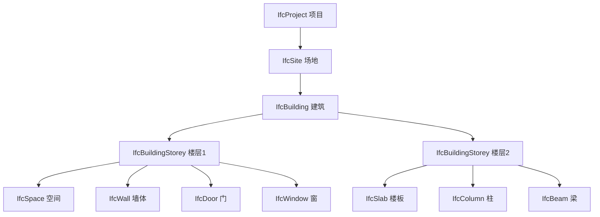

**图 2-1 IFC 空间结构层级关系**

模型里的每个实体都有两层标识：ExpressID 是文件内的行号级编号，GlobalId 则是 128 位的全局唯一标识。实体之间靠关系对象（IfcRelationship 的各种子类）串联起来，其中最关键的三种是：IfcRelAggregates 描述空间包含层级（建筑聚合楼层），IfcRelContainedInSpatialStructure 把具体构件挂到所属楼层，IfcRelDefinesByProperties 把属性集（如 Pset_WallCommon 里的防火等级、隔热系数等）关联到构件上。

#### 2.1.2 web-ifc 解析引擎

web-ifc 是一个用 C++ 实现、编译为 WebAssembly 的 IFC 解析器，使浏览器无需后端介入即可直接读取 .ifc 文件。其处理管线如图 2-2 所示。

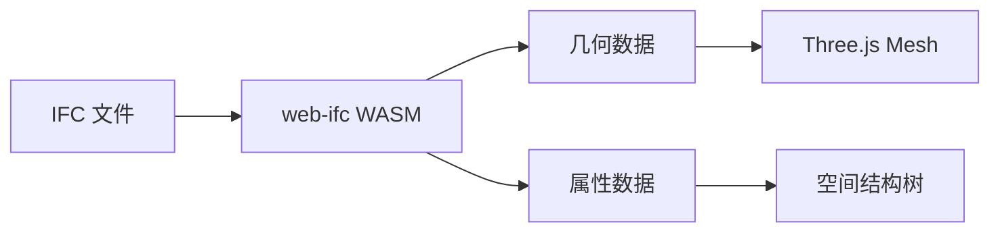

**图 2-2 web-ifc 解析管线**

web-ifc 暴露的核心 API 包括：`OpenModel` 接收文件二进制数据并返回模型句柄；`StreamAllMeshes` 以流式回调逐个吐出几何体，每个几何体包含交错排列的顶点（位置 + 法线，6 个 float 一组）、三角面索引和 4×4 变换矩阵；`GetLine` 按 ExpressID 读取单个实体的完整信息。流式接口是性能关键——它避免了一次性把所有几何体堆进内存造成的峰值压力。

### 2.2 Web 三维渲染技术

#### 2.2.1 WebGL 与 Three.js

WebGL 是浏览器内置的图形 API，映射了 OpenGL ES 2.0/3.0 的能力。Three.js 在 WebGL 之上搭起了一层面向对象的场景图抽象——开发者只需要组装 Scene、Camera、Light 和 Mesh，框架自动完成顶点着色、光栅化和片元着色的底层调度，整体管线如图 2-3 所示。

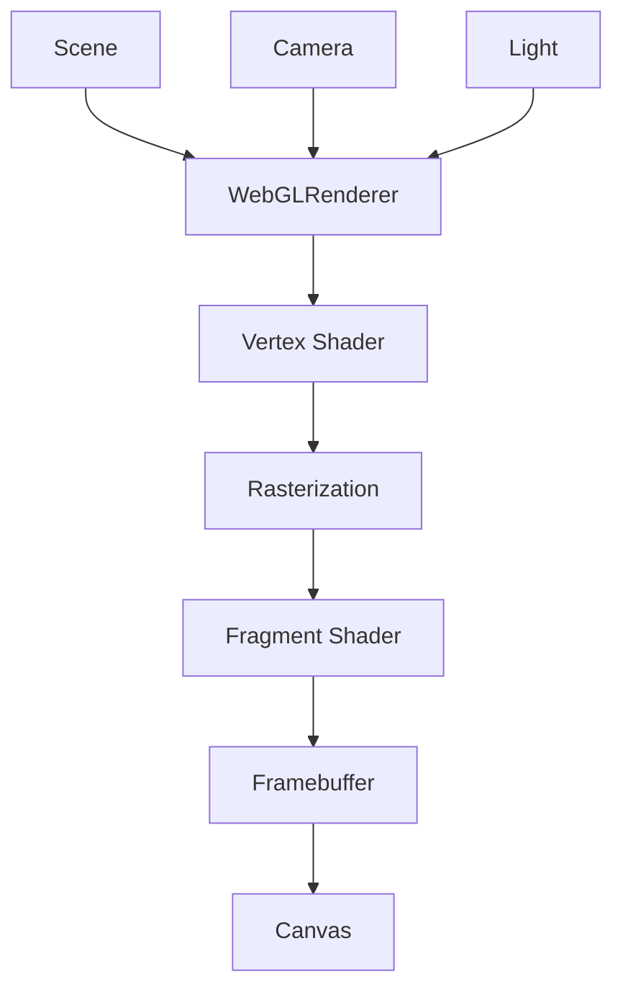

**图 2-3 Three.js 渲染管线示意**

在本系统中，Three.js 承担场景维护、OrbitControls 轨道相机、MeshPhongMaterial 光照渲染、EffectComposer 后处理和 Raycaster 射线检测五项核心职责。

#### 2.2.2 后处理渲染技术

后处理指的是在一帧渲染完成后，对帧缓冲图像做额外的像素级加工。Three.js 通过 EffectComposer 串联多个处理通道（Pass），本系统用到了三种典型效果：

**SSAO**（屏幕空间环境光遮蔽）在屏幕空间中采样相邻像素的深度差异，推算出每个像素被遮挡的程度，从而在凹角和缝隙处渲染出柔和暗影，让建筑模型的层次感大幅提升。

**Sobel 描边**对渲染画面做 3×3 卷积运算，提取亮度梯度变化剧烈的像素，生成类似建筑工程图纸的线稿风格。

**热力图着色**不属于传统后处理，而是在材质层面根据构件属性值（面积、造价或体积）把数值映射到"蓝→青→绿→黄→红"的色阶上，用色彩直观表达数据分布。

### 2.3 Next.js 全栈开发框架

Next.js 由 Vercel 维护，是目前 React 生态中最主流的全栈框架。本系统使用的 16 版本基于 App Router 架构组织路由，前端默认以 React Server Components 在服务端渲染，需要浏览器交互的部分用 `"use client"` 标记为客户端组件。后端逻辑写在 `app/api/` 目录下的 Route Handler 中，直接使用 Web 标准的 Request/Response 对象，不需要另起 Express 之类的服务器。中间件（Middleware）可以在请求到达路由之前执行鉴权拦截。前后端共享同一套 TypeScript 类型定义，接口契约的维护成本极低。

### 2.4 大语言模型与 AI Agent

大语言模型（LLM）以 Transformer 为骨干，经海量文本预训练后具备了跨领域的语言理解和生成能力。本系统对接 DeepSeek API（兼容 OpenAI 接口规范），通过精心编排的系统提示词把 IFC 模型的结构化摘要注入上下文，使模型能够针对特定建筑回答"这栋楼有几层""一层有多少扇门"之类的问题。

更进一步，系统实现了一种轻量级的 AI Agent 模式：AI 不仅产出文字回复，还会在回复末尾附带结构化的 JSON 指令（如高亮某类构件、切换视角、开启X光），前端解析器识别这些指令后自动调用 Three.js 接口执行，形成"自然语言 → 语义理解 → 结构化动作 → 三维操控"的闭环。

AI 响应采用 SSE（Server-Sent Events）协议逐 token 推送，用户在首个字符到达时就能开始阅读，主观感受到的等待时间远小于完整响应的生成耗时。

### 2.5 实时协作技术

文档级实时协作（Google Docs、Figma）的核心在于 OT 或 CRDT 算法保证并发编辑的最终一致性。Liveblocks 是近年崛起的协作基础设施，提供三层原语：**Presence** 管理临时用户状态（如光标位置、选中对象），随用户离线自动清除；**Storage** 承载持久化的共享数据（如批注列表），底层用 CRDT 做冲突合并；**Broadcast** 用于一次性的事件通知。

三维 BIM 协作比文档协作棘手得多——光标不再是二维屏幕坐标，而是需要映射到模型表面的三维世界坐标；选中对象不再是一段文字，而是一个带 ExpressID 的三维构件。本系统正是在 Liveblocks 的基础上解决了这些三维特有的同步难题。

---

## 第3章 系统需求分析与总体设计

### 3.1 需求分析

#### 3.1.1 功能性需求

通过对典型 BIM 应用场景的调研，系统功能需求归纳为六个模块，各模块的子功能关系如图 3-1 所示。

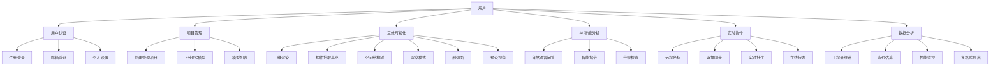

**图 3-1 系统功能结构图**

各模块的详细功能清单如表 3-1 所示。

**表 3-1 功能需求清单**

| 模块 | 编号 | 功能描述 | 优先级 |
|------|------|---------|--------|
| 用户认证 | F-01 | 邮箱注册与密码登录 | 高 |
| 用户认证 | F-02 | 注册后邮箱验证 | 高 |
| 用户认证 | F-03 | 个人信息管理（头像、邮箱修改） | 中 |
| 项目管理 | F-04 | 创建、浏览、删除项目 | 高 |
| 项目管理 | F-05 | 上传 IFC 文件到项目 | 高 |
| 项目管理 | F-06 | 模型卡片展示（缩略图、文件大小、时间） | 高 |
| 三维可视化 | F-07 | IFC 模型三维渲染与轨道交互 | 高 |
| 三维可视化 | F-08 | 鼠标点击拾取构件并查看属性 | 高 |
| 三维可视化 | F-09 | 空间结构树层级浏览与定位 | 高 |
| 三维可视化 | F-10 | 六种渲染模式切换 | 中 |
| 三维可视化 | F-11 | 剖切面高度控制与预设视角 | 中 |
| AI 分析 | F-12 | 基于模型上下文的 AI 对话 | 高 |
| AI 分析 | F-13 | 自然语言指令驱动三维视图 | 高 |
| AI 分析 | F-14 | 建筑合规性规则生成与检查 | 中 |
| 实时协作 | F-15 | 多人远程光标实时同步 | 中 |
| 实时协作 | F-16 | 构件选择状态实时广播 | 中 |
| 实时协作 | F-17 | 协作批注共享 | 中 |
| 数据分析 | F-18 | 工程量自动统计与图表 | 中 |
| 数据分析 | F-19 | 构件编辑与多格式导出 | 低 |
| 数据分析 | F-20 | 性能实时监控仪表盘 | 低 |

#### 3.1.2 非功能性需求

**性能方面**：10 MB 以下的 IFC 文件加载时间应控制在 10 秒内；三维渲染帧率维持 30 FPS 以上；AI 流式首 token 延迟不超过 2 秒；协作同步延迟低于 500 ms。

**安全方面**：密码使用 bcrypt 哈希存储；所有 API 端点要求有效会话；文件上传仅接受 .ifc 格式。

**可用性方面**：支持桌面和平板浏览器；支持亮暗主题切换；关键操作有加载指示和错误反馈。

**可维护性方面**：全量 TypeScript 严格模式；三维逻辑与 UI 通过自定义 Hook 解耦；ESLint 统一代码风格。

### 3.2 系统总体架构设计

平台采用 Next.js 16 前后端一体化架构，整体分为客户端层、服务层、数据层和外部服务四个层次，如图 3-2 所示。

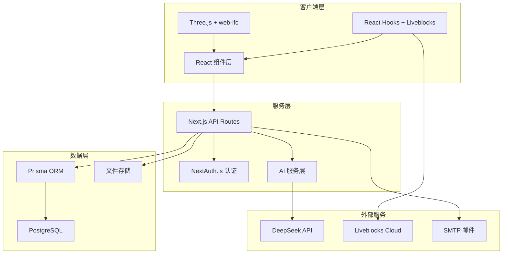

**图 3-2 系统总体架构图**

客户端层包含 React 页面组件、Three.js 三维渲染引擎（内含 web-ifc WASM 解析模块）以及通过自定义 Hook 和 Liveblocks 管理的状态层。服务层由 Next.js API Routes 提供 RESTful 接口，NextAuth.js 负责身份认证，AI 服务层封装了与 DeepSeek 的通信及流式传输逻辑。数据层以 PostgreSQL 为持久化存储，Prisma ORM 提供类型安全的数据操作，文件存储支持本地文件系统和 Supabase 对象存储两种方案。外部服务包括 DeepSeek 大语言模型、Liveblocks 协作云和 SMTP 邮件服务。

技术选型汇总如表 3-2 所示。

**表 3-2 技术选型一览**

| 层 | 技术 | 版本 | 用途 |
|----|------|------|------|
| 前端框架 | Next.js | 16.1.7 | App Router 全栈骨架 |
| UI 库 | React | 19.2.3 | 界面构建 |
| 语言 | TypeScript | 5.x | 类型安全 |
| 样式 | Tailwind CSS | 4.x | 原子化 CSS |
| UI 组件 | shadcn/ui | 4.0.8 | 可定制组件 |
| 三维 | Three.js | 0.183.2 | WebGL 渲染 |
| IFC 解析 | web-ifc | 0.0.77 | WASM 解析引擎 |
| 数据库 | PostgreSQL | - | 关系型存储 |
| ORM | Prisma | 7.5.0 | 数据访问 |
| 认证 | NextAuth.js | 5.0-beta.30 | 身份认证 |
| 协作 | Liveblocks | 3.15.5 | 实时协同 |
| AI | DeepSeek API | - | 大语言模型 |
| 图表 | Recharts | 3.8.0 | 数据可视化 |

### 3.3 数据库设计

数据库基于 PostgreSQL，通过 Prisma Schema 定义模型。核心实体及其关系如图 3-3 所示。

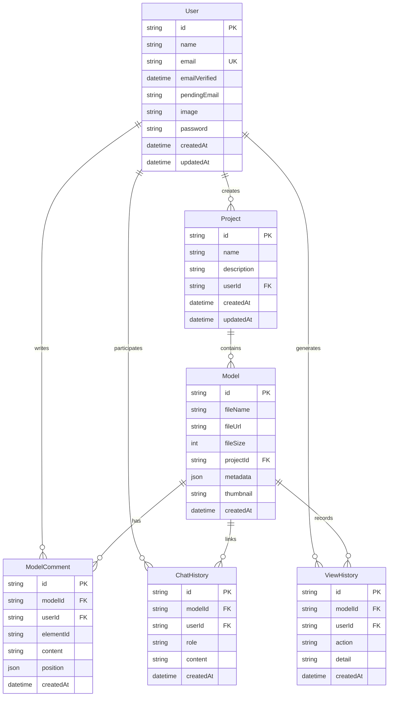

**图 3-3 数据库 E-R 图**

几点设计说明：User 的 password 字段存储 bcrypt 哈希值，pendingEmail 用于邮箱变更的待验证过渡态。Model 的 metadata 以 JSON 存放解析后的构件计数、楼层信息等，thumbnail 存 Base64 编码的缩略图。ModelComment 的 elementId 关联 IFC 构件的 ExpressID，position 以 JSON 记录批注在三维空间的坐标。ChatHistory 通过 role 字段区分用户消息和 AI 回复。ViewHistory 的 action 覆盖 view、annotate、chat、export 四种行为类型。

### 3.4 系统功能模块划分

前端按照"页面路由—业务 Hook—UI 组件"三层组织，后端按资源切分 API 路由文件，模块划分如图 3-4 所示。

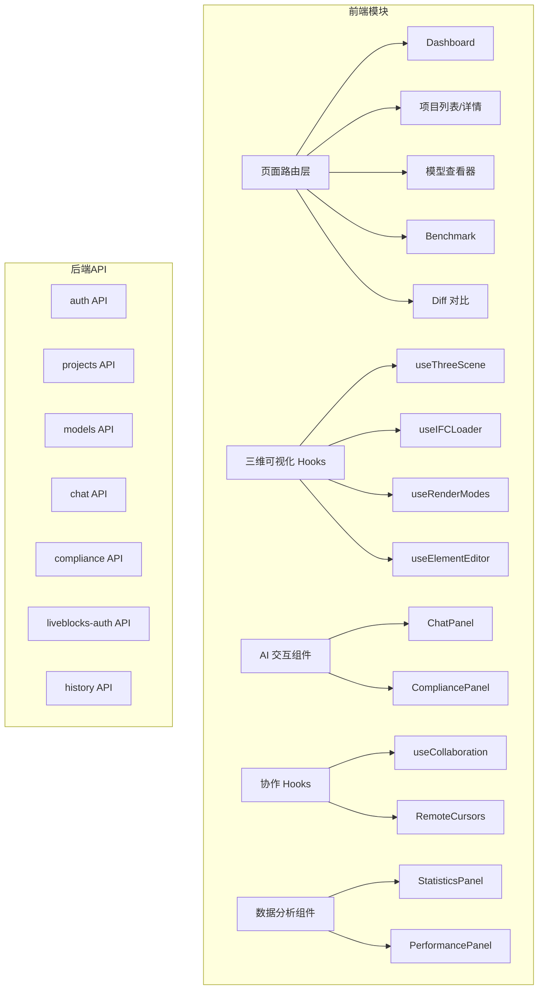

**图 3-4 功能模块划分**

前端的核心三维逻辑被拆进 9 个自定义 Hook 中（合计约 2800 行 TypeScript），与 UI 组件层保持松耦合。后端每个 API 资源一个独立路由文件，遵循 RESTful 风格。

---

## 第4章 IFC 三维可视化模块的设计与实现

### 4.1 IFC 文件解析与加载流程

#### 4.1.1 整体加载架构

从用户点击"打开模型"到三维画面呈现，经历了文件获取、WASM 初始化、几何流式提取、网格构建、空间树组装等一连串环节，完整流程如图 4-1 所示。

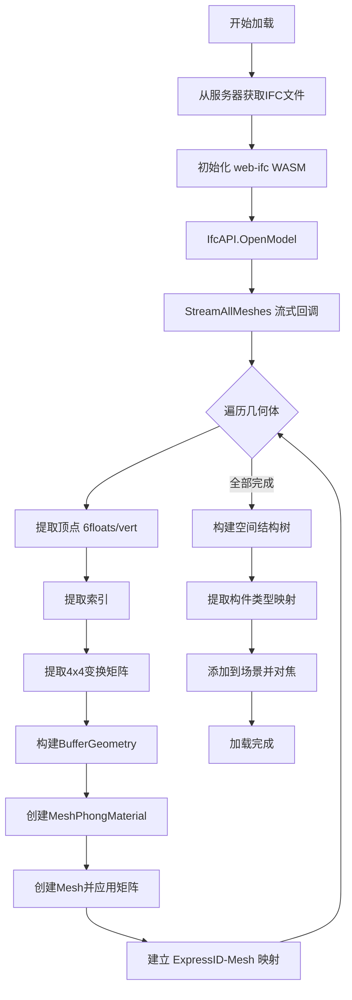

**图 4-1 IFC 模型加载完整流程**

这套流程的代码主体封装在 `useIFCLoader` 这个自定义 Hook 里，总计 630 行。下面对几个关键环节展开说明。

#### 4.1.2 几何数据流式解析

web-ifc 的 `StreamAllMeshes` 接口是整个加载过程的性能命脉。它以回调形式逐个返回 flatMesh 对象，每个对象包含构件的 expressID 和一组几何片段，每个几何片段携带 RGBA 颜色、16 元素的变换矩阵和该几何体自身的 expressID。

顶点数据按"position.x, position.y, position.z, normal.x, normal.y, normal.z"交错排列，每个顶点占 6 个浮点数。系统拆分出独立的位置和法线数组后，分别挂到 BufferGeometry 的 position 和 normal 属性上。索引数组直接传给 IndexedBufferGeometry 的 index 属性，利用索引复用减少内存占用。变换矩阵通过 `mesh.matrix.fromArray(flatTransformation)` 一次性写入，同时关闭 `matrixAutoUpdate` 避免逐帧重新计算。材质方面，根据颜色的 w 分量判断是否需要开启透明模式。

#### 4.1.3 ExpressID 双向映射

系统维护两张映射表：`expressIdToMesh`（ExpressID → Mesh）和 `meshToExpressIds`（Mesh → ExpressID 数组）。前者用于"给定一个构件 ID，找到它的三维网格"（比如 AI 要求高亮某个构件时），后者用于"鼠标点到一个网格，反查出它对应的 IFC 实体"（构件拾取时）。两张表在加载阶段同步构建，后续所有交互都经由它们完成 IFC 语义层和 Three.js 渲染层之间的桥接。

#### 4.1.4 空间结构树构建

空间树的构建采用递归策略：以 IfcProject 为根节点，先沿 IfcRelAggregates 关系向下展开 Site → Building → BuildingStorey 的层级，再通过 IfcRelContainedInSpatialStructure 把具体构件挂载到对应楼层节点之下。每个节点记录 expressID、IFC 类型码和名称，子节点按关系类型分组排列。最终生成的树状数据供前端的空间结构树面板使用，也是 AI 上下文构建的重要数据源。

### 4.2 Three.js 渲染引擎封装

#### 4.2.1 场景初始化

场景管理封装在 `useThreeScene`（262 行）中。WebGLRenderer 开启抗锯齿和 ACES 色调映射，输出到 SRGBColorSpace；主相机为 45° 透视相机，搭配 OrbitControls 提供阻尼轨道交互（dampingFactor 0.08）；光照由一盏强度 0.6 的环境光和一盏强度 0.8 的方向光组合而成；画面右下角有一个小型正交相机渲染的坐标轴指示器，帮助用户辨别当前视角方向。此外还预置了一个沿 Y 轴的裁剪平面，为剖切功能做准备。

#### 4.2.2 自定义 Hooks 架构

全部三维逻辑拆分成 9 个 Hook，各自负责单一职责，彼此通过 ref 和返回值传递依赖。它们的调用关系如图 4-2 所示。

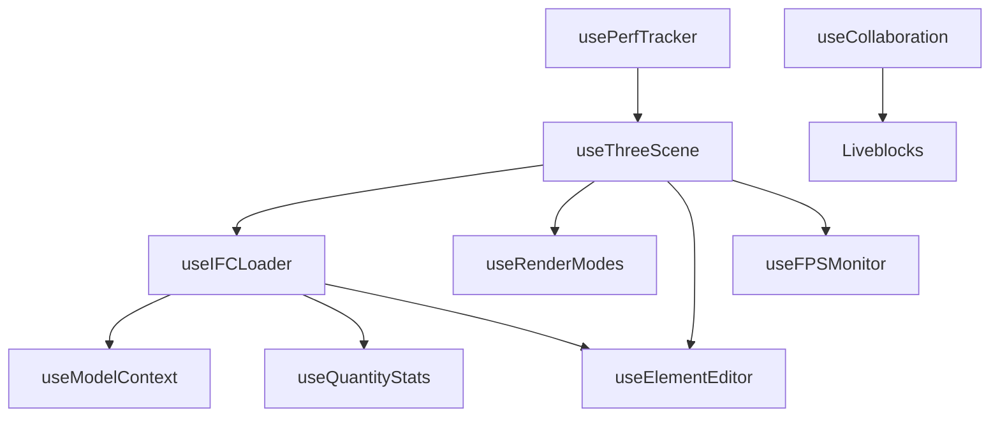

**图 4-2 Hooks 依赖关系**

这种架构带来三个好处：关注点分离——每个 Hook 只管自己的事；可复用性——某个 Hook 可以脱离当前页面单独用在别处；状态隔离——各 Hook 内部的 useState/useRef 不会互相干扰。

#### 4.2.3 动画循环

渲染循环由 `requestAnimationFrame` 驱动。每一帧依次执行：更新轨道控制器的阻尼动画、判断有无 EffectComposer（有则走后处理管线，否则走标准渲染路径）、叠加绘制坐标轴指示器、触发外部回调（FPS 计数、渲染信息采集等）。

### 4.3 交互功能实现

#### 4.3.1 Raycasting 构件拾取

构件拾取是三维交互的核心。用户在画布上点击时，系统将屏幕坐标归一化到 NDC 空间，创建从相机发出的射线，遍历场景所有网格做求交测试。命中后取最近的 Mesh，通过 `meshToExpressIds` 反查 ExpressID，再经 `web-ifc.GetLine` 获取该构件的完整属性信息。高亮效果通过在场景中临时添加一个克隆的半透明叠加网格（颜色 #22e1ff、透明度 0.6 的 LambertMaterial）来实现，取消选择时移除该叠加网格。完整交互时序如图 4-3 所示。

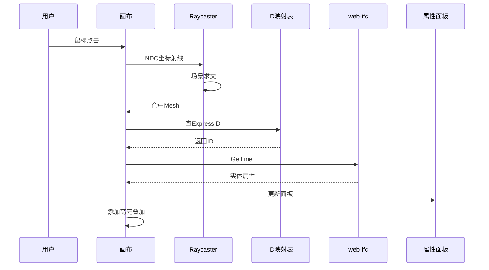

**图 4-3 构件拾取交互时序**

#### 4.3.2 剖切面

剖切面通过 Three.js 的 ClippingPlane 实现。系统创建一个法线朝 -Y 方向的平面 `new Plane(new Vector3(0,-1,0), constant)`，开启渲染器的 `localClippingEnabled`，将该平面添加到所有材质的 `clippingPlanes` 数组。调节 constant 值即可上下移动切割面，实时暴露建筑内部结构。用户在工具栏滑块上拖动即可改变剖切高度。

#### 4.3.3 预设视角

提供顶视、前视和等轴测（ISO）三种快捷视角。切换时先计算模型的包围盒中心和尺寸，再把相机放到对应方向的适当距离上（顶视在正上方、前视在正前方、ISO 在对角线方向），最后调用 `controls.target` 指向包围盒中心。

### 4.4 高级渲染模式

#### 4.4.1 渲染模式概览

六种渲染模式封装在 `useRenderModes`（376 行）中，模式切换时先缓存当前所有网格的原始材质，按目标模式修改或替换材质，退出时恢复缓存。

**表 4-1 渲染模式说明**

| 模式 | 技术实现 | 典型用途 |
|------|---------|---------|
| Realistic | 标准 Phong 光照 | 日常浏览 |
| Wireframe | material.wireframe = true | 结构分析 |
| X-Ray | transparent + opacity 0.15 | 透视内部 |
| SSAO | SSAOPass 后处理 | 强化层次 |
| Edge | Sobel Shader | 图纸风格 |
| Heatmap | 属性值色阶映射 | 数据分析 |

#### 4.4.2 SSAO 与 Sobel 描边

SSAO 使用 Three.js 自带的 SSAOPass，kernelRadius 设为 8，minDistance 0.005，maxDistance 0.1。Sobel 描边则用自定义的 Fragment Shader 在 3×3 邻域做亮度梯度卷积，`edgeStrength` 参数控制线条粗细。两者都挂在 EffectComposer 管线上，通过 `pass.enabled` 独立开关。

#### 4.4.3 热力图

热力图模式支持面积、造价、体积三个维度。对每个构件计算其属性值后，在全局最小值到最大值之间做归一化，再映射到五段色阶（蓝 → 青 → 绿 → 黄 → 红）上。归一化公式为 t = (v - min) / (max - min)，映射函数在 t 的五个区间内做线性插值。

#### 4.4.4 后处理管线组装

EffectComposer 按以下顺序串联各 Pass，如图 4-4 所示。

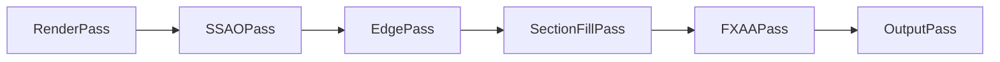

**图 4-4 后处理管线顺序**

每种渲染模式只激活自己需要的 Pass，其余保持 disabled 状态。

---

## 第5章 AI 智能分析模块的设计与实现

### 5.1 AI 对话系统架构

#### 5.1.1 三层架构

AI 模块按"上下文注入 → 流式对话 → 指令解析"三层组织，如图 5-1 所示。

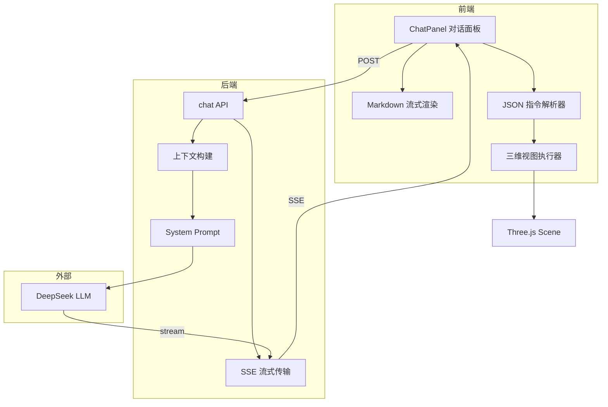

**图 5-1 AI 对话系统三层架构**

前端的 ChatPanel 组件负责消息的收发和渲染，接收到完整回复后交给指令解析器扫描 JSON 动作块。后端的 chat API 先将用户消息持久化到 ChatHistory 表，然后把模型上下文注入系统提示词、连同对话历史一起发给 DeepSeek，最后通过 ReadableStream 将流式响应以 SSE 形式推回前端。

#### 5.1.2 模型上下文构建

`useModelContext`（83 行）从 IFC 加载结果中提炼出 AI 能理解的结构化摘要，包含文件名、构件总数与楼层总数、简化到 4 层深度的空间结构树、按 IFC 类型聚合的构件计数以及前 200 个构件的基本信息。深度截断和数量截断是为了避免上下文过长导致 token 浪费和回答质量下滑。

#### 5.1.3 系统提示词

系统提示词给 AI 划定了两项能力：回答关于建筑结构和构件的问题、在回复末尾附带 JSON 格式的视图操控指令。提示词中明确列出了七种支持的 action 类型（highlightByType、setView、toggleWireframe、toggleXRay、toggleClipping、highlightElement、resetView）及其参数格式，确保前端解析器能可靠地识别和执行。

### 5.2 自然语言指令解析与执行

#### 5.2.1 解析逻辑

AI 回复的文本中如果包含 JSON 代码块，前端用正则表达式提取出来并尝试 `JSON.parse`。解析成功后遍历 actions 数组，根据每条 action 的 type 分发到对应的 Three.js 操作函数，整体流程如图 5-2 所示。

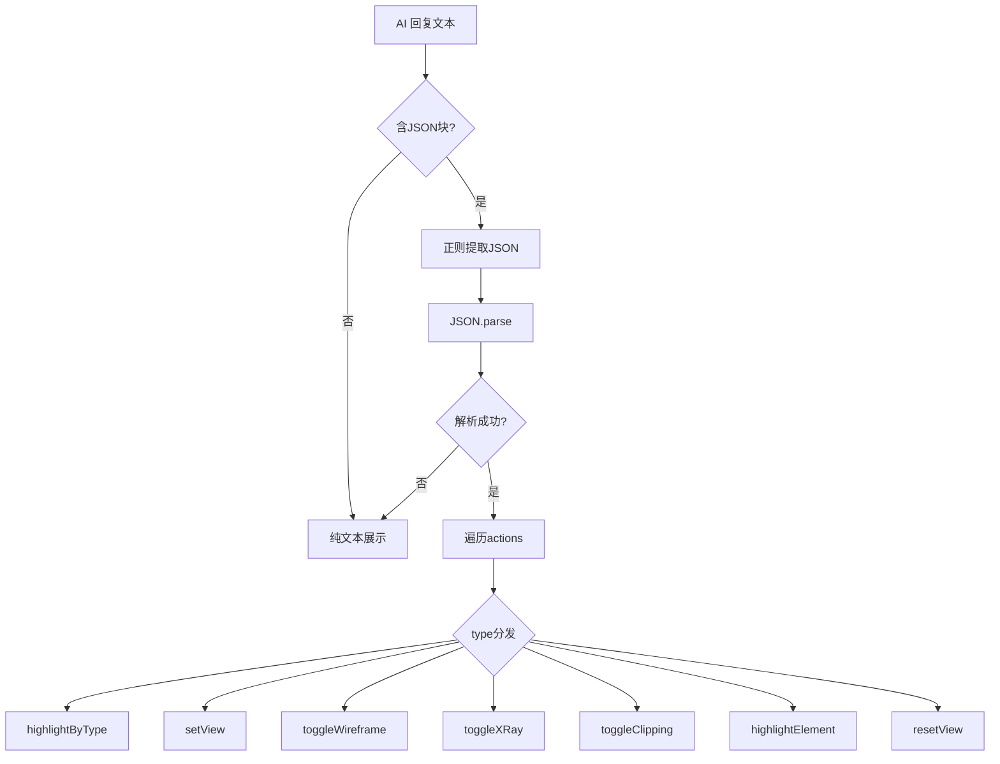

**图 5-2 指令解析与分发流程**

#### 5.2.2 指令类型

七种指令覆盖了日常浏览中最常用的视图操控需求，对应关系如表 5-1 所示。

**表 5-1 AI 指令与自然语言映射**

| 指令 | 参数 | 自然语言示例 | 执行效果 |
|------|------|-------------|---------|
| highlightByType | IFC 类型名 | "高亮所有墙体" | 该类型构件变亮 |
| setView | top/front/iso | "俯视看一下" | 相机跳到预设位置 |
| toggleWireframe | bool | "打开线框" | 线框渲染 |
| toggleXRay | bool | "X光模式" | 半透明 |
| toggleClipping | bool | "剖开看内部" | 开启剖切 |
| highlightElement | expressID | "156号构件亮起来" | 单构件高亮 |
| resetView | 无 | "恢复默认" | 重置视图 |

#### 5.2.3 流式传输

对话的全过程如图 5-3 所示。后端调用 DeepSeek 时设置 `stream: true`，在 ReadableStream 中逐 chunk 将 delta token 以 SSE 格式推给前端。前端用 `response.body.getReader()` 持续读取，每收到一段 token 就追加到当前消息气泡的尾部，用户看到的是一个逐字展开的打字机效果。流结束后后端把完整回复存入 ChatHistory，前端开始扫描 JSON 指令块。

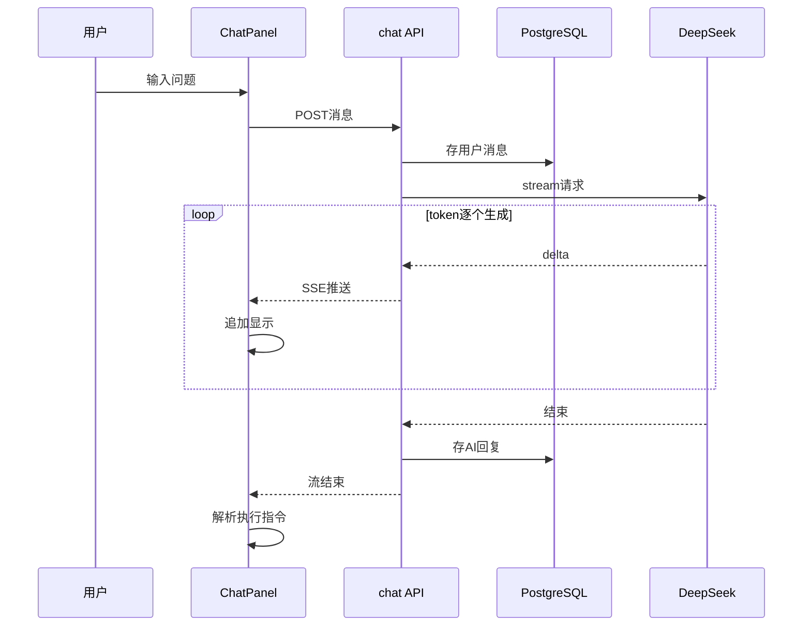

**图 5-3 流式对话时序**

### 5.3 合规性检查引擎

#### 5.3.1 规则 DSL

合规检查的核心是一套声明式规则语法：`IFCType.property operator value unit`。支持 9 种构件类型（IfcDoor、IfcWindow、IfcWall、IfcSlab、IfcBeam、IfcColumn、IfcStairFlight、IfcSpace、IfcRoof），10 种属性（height、width、depth、area、volume 等），8 种运算符（==、!=、>=、<=、>、<、contains、exists），和 mm、cm、m、m²、m³ 五种单位。示例：

```
IfcDoor.height >= 2100 mm
IfcStairFlight.riserHeight <= 175 mm
IfcWall.fireRating exists
```

#### 5.3.2 内置规则集

系统预置了 9 条依据中国现行建筑规范的检查规则，如表 5-2 所示。

**表 5-2 内置合规规则**

| 规则 | DSL | 规范依据 | 级别 |
|------|-----|---------|------|
| 入户门最小高度 | IfcDoor.height >= 2000 mm | GB 50096-2011 | error |
| 窗台最小高度 | IfcWindow.height >= 900 mm | GB 50096-2011 | warning |
| 踏步最大高度 | IfcStairFlight.riserHeight <= 175 mm | GB 50352-2019 | error |
| 踏步最小宽度 | IfcStairFlight.treadLength >= 250 mm | GB 50352-2019 | error |
| 房间最小面积 | IfcSpace.area >= 5 m2 | GB 50096-2011 | warning |
| 走廊最小宽度 | IfcSpace.width >= 1100 mm | GB 50096-2011 | error |
| 最低层高 | IfcSpace.height >= 2400 mm | GB 50096-2011 | error |
| 墙体防火等级 | IfcWall.fireRating exists | GB 50016-2014 | info |
| 梁最小高度 | IfcBeam.height >= 200 mm | 结构规范 | warning |

#### 5.3.3 规则执行流程

引擎遍历模型中所有构件，对类型匹配的构件提取属性值（先查直接属性，找不到再深入 IfcRelDefinesByProperties 关联的属性集），做单位转换后执行比较运算。不合规的构件生成违规记录（含构件 ID、规则名、期望值、实际值、严重级别），汇总后输出检查报告，并在三维场景中将违规构件标红高亮。流程如图 5-4 所示。

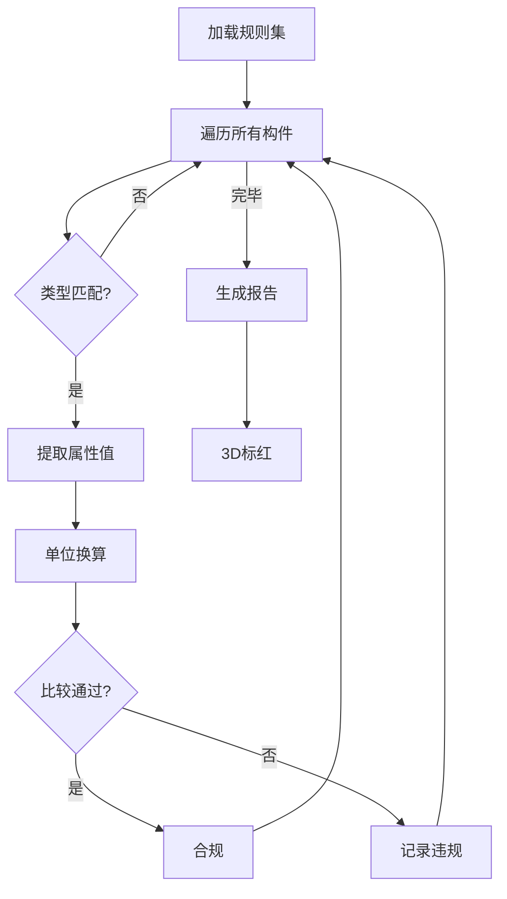

**图 5-4 合规检查执行流程**

#### 5.3.4 AI 辅助规则生成

用户还可以用自然语言描述规范要求（例如"所有门高度不低于 2100mm"），系统将描述发送给 DeepSeek 的 `/api/compliance` 端点，AI 根据专用的系统提示词生成符合 DSL 语法的规则 JSON，直接导入规则集执行。

---

## 第6章 项目管理与实时协作模块的设计与实现

### 6.1 用户认证与权限管理

#### 6.1.1 认证流程

认证基于 NextAuth.js v5 的 Credentials Provider 和 JWT 策略。用户注册时密码经 bcryptjs 哈希后存入数据库，注册完成即触发邮箱验证流程——通过 Nodemailer 发送含 24 小时有效 token 的验证链接。中间件拦截所有 `/dashboard` 请求，检查 Cookie 中是否携带有效 session token，未认证则重定向到登录页。每个 API Route 开头也会调用 `auth()` 验证身份。完整认证流程如图 6-1 所示。

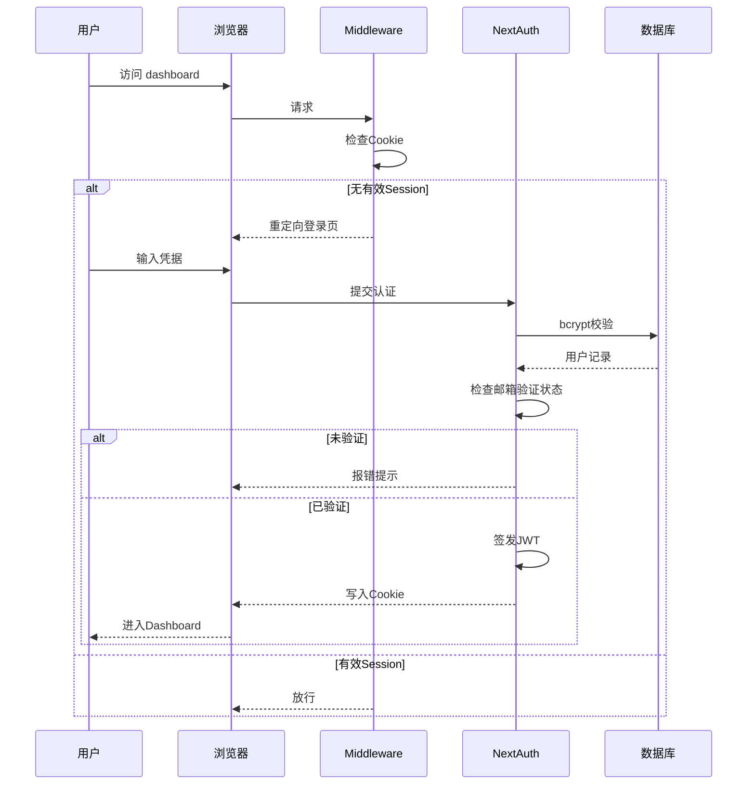

**图 6-1 认证流程**

### 6.2 项目与模型管理

系统以"项目"为模型的组织容器。用户在 Dashboard 创建项目后可向其中上传 IFC 文件。上传接口先校验扩展名，然后按时间戳生成唯一文件名写入本地 `uploads/` 目录（或 Supabase 存储桶），最后在 Model 表中创建记录。模型首次在查看器中加载完成时，`captureThumb` 方法抓取当前视角的截图作为缩略图，经 Base64 编码后通过 PATCH 接口写回数据库，供项目详情页的模型卡片展示。

### 6.3 实时多人协作

#### 6.3.1 架构

协作模块以 Liveblocks 为基础设施，每个模型查看器对应一个 Room（ID 格式 `model:{modelId}`）。用户进入页面时自动加入房间，离开时自动退出。架构如图 6-2 所示。

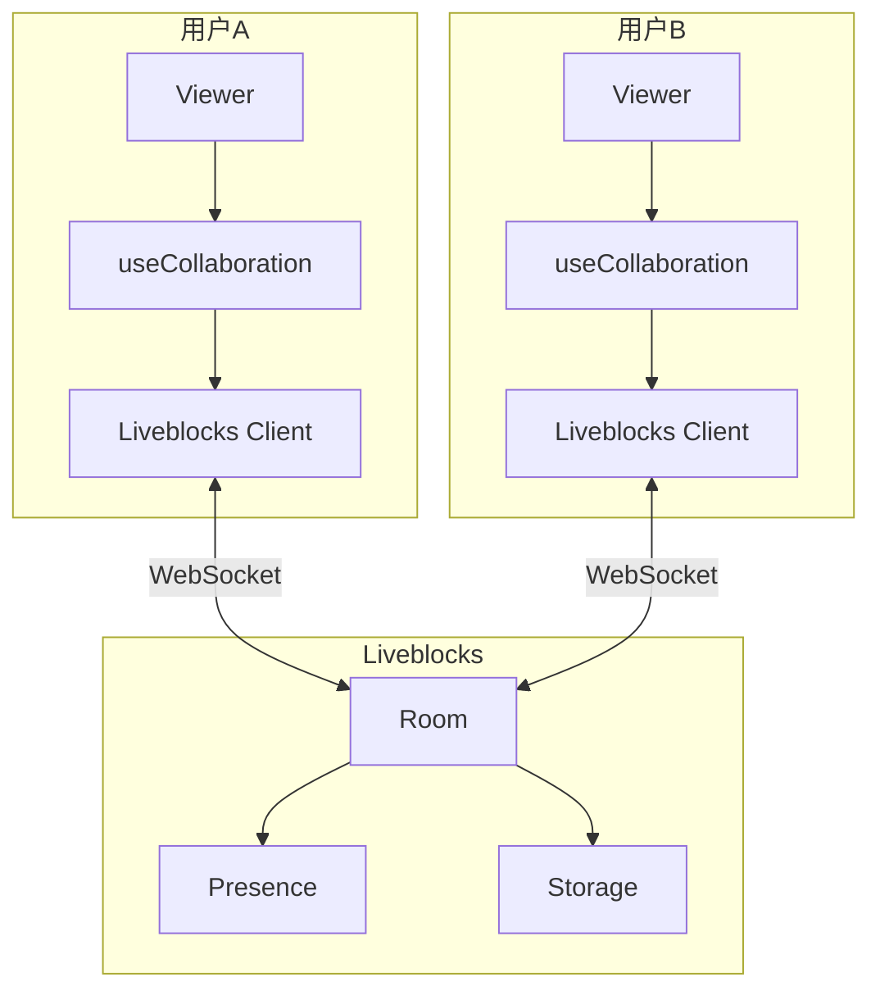

**图 6-2 协作架构**

#### 6.3.2 Presence 与三维光标

Presence 数据包含屏幕坐标（x, y）和可选的三维世界坐标（worldX, worldY, worldZ），以及当前选中构件的 expressID。鼠标移动时，系统不仅记录屏幕坐标，还通过 Raycaster 求取射线与模型表面的交点，把三维坐标一并广播出去。远程用户接收后，通过 SVG 叠加层绘制带颜色标签的光标图标；若对方选中了某个构件，本地还会为该构件创建一个带用户颜色的半透明叠加网格，直观标示"队友在看什么"。

#### 6.3.3 批注协作

批注数据存放在 Liveblocks Storage 层的 LiveList 中（CRDT 保证并发写入不冲突）。每条批注包含作者 ID、姓名、颜色、关联构件 ID、文本内容、三维空间坐标和时间戳。新增批注时同时通过 Broadcast 事件即时通知所有在线用户，并经 API 持久化到 PostgreSQL 的 ModelComment 表中。

### 6.4 构件编辑与导出

#### 6.4.1 编辑能力

`useElementEditor`（966 行，是项目中最庞大的 Hook）提供了属性修改、平移/旋转/缩放变换、隐藏/显示、复制、删除和撤销六类操作。所有修改记录在 `modifications` 数组中，撤销时回退到上一步的状态快照。

编辑系统最大的技术难点在于**把 Three.js 层面的网格变换同步回 IFC 数据**。`syncTransformsToIFC` 方法的做法是：对比每个被修改构件的当前矩阵与原始矩阵，计算出差异后，在 web-ifc 中创建新的 IfcCartesianPoint 和 IfcDirection 实体，组装成新的 IfcAxis2Placement3D，最后更新构件 IfcLocalPlacement 的 RelativePlacement 引用。新实体的 ExpressID 从 `GetMaxExpressID() + 1` 起递增分配，确保不与已有实体冲突。

#### 6.4.2 多格式导出

**表 6-1 导出格式**

| 格式 | 扩展名 | 特点 |
|------|--------|------|
| glTF | .glb | Web 3D 标准，体积小 |
| OBJ | .obj | 通用网格格式，兼容性广 |
| IFC | .ifc | 保留全部 BIM 语义信息 |

IFC 导出前自动执行变换同步和删除同步，导出后还会用一个临时 IfcAPI 实例重新解析文件验证完整性。

---

## 第7章 工程量统计与数据分析模块

### 7.1 工程量自动提取

`useQuantityStats`（174 行）从空间树、类型映射和 Three.js 几何体三个数据源中提炼出以下统计项：构件总数与楼层总数、按 IFC 类型降序排列的构件计数、按楼层聚合的构件分布、总顶点与面数、包围盒尺寸、估算表面积和体积。

表面积的计算方法是遍历所有 Mesh 的每个三角面，把三个顶点变换到世界坐标系后用叉积公式求面积并累加：$S = \frac{1}{2}|\vec{AB} \times \vec{AC}|$。体积则取包围盒的长宽高乘积作为粗略估算。

### 7.2 数据可视化与报表

统计面板（681 行）分为"概览"和"造价"两个 Tab。概览 Tab 展示模型摘要卡片、Recharts 饼图（构件类型分布）和柱状图（楼层构件数）。造价 Tab 提供可编辑的单价表，用户填入每种构件的单价后系统自动计算分项和总额，并以柱状图展示各类造价占比。

统计数据支持一键导出为多 Sheet 的 Excel 文件：Sheet 1 模型概况，Sheet 2 构件类型统计，Sheet 3 楼层统计，Sheet 4 造价明细。底层使用 SheetJS（xlsx 库）生成 .xlsx 二进制。

### 7.3 性能监控

`usePerfTracker` 和 `useFPSMonitor` 两个 Hook 协作采集实时性能数据。FPS 采用 500 ms 为窗口的滑动计数法，每半秒算一次帧率，维护 120 个样本的滚动窗口计算均值以及 60 个样本的历史数组供趋势图使用。此外还采集模型加载时间、AI 响应延迟（最近 50 次取平均）、渲染器的 draw calls / 三角形数、JS 堆内存、几何体内存和纹理内存等指标。

**表 7-1 性能监控指标**

| 类别 | 指标 | 采集方式 | 单位 |
|------|------|---------|------|
| 帧率 | 当前/均值/极值 FPS | rAF 计数 | fps |
| 加载 | 模型加载耗时 | performance.now | ms |
| AI | 响应延迟（最近/平均） | 请求计时 | ms |
| 渲染 | Draw Calls / 三角形数 | renderer.info | 次/个 |
| 内存 | JS 堆 / 几何体 / 纹理 | performance.memory | MB |

性能面板（281 行）以仪表盘形式展示这些指标，FPS 区域还附带一个 Recharts AreaChart 趋势图。

### 7.4 活动历史

ViewHistory 表记录四类用户操作：view（查看模型）、annotate（添加批注）、chat（AI 对话）、export（导出文件）。Dashboard 的历史记录页面按时间倒序展示个人操作日志。

---

## 第8章 系统测试与性能评估

### 8.1 测试环境

**表 8-1 测试环境**

| 项目 | 配置 |
|------|------|
| 操作系统 | Windows 11 |
| CPU | Intel Core i7 / AMD Ryzen 7 |
| 内存 | 16 GB |
| GPU | NVIDIA RTX 3060 / 集成显卡 |
| 浏览器 | Chrome 124、Edge 124、Firefox 126 |
| 分辨率 | 1920 x 1080 |
| Node.js | v20.x |
| 数据库 | PostgreSQL 16 |

### 8.2 功能测试

涵盖 27 个测试用例，覆盖用户认证、文件上传、三维渲染、渲染模式、AI 对话、合规检查、实时协作、构件编辑、导出和统计全部核心路径。

**表 8-2 功能测试用例（节选）**

| 编号 | 模块 | 用例 | 预期 | 状态 |
|------|------|------|------|------|
| T-01 | 认证 | 邮箱注册并验证 | 收到验证邮件，验证后可登录 | 通过 |
| T-06 | 三维 | 加载 IFC 模型 | 模型正确渲染 | 通过 |
| T-07 | 三维 | 点击拾取构件 | 高亮并显示属性 | 通过 |
| T-11 | 渲染 | 切换 SSAO | 出现环境光遮蔽效果 | 通过 |
| T-14 | AI | 询问建筑信息 | 正确回答模型相关问题 | 通过 |
| T-15 | AI | "高亮所有墙体" | 回复并高亮 | 通过 |
| T-17 | 合规 | 运行内置规则集 | 生成检查报告 | 通过 |
| T-19 | 协作 | 多人光标同步 | 远程光标实时可见 | 通过 |
| T-21 | 协作 | 添加协作批注 | 实时同步到所有用户 | 通过 |
| T-25 | 导出 | 导出 IFC 格式 | 文件完整，编辑已同步 | 通过 |
| T-27 | 统计 | Excel 报表导出 | 多 Sheet xlsx 文件正确 | 通过 |

全部 27 条用例均通过。

### 8.3 性能测试

#### 8.3.1 加载性能

**表 8-3 不同规模 IFC 模型加载测试**

| 模型 | 文件大小 | 构件数 | 三角面数 | 加载耗时 | 内存峰值 |
|------|---------|--------|---------|---------|---------|
| 小型住宅 | 1.2 MB | ~200 | ~50K | ~1.5s | ~80 MB |
| 中型办公楼 | 5.8 MB | ~800 | ~200K | ~4.2s | ~180 MB |
| 大型综合体 | 15.3 MB | ~2500 | ~600K | ~12.8s | ~420 MB |
| 超大型项目 | 35.6 MB | ~6000 | ~1.5M | ~28.5s | ~850 MB |

> 注：数据在独立显卡环境下采集，具体数值因硬件而异。

<!-- TODO: 插入实际 benchmark 页面的加载时间折线图截图 -->

**图 8-1 文件大小与加载时间关系**（请补充截图）

加载耗时与文件大小大致呈线性关系。10 MB 以下的文件 5 秒内可完成加载。

#### 8.3.2 渲染帧率

以 5.8 MB 中型办公楼为测试对象：

**表 8-4 各渲染模式帧率**

| 模式 | 平均 FPS | 最低 FPS | GPU 占用 |
|------|---------|---------|---------|
| Realistic | 58 | 45 | 35% |
| Wireframe | 62 | 50 | 28% |
| X-Ray | 55 | 42 | 38% |
| SSAO | 42 | 32 | 52% |
| Edge | 48 | 36 | 45% |
| Heatmap | 56 | 44 | 36% |

<!-- TODO: 插入帧率柱状图截图 -->

**图 8-2 各模式帧率对比**（请补充截图）

所有模式均保持在 30 FPS 以上。SSAO 因额外的深度采样计算帧率稍低，但仍然流畅。

#### 8.3.3 AI 响应延迟

**表 8-5 AI 响应延迟**

| 问题类型 | 首 token 延迟 | 完整响应 | 示例 |
|---------|-------------|---------|------|
| 简单查询 | ~0.8s | ~2.1s | "这栋楼几层?" |
| 统计类 | ~1.0s | ~3.5s | "列出所有构件类型" |
| 指令类 | ~0.9s | ~2.8s | "高亮墙体并俯视" |
| 合规类 | ~1.2s | ~4.2s | "门高是否达标" |

> 延迟受网络和 AI 服务负载影响。

SSE 流式传输让用户在首 token 抵达后就开始阅读，主观等待感显著降低。

#### 8.3.4 协作延迟

两名用户在同一局域网内测试：

**表 8-6 协作同步延迟**

| 操作 | 平均延迟 | 最大延迟 |
|------|---------|---------|
| 光标移动 | ~80ms | ~150ms |
| 构件选择 | ~100ms | ~200ms |
| 批注发送 | ~120ms | ~250ms |

全部在 250 ms 以内，协作体验流畅。

### 8.4 兼容性测试

**表 8-7 浏览器兼容性**

| 浏览器 | 版本 | 三维渲染 | AI 对话 | 协作 | 评价 |
|--------|------|---------|--------|------|------|
| Chrome | 124+ | 正常 | 正常 | 正常 | 完全支持 |
| Edge | 124+ | 正常 | 正常 | 正常 | 完全支持 |
| Firefox | 126+ | 正常 | 正常 | 正常 | 完全支持 |
| Safari | 17+ | WASM略慢 | 正常 | 正常 | 基本支持 |

### 8.5 同类平台对比

**表 8-8 与同类 Web BIM 平台功能对比**

| 功能 | 本平台 | BIMServer | IFC.js | Xeokit | Speckle |
|------|--------|-----------|--------|--------|---------|
| IFC 解析 | 有 | 有 | 有 | 有 | 有 |
| 浏览器端渲染 | 有 | 有 | 有 | 有 | 有 |
| 构件拾取属性 | 有 | 有 | 有 | 有 | 有 |
| 空间结构树 | 有 | 有 | 有 | 有 | 有 |
| 渲染模式 (6种) | 有 | 无 | 部分 | 部分 | 无 |
| SSAO | 有 | 无 | 无 | 有 | 无 |
| 热力图 | 有 | 无 | 无 | 无 | 无 |
| AI 问答 | 有 | 无 | 无 | 无 | 无 |
| AI 指令驱动 | 有 | 无 | 无 | 无 | 无 |
| 合规检查 | 有 | 插件 | 无 | 无 | 无 |
| 实时多人协作 | 有 | 无 | 无 | 无 | 版本级 |
| 远程光标 | 有 | 无 | 无 | 无 | 无 |
| 构件编辑 | 有 | 无 | 无 | 无 | 无 |
| 工程量统计 | 有 | 插件 | 无 | 无 | 有 |
| 多格式导出 | 3种 | 多种 | 无 | 无 | 多种 |
| 开源免费 | 是 | 是 | 是 | 商业 | 部分 |

在 AI 分析、实时协作和渲染模式丰富度三个维度上，本平台相比同类方案具有明显差异化。

---

## 第9章 总结与展望

### 9.1 工作总结

本文围绕"让 BIM 协作走进浏览器"这一目标，从零搭建了一个基于 Web 的 IFC 建筑信息模型智能协作平台。回顾全文，完成的主要工作有：

一是落地了 Next.js 16 全栈架构，打通了从用户注册、项目管理、文件存储到认证鉴权的后端全链路。

二是在浏览器端实现了 IFC 模型的高效加载和交互——web-ifc WASM 解析 + Three.js 渲染 + 9 个自定义 Hook（合计约 2800 行）实现了流式几何加载、构件拾取、空间树导航、剖切面、六种渲染模式等能力。

三是完成了 AI Agent 系统的工程化落地，包括上下文注入、流式对话、七种结构化指令、合规检查 DSL 引擎及 AI 辅助规则生成。

四是在三维场景中跑通了多人实时协作——远程光标带世界坐标、构件选择广播、CRDT 批注共享，同步延迟控制在 250 ms 以内。

五是提供了工程量统计、造价估算、Excel 导出、性能监控、构件编辑（含 IFC 回写）和三种格式导出的完整工具包。

六是通过 27 个功能用例和多维度的性能测试验证了系统的正确性和可用性。

### 9.2 不足与展望

尽管平台已具备较完整的功能覆盖，仍有若干值得改进的方向：

**大模型加载优化。** 超过 30 MB 的文件加载耗时接近半分钟，可以考虑引入 LOD（多层次细节）或按楼层/视野范围做按需加载，降低初始内存峰值和等待时间。

**AI 上下文扩容。** 当前把全量摘要塞进系统提示词的做法在大型模型上可能超出 token 限额，后续可接入 pgvector 做属性数据的向量化检索（RAG），按需注入最相关的上下文片段。

**移动端触控适配。** 三维交互目前以鼠标操作为主，平板端的双指缩放、单指旋转等手势还需要专门优化。

**离线缓存。** 利用 Service Worker 和 IndexedDB 做模型的本地缓存，让用户在网络不稳定时也能查看已加载过的模型。

**版本管理深化。** 当前的模型 Diff 功能较为基础，后续可做完整的版本链、任意两版间的差异分析和 GlobalId 级变更追踪。

---

## 参考文献

[1] buildingSMART International. Industry Foundation Classes (IFC) — ISO 16739-1:2018 [S]. International Organization for Standardization, 2018.

[2] Eastman C, Teicholz P, Sacks R, et al. BIM Handbook: A Guide to Building Information Modeling for Owners, Managers, Designers, Engineers and Contractors [M]. 3rd ed. Hoboken: John Wiley & Sons, 2018.

[3] Three.js Contributors. Three.js Documentation [EB/OL]. https://threejs.org/docs/, 2024.

[4] That Open Company. web-ifc: Reading and writing IFC files with Javascript [EB/OL]. https://github.com/ThatOpen/engine_web-ifc, 2024.

[5] Vercel. Next.js Documentation [EB/OL]. https://nextjs.org/docs, 2024.

[6] Prisma. Prisma ORM Documentation [EB/OL]. https://www.prisma.io/docs, 2024.

[7] Liveblocks. Liveblocks Documentation [EB/OL]. https://liveblocks.io/docs, 2024.

[8] DeepSeek AI. DeepSeek API Documentation [EB/OL]. https://platform.deepseek.com/docs, 2024.

[9] 中华人民共和国住房和城乡建设部. GB 50096-2011 住宅设计规范 [S]. 北京: 中国建筑工业出版社, 2011.

[10] 中华人民共和国住房和城乡建设部. GB 50016-2014 建筑设计防火规范 [S]. 北京: 中国建筑工业出版社, 2014.

[11] 张建平, 李丁, 林佳瑞, 等. BIM 在工程施工中的应用 [J]. 施工技术, 2012, 41(16): 10-17.

[12] Volk R, Stengel J, Schultmann F. Building Information Modeling (BIM) for existing buildings — Literature review and future needs [J]. Automation in Construction, 2014, 38: 109-127.

[13] Pauwels P, Zhang S, Lee Y C. Semantic web technologies in AEC industry: A literature overview [J]. Automation in Construction, 2017, 73: 145-165.

[14] Vaswani A, Shazeer N, Parmar N, et al. Attention Is All You Need [C]. Advances in Neural Information Processing Systems, 2017: 5998-6008.

[15] Brown T B, Mann B, Ryder N, et al. Language Models are Few-Shot Learners [C]. Advances in Neural Information Processing Systems, 2020, 33: 1877-1901.

[16] Zheng Z, Zhou J, Jiajia Y, et al. ChatGPT for BIM: Opportunities and Challenges of Large Language Models for Building Information Modeling [J]. arXiv preprint arXiv:2310.09267, 2023.

[17] Sun J, Olsson J, Liebich T, et al. OpenBIM and Its Impact on Sustainability in the Built Environment [J]. Sustainability, 2021, 13(22): 12751.

[18] Xu Z, Huang T, Li B, et al. Developing an IFC-based database for construction quality inspection [J]. Advances in Engineering Software, 2018, 124: 12-23.

[19] 何关培. 建筑信息模型——BIM 的发展及其在设计中的应用 [J]. 建筑结构, 2011, 41(S1): 18-22.

[20] 林佳瑞, 张建平. 面向 BIM 的 IFC 建筑模型简化与 Web 可视化方法 [J]. 图学学报, 2016, 37(2): 163-170.

---

## 致谢

从选题到落笔，这篇论文前后跨越了大半个学期。在此想对帮助过我的每一位表达诚挚的感谢。

首先感谢导师的悉心指导——从技术方案的选择到实验数据的采集，每一次讨论都让我少走了不少弯路。其次感谢几位同学在前期调研和后期测试中给予的协助，尤其是多人协作功能的联调离不开他们的耐心配合。

感谢 buildingSMART 组织维护的 IFC 开放标准，以及 Three.js、web-ifc、Next.js、Liveblocks 等开源项目背后的贡献者们——没有这些优秀的基础设施，本系统的快速实现无从谈起。

最后，感谢家人在整个学业阶段给予的理解和支持。

<!-- TODO: 根据实际情况补充和修改致谢内容 -->
